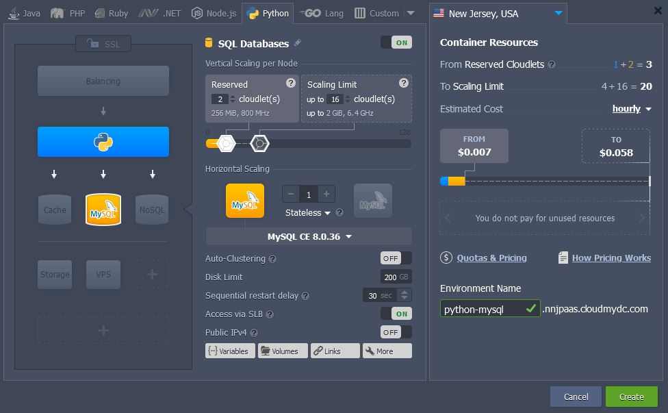
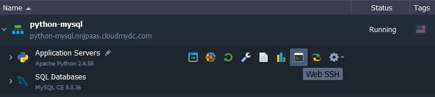
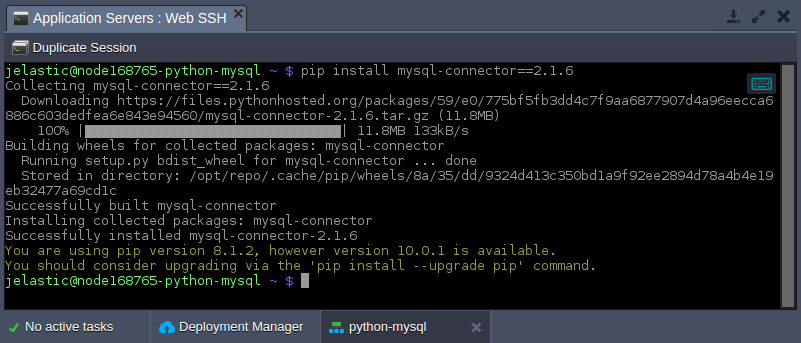
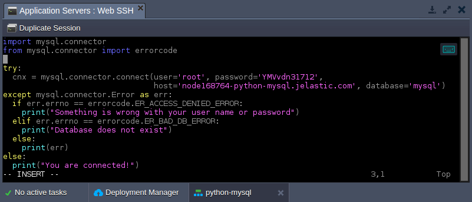
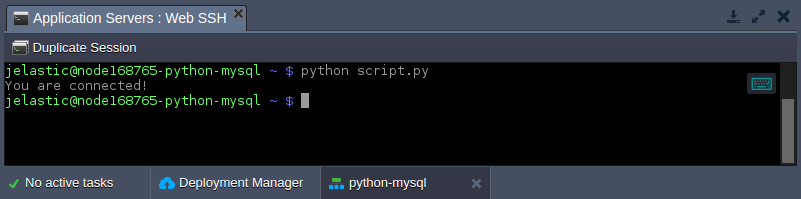

<!-- ## Python Application Connection to MySQL/MariaDB/Percona -->

**MySQL**, **MariaDB**, and **Percona** are highly popular among developers all over the world, when an open source SQL databases are required. In this instruction we’ll show you how to connect your **Python** application, hosted within the platform, to these DB servers.

1. Log into the platform dashboard and [create a new environment](/environment-management/setting-up-environment) with both Python and MySQL (or Python and MariaDB) servers.

<div style={{
    display:'flex',
    justifyContent: 'center',
    margin: '0 0 1rem 0'
}}>



</div>

:::tip Tip

Locating instances within a single environment is just an example, you can establish connection between different environments in just the same way.

:::

2. After environment creation, access your application server via SSH Gate, e.g. by pressing the **[Web SSH](/deployment-tools/ssh/ssh-access/web-ssh#ssh-access-via-web-browser)** button.

<div style={{
    display:'flex',
    justifyContent: 'center',
    margin: '0 0 1rem 0'
}}>



</div>

A terminal emulator with the automatically established SSH connection to your node will be opened in the appropriate tab.

3. Now, install a [MySQL connector for Python](https://github.com/sanpingz/mysql-connector) (it works with MariaDB as well) with the following command:

```bash
pip install mysql-connector==2.1.6
```

<div style={{
    display:'flex',
    justifyContent: 'center',
    margin: '0 0 1rem 0'
}}>



</div>

:::tip Note

In order to use the newer version of the MySQL connector, you need to additionally install [Protobuf C++](https://protobuf.dev/downloads/) of the 2.6.0 version or above.

:::

4. Next, let’s create a simple Python script to establish database connection. You can use any preferable text editor for this task, as well as any filename with the **_.py_** extension (e.g. **_vim script.py_**).

```bash
import mysql.connector
from mysql.connector import errorcode
try:
  cnx = mysql.connector.connect(user='{user}', password='{password}',
                                host='{host}', database='{database}')
except mysql.connector.Error as err:
  if err.errno == errorcode.ER_ACCESS_DENIED_ERROR:
    print("Something is wrong with your user name or password")
  elif err.errno == errorcode.ER_BAD_DB_ERROR:
    print("Database does not exist")
  else:
    print(err)
else:
  print("You are connected!")
  cnx.close()
```

Here, you need to adjust the connection string (all the required information is provided within email for your MySQL / MariaDB node):

- `{user}` - username to log into database with
- `{password}` - password for the appropriate user
- `{host}` - link to your MySQL / MariaDB container
- `{database}` - database to be accessed (e.g. the default mysql one)

<div style={{
    display:'flex',
    justifyContent: 'center',
    margin: '0 0 1rem 0'
}}>



</div>

This script will connect to the specified database server with the provided credentials and will print connection errors (if any) or just a “You are connected!” phrase.

5. So, let’s execute our code with the appropriate command:

```bash
python script.py
```

<div style={{
    display:'flex',
    justifyContent: 'center',
    margin: '0 0 1rem 0'
}}>



</div>

If the “You are connected!” string appeared within terminal, the connection was successful. Now, you can be sure that your database server is accessible and you can [extend the code](https://dev.mysql.com/doc/connector-python/en/) to execute the required actions.
