## MariaDB/MySQL/Percona Auto-Сlustering

Database clusterization is an obligatory requirement for highly loaded production applications to ensure data availability and high performance. However, the configuration of a reliable cluster is not a trivial task even for experienced developers and system administrators. For solving this problem, the platform introduced out-of-the-box clustering for MariaDB/MySQL/Percona to make applications highly available by default.

<div style={{
    display:'flex',
    justifyContent: 'center',
    margin: '0 0 1rem 0'
}}>

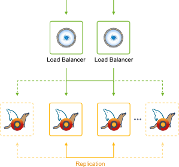

</div>

The implemented solution provides a set of benefits:

- **high availability with pre-configured replication options** - Primary-Secondary, Primary-Primary, Galera, XtraDB
- **scalability and autodiscovery** – new nodes, added during [horizontal scaling](/docs/application-setting/scaling-and-clustering/horizontal-scaling#horizontal-scaling-inside-the-cloud-multi-node), are connected to the cluster with all required adjustments being applied automatically
- **efficient load balancing** – each cluster is supplemented with two ProxySQL nodes for load balancing with automatic splitting of read/write requests
- **automated failover** – the database nodes that are temporarily unavailable or have high latency are automatically excluded from the cluster and re-added once the connection is restored

All these benefits can be achieved just in a few clicks within a topology wizard. Explore the steps below to activate [auto-clustering for your MariaDB/MySQL/Percona databases](https://github.com/jelastic-jps/mysql-cluster) in PaaS.

## Enable Automatic Clustering for Databases

Click on **New Environment** at the dashboard and choose **MariaDB/MySQL/Percona** database.

<div style={{
    display:'flex',
    justifyContent: 'center',
    margin: '0 0 1rem 0'
}}>

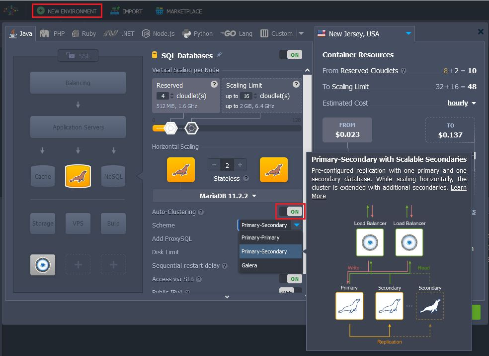

</div>

Activate the **Auto-Clustering** button. As a result, a dropdown with different replication schemes will appear:

- **MariaDB** - Primary-Secondary, Primary-Primary, and Galera
- **MySQL** - Primary-Secondary and Primary-Primary
- **Percona** - Primary-Secondary, Primary-Primary, and XtraDB

## Auto-Clustering Options

Choose the replication type you prefer, add the necessary number of nodes.

## Highly Available ProxySQL Load Balancer

Each MariaDB/MySQL/Percona auto-clustering solution has two ProxySQL nodes enabled by default in front of the database cluster. If required you can exclude them from the cluster topology before installation with the respective switch. Keep in mind that you won’t be able to do that afterward.

<div style={{
    display:'flex',
    justifyContent: 'center',
    margin: '0 0 1rem 0'
}}>

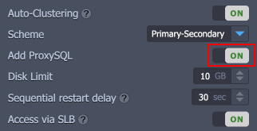

</div>

## Database Cluster Access Credentials

During cluster creation, the platform automatically generates database access credentials, but you may override them with your own ones in three simple steps:

1. Click on the **Variables** button.

<div style={{
    display:'flex',
    justifyContent: 'center',
    margin: '0 0 1rem 0'
}}>

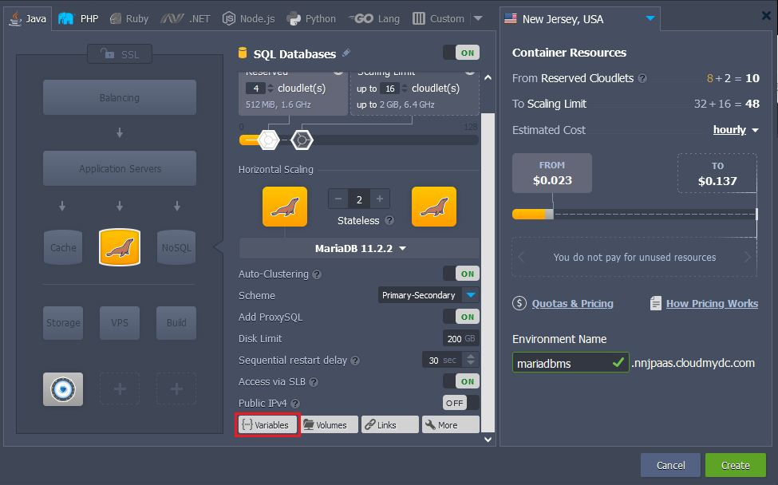

</div>

2. Then press **Add** to provide custom user’s database credentials via two variables **DB_USER** and **DB_PASS** as follows:

<div style={{
    display:'flex',
    justifyContent: 'center',
    margin: '0 0 1rem 0'
}}>

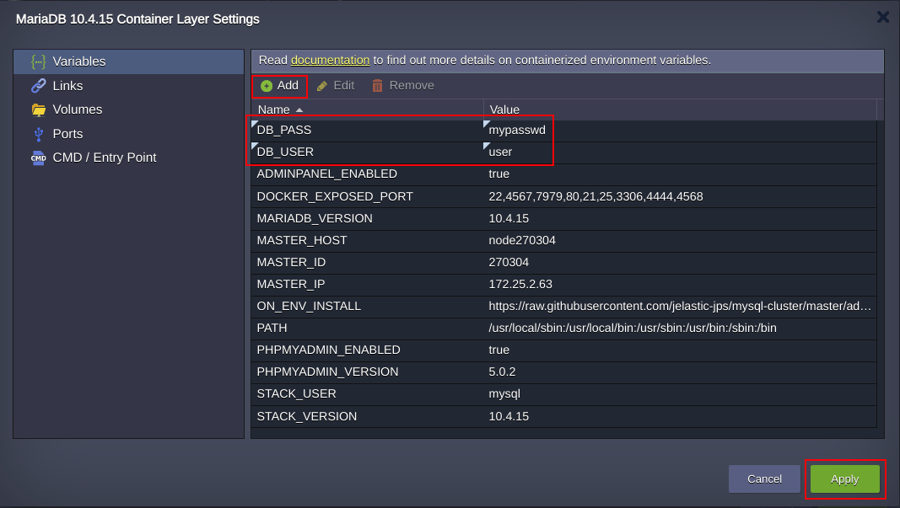

</div>

3. Press **Apply** and custom credentials will be mailed to you upon cluster successful installation as for access to the **PHP MyAdmin at Primary Node** and database cluster **Entry Point**.

## Cluster Horizontal Scaling

If you decide to scale the primary-secondary/primary-primary topologies with an extra database node, it will be created via cloning an existing secondary node. Once the cloning procedure is completed the database on the new cluster member catches up data via binlog replay. Such an algorithm guarantees the [binlog](https://dev.mysql.com/doc/dev/mysql-server/latest/) will never expire and horizontal scaling takes a short period of time.

## Cluster Layers Isolation

Depending on whether you are going to use an external application or not, you may decide what layers you will expose outside - all or the entry point proxy layer only. Turn the [SLB access](/docs/application-setting/external-access-to-applications/shared-load-balancer#deny-access-via-shared-load-balancer) switch into the required position for each layer and click **Create**.

<div style={{
    display:'flex',
    justifyContent: 'center',
    margin: '0 0 1rem 0'
}}>

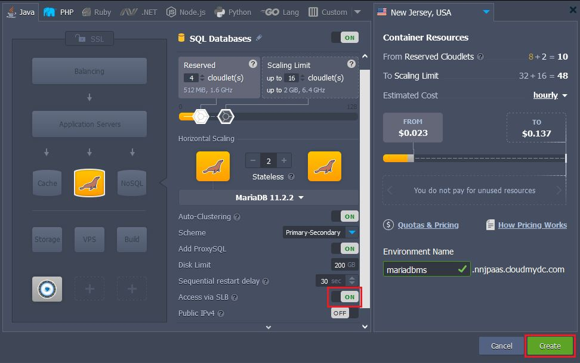

</div>

That’s all! No configurations required, the cluster is ready to work with.

<div style={{
    display:'flex',
    justifyContent: 'center',
    margin: '0 0 1rem 0'
}}>

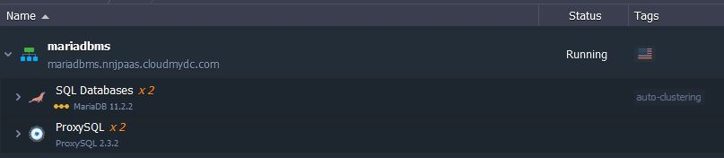

</div>

## Database Cluster Access Information

After successful installation, you’ll receive a number of emails with the cluster information:

- **PHP MyAdmin at Primary Node** - web administration interface with credentials to access the database server for interactive management.

<div style={{
    display:'flex',
    justifyContent: 'center',
    margin: '0 0 1rem 0'
}}>

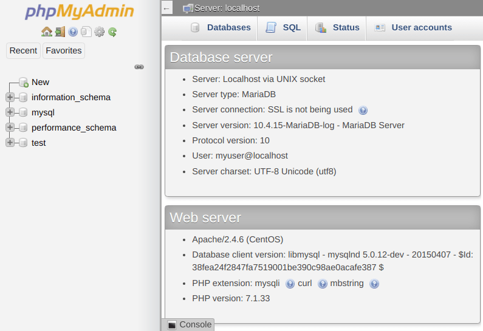

</div>

- **Entry Point for Connections to Database Cluster** - [hostname and credentials for connecting](/docs/application-setting/domain-name-management/container-dns-hostnames#hostnames-for-specific-layers) an application to the database cluster.These nodes form a proxy layer referred to as the entry point for the database cluster with hostname as follows: **_proxy.${envName}.${platformDomain}_**.

<div style={{
    display:'flex',
    justifyContent: 'center',
    margin: '0 0 1rem 0'
}}>

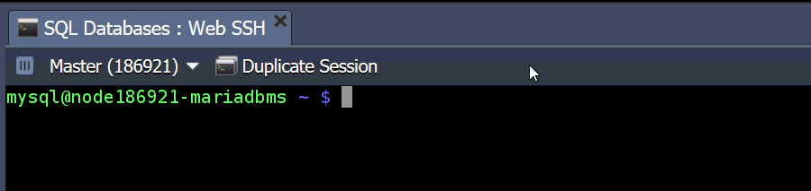

</div>

:::danger Note

In case you are going to create and use the custom user accounts after cluster installation, you should add them to the **mysql_users** table on each ProxySQL node, otherwise you won’t be able to establish connection to the database via the proxy layer. To do this issue commands below:

```bash
$ MYSQL_PWD=admin mysql -h 127.0.0.1 -P6032 -uadmin -e "INSERT INTO mysql_users (username,password,default_hostgroup) VALUES ('<username>', '<password>', 2);"
$ MYSQL_PWD=admin mysql -h 127.0.0.1 -P6032 -uadmin -e "LOAD MYSQL USERS TO RUNTIME; SAVE MYSQL USERS TO DISK;"
```

Substitute and with credentials of a newly created database account.

:::

- **Cluster Orchestrator Panel** - credentials to access the Orchestrator panel, intended for convenient cluster management. Use the received credentials to access admin panel of cluster [Orchestrator](https://github.com/openark/orchestrator) installed on ProxySQL node, that provides a possibility to review the cluster topology information: slick visualization of topologies, replication problems if there are any, read/write distribution, state of health check-ups and autodiscovery of newly added DB nodes, etc.

<div style={{
    display:'flex',
    justifyContent: 'center',
    margin: '0 0 1rem 0'
}}>

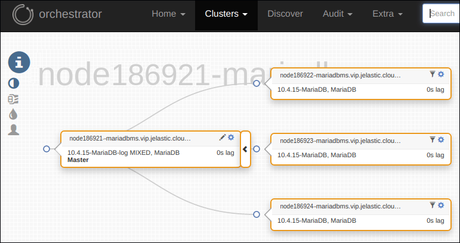

</div>

## What Replication Type to Choose?

Let’s consider the details about each replication scheme available for databases within the platform in order to understand which one is the most suitable for the specific needs and use cases.

## Primary-Secondary MariaDB/MySQL/Percona Replication

**_Primary-secondary_** replication is the most common used topology, that provides a good consistency (i.e. exactly one node to modify data), but no automatic failover upon primary failure. A write latency in asynchronous replication is low because the write is recorded locally by the primary server before writing to the secondary servers. It allows to scale-out the reads, providing the highest performance, since adding more replicas does not affect replication latency. Secondaries can be read without impact on the primary, providing such obvious advantages as:

- High performance for read requests
- Database backup can be done with no impact on primary instance
- Analytical requests can load the secondary instance only (without affecting the primaty)

<div style={{
    display:'flex',
    justifyContent: 'center',
    margin: '0 0 1rem 0'
}}>


</div>

## Primary-Primary MariaDB/MySQL/Percona Replication

**_Primary-primary_** asynchronous replication operates with two primary nodes simultaneously, Compared to the default primary-secondary solution, it benefits on the balancing of writing load and simpler recovery upon one primary node failure.

<div style={{
    display:'flex',
    justifyContent: 'center',
    margin: '0 0 1rem 0'
}}>

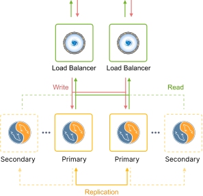

</div>

In contrast to the default settings, in primary-primary cluster scaling leads to secondaries addition to the cluster. Upon creation, the secondary instances are equally distributed between primary nodes that allow smoothly distribute the replication workload and increase the reads capacity of the cluster.

## MariaDB Galera and Percona XtraDB Clusters

**_Galera and XtraDB clusters_** topologies are multi-primary synchronous replications that are performed at a transaction commit time, by broadcasting transaction write set to all cluster nodes for applying. They make sure the write is sent to all nodes in the cluster before this write will be actually committed.

<div style={{
    display:'flex',
    justifyContent: 'center',
    margin: '0 0 1rem 0'
}}>


</div>

A user application can send reads and writes to any node in the cluster, that provides an ability to scale-out read and write transactions. Adding nodes to a cluster is fully automated. Excluding nodes from the cluster is just a matter of removing the unneeded or failed ones. There is no need anymore to implement the bulky logic for separation of reads and writes, the scaling potential can be immediately implemented with no need to change the application logic. Galera and XtraDB offer one of the best protection against data loss and inconsistent databases since there is no delay in replicating data. If one of the cluster nodes fails the user application won’t see it and will continue to serve users using the other nodes that may also be located in other data centers.
