## MySQL/MariaDB/Percona Database Primary-Secondary Replication

**_Primary-secondary replication_** is used to solve many different problems with performance, supporting the backup of different databases, and as a part of a larger solution to alleviate system failures. It enables data from one database server (the master) to be replicated to one or more database servers (the slaves). The master logs the updates, which then ripple through to the slaves. The slave outputs a message stating that it has received the update successfully, which allows sending subsequent updates. Master-slave replication can be either synchronous or asynchronous. The difference is simply the timing of propagation of changes. If the changes are made to the master and slave at the same time, it is synchronous. If changes are queued up and written later, it is asynchronous.

<div style={{
    display:'flex',
    justifyContent: 'center',
    margin: '0 0 1rem 0'
}}>

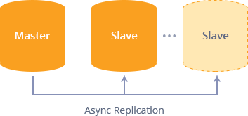

</div>

The target usage for replication in MySQL/MariaDB/Percona databases includes:

- Scale-out solutions
- Data security
- Analytics
- Long-distance data distribution

How you can use such replication and take advantage of it:

- **Backups:** to use replication as a backup solution, replicate data from the master to a slave, and then back up the data slave. The slave can be paused and shut down without affecting the running operation of the master, so you can produce an effective snapshot of “live” data that would otherwise require the master to be shut down.
- **Scale-out:** you can use replication as a scale-out solution; that is, where you want to split up a load of database queries across multiple database servers, within some reasonable limitations. Because replication works from the distribution of one master to one or more slaves, using it for scale-out works best in an environment where you have a high number of reads and a low number of writes/updates.
- **Spreading the load:** there may be situations when you have a single master and wish to replicate different databases to different slaves. For example, you may want to distribute sales data only to the required departments to help spread the load during data analysis.
- **Increasing the performance:** as the number of slaves connecting to a master increases, the load, although minimal, also increases, as each slave uses a client connection to the master. As each slave must receive a full copy of the master binary log, the network load on the master may also increase and create a bottleneck. If you are using a large number of slaves connected to one master, and that master is also busy processing requests (for example, as part of a scale-out solution), then you may want to improve the replication process’s performance. One way to improve the performance of the replication process is to create a deeper replication structure that enables the master to replicate to only one slave, and for the remaining slaves to connect to this primary slave for their replication requirements.
- **Failover alleviating:** You can set up a master and a slave (or several slaves) and write a script that monitors the master to check whether it is up. Then instruct your applications and the slaves to change master in case of failure.
- **Security:** you can use SSL for encrypting the transfer of the binary log required during replication, but both the master and the slave must support SSL network connections. If either host does not support SSL connections, replication through an SSL connection is not possible. Setting up replication using an SSL connection is similar to setting up a server and client using SSL. You must obtain (or create) a suitable security certificate that you can use on the master and a similar certificate (from the same certificate authority) on each slave.

Now, let’s examine a simple example of how to configure master-slave replication on the platform.

You are able to set a DB cluster in two ways:

- [automatically](/docs/Database/MySQL-MariaDB-Percona/High%20Availability%20Cluster/Manual%20Primary-Secondary%20Replication#one-click-installation) (via one-click widget)
- [manually](/docs/Database/MySQL-MariaDB-Percona/High%20Availability%20Cluster/Manual%20Primary-Secondary%20Replication#manual-installation) (following the step-by-step instruction)

## One-Click Installation

You can get a **MySQL** or **MariaDB** database cluster with the required replication type (including the master-slave one) up and running within minutes using one-click install widget:

<input type="text" placeholder="Enter Email here"/>

The process is simple - just provide your email and confirm via the appropriate notification. Read the **MariaDB/MySQL Auto-Clustering** article for more information on the installed package and available customization options.

## Manual Installation

If you prefer to configure the Master-Slave replication manually in order to get more slave replicators or specify some custom configurations, please, follow the instruction below.

## Create Environments

:::tip Tip

The instruction below is fully suitable for both **MySQL** and **MariaDB** database servers.

:::

First of all, we create two environments for our master and slave databases.

1. Log in to the platform dashboard and click the **New Environment** button.

<div style={{
    display:'flex',
    justifyContent: 'center',
    margin: '0 0 1rem 0'
}}>


</div>

2. In the **Environment Topology** wizard, pick **MariaDB** (or MySQL) as a database you want to use. Set the cloudlet limit and type the name of your first environment, for example, _masterbase_.

<div style={{
    display:'flex',
    justifyContent: 'center',
    margin: '0 0 1rem 0'
}}>

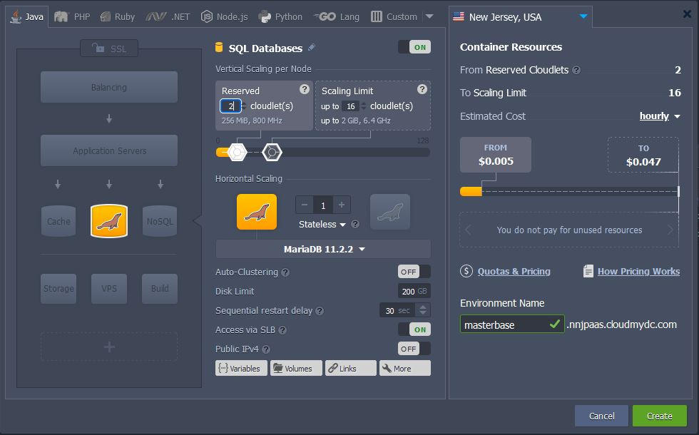

</div>

Wait just a minute for your environment to be created.

<div style={{
    display:'flex',
    justifyContent: 'center',
    margin: '0 0 1rem 0'
}}>

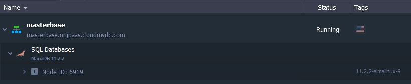

</div>

3. In the same way, create one more environment with MariaDB or just [clone](/docs/environment-management/cloning-environment) it. Let’s name it slavebase. It will be located on the other hardnode, which is even more secure and reliable for storing your data.

Now you have two identical environments with two databases.

<div style={{
    display:'flex',
    justifyContent: 'center',
    margin: '0 0 1rem 0'
}}>

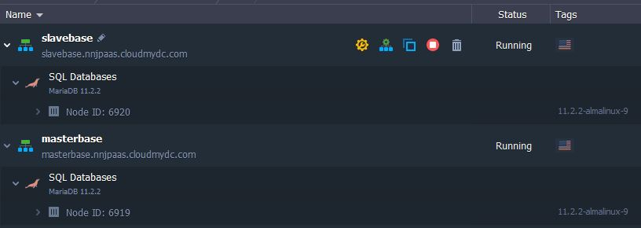

</div>

## Configure Master Database

Let’s configure the master base now.

1. Click the **Config** button for your master database.

<div style={{
    display:'flex',
    justifyContent: 'center',
    margin: '0 0 1rem 0'
}}>

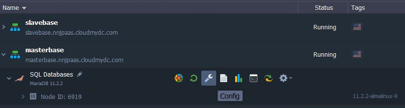

</div>

2. Navigate to the my.cnf file and add the following properties as it is shown below:

```bash
server-id = 1
log-bin = mysql-bin
binlog-format = mixed
```

<div style={{
    display:'flex',
    justifyContent: 'center',
    margin: '0 0 1rem 0'
}}>

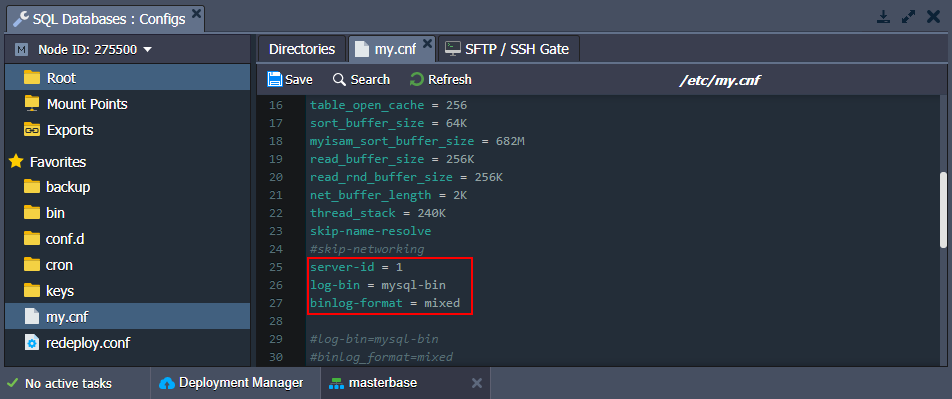

</div>

We use the “mixed” binlog format (binlog-format = mixed) to allow a replication of operations with foreign keys.

:::tip Note

Do not use the “statement” binlog format. Otherwise, you will get errors later on!

:::

3. **Save** the changes and **Restart** MariaDB in order to apply the new configuration parameters.

<div style={{
    display:'flex',
    justifyContent: 'center',
    margin: '0 0 1rem 0'
}}>

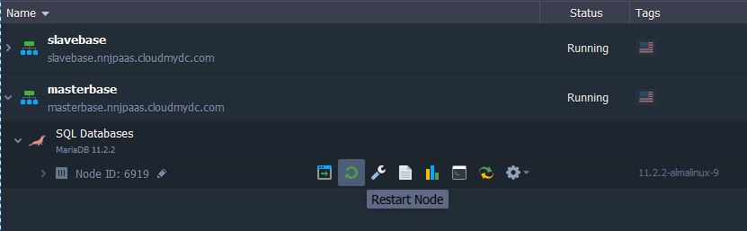

</div>

4. Click the **Open in Browser** button for **MariaDB**. The platform have sent you an email with credentials to the database. Log in using these credentials.

5. Navigate to the **User accounts** tab and click **Add user account**.

<div style={{
    display:'flex',
    justifyContent: 'center',
    margin: '0 0 1rem 0'
}}>

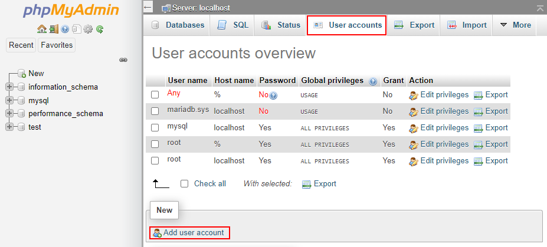

</div>

6. Specify the name and password for your slave replication user.

<div style={{
    display:'flex',
    justifyContent: 'center',
    margin: '0 0 1rem 0'
}}>

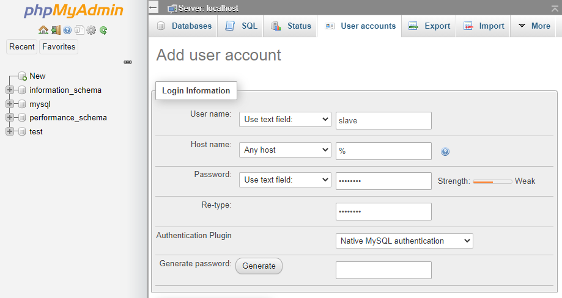

</div>

Now, scroll down and tick the replication client and replication slave administration privileges.

<div style={{
    display:'flex',
    justifyContent: 'center',
    margin: '0 0 1rem 0'
}}>

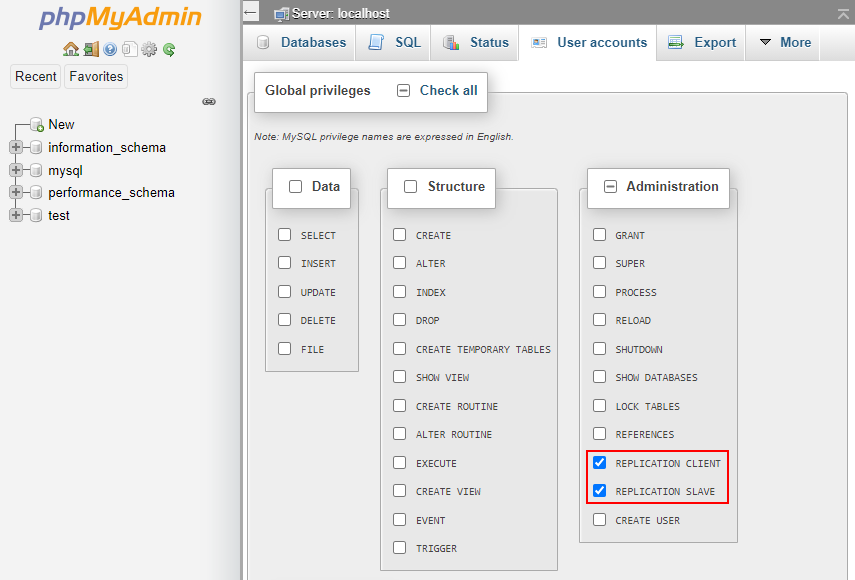

</div>

Click **Go** at the bottom of the page.

7. Switch to the **Status** tab to ensure that replication is configured correctly.

<div style={{
    display:'flex',
    justifyContent: 'center',
    margin: '0 0 1rem 0'
}}>

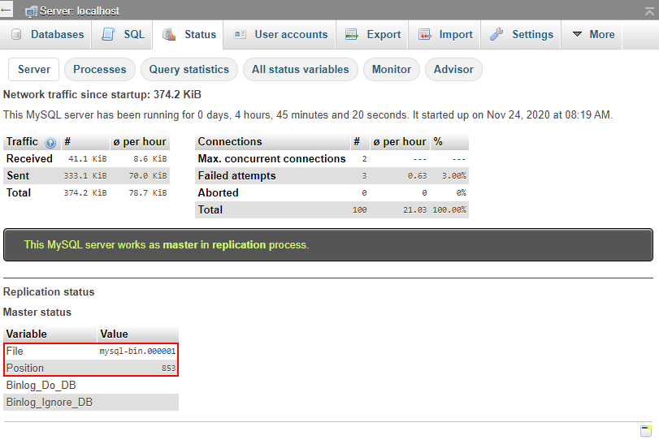

</div>

Pay attention to the log File and Position values, as they will be needed later to set up the slave database.

## Configure Slave Database

Let’s go back to the platform dashboard and configure our slave database.

1. Click the **Config** button for your slavebase environment.

<div style={{
    display:'flex',
    justifyContent: 'center',
    margin: '0 0 1rem 0'
}}>

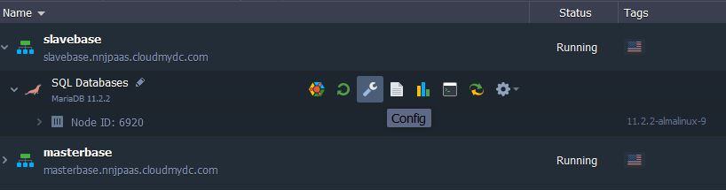

</div>

2. Navigate to the **_my.cnf_** file and add the following strings:

```bash
server-id = 2
slave-skip-errors = all
```

<div style={{
    display:'flex',
    justifyContent: 'center',
    margin: '0 0 1rem 0'
}}>

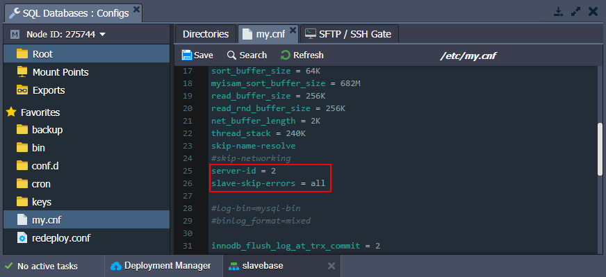

</div>

We allow our slave base to skip all errors from master (slave-skip-errors = all) in order not to stop normal slave operation in case of errors on master base.

:::tip Note

This skipping is not recommended for use during the development stage as it helps to find and troubleshoot bugs. However, in production (when your code is already tested), it helps to avoid desynchronization over some minor issues on the master node.

:::

3. Next, open the **_/etc/phpMyAdmin/config.inc.php_** file and append it with the next option:

```bash
$cfg['AllowArbitraryServer'] = true;
```

<div style={{
    display:'flex',
    justifyContent: 'center',
    margin: '0 0 1rem 0'
}}>

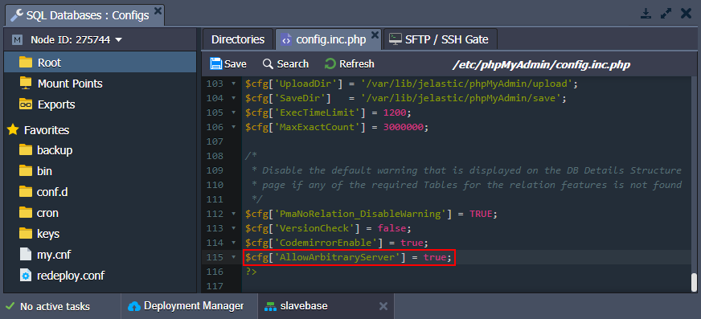

</div>

4. **Save** the changes and **Restart** your slave database server in order to apply the new configuration parameters.

<div style={{
    display:'flex',
    justifyContent: 'center',
    margin: '0 0 1rem 0'
}}>

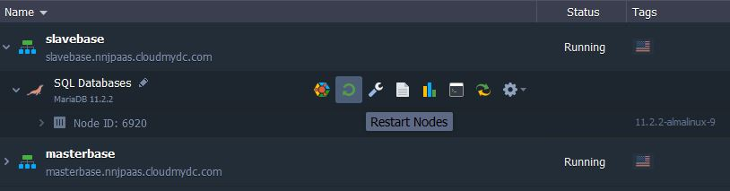

</div>

5. Let’s configure our slave database server via a built-in [Web SSH](http://localhost:3000/docs/deployment-tools/ssh/ssh-access/web-ssh#ssh-access-via-web-browser) client. Connect to your database using credentials from the email received after the node creation.

```bash
mysql -u root -p
```

<div style={{
    display:'flex',
    justifyContent: 'center',
    margin: '0 0 1rem 0'
}}>

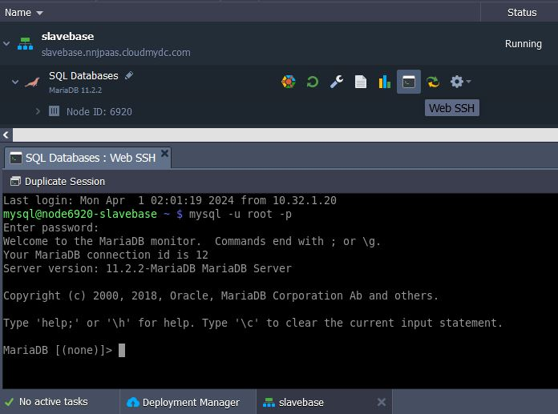

</div>

6. Provide replication master details.

```bash
CHANGE MASTER TO
MASTER_HOST='node275500-masterbase.jelastic.com',
MASTER_USER='slave',
MASTER_PASSWORD='passw0rd',
MASTER_LOG_FILE='mysql-bin.000001',
MASTER_LOG_POS=853;
```

Do not forget to replace the option’s values in the example above with the correct data:

- **MASTER_HOST** - URL or IP of the replication master
- **MASTER_USER** - replication user
- **MASTER_PASSWORD** - replication user’s password,
- **MASTER_LOG_FILE** - master’s log file (see the last step of the master configuration section)
- **MASTER_LOG_POS** - master’s log position (see the last step of the master configuration section)

<div style={{
    display:'flex',
    justifyContent: 'center',
    margin: '0 0 1rem 0'
}}>

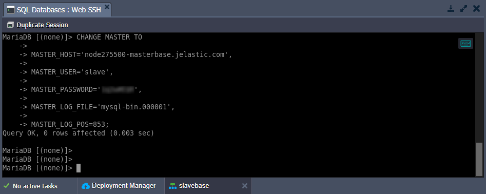

</div>

7. Now, you can to start replication slave with the appropriate command:

```bash
start slave;
```

<div style={{
    display:'flex',
    justifyContent: 'center',
    margin: '0 0 1rem 0'
}}>

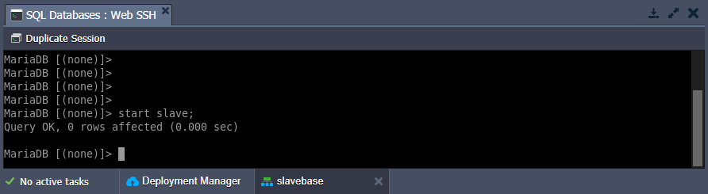

</div>

:::tip Tip

If you want to ensure that everything is configured correctly, log in to the slave database admin and go to the **Status** tab.

<div style={{
    display:'flex',
    justifyContent: 'center',
    margin: '0 0 1rem 0'
}}>

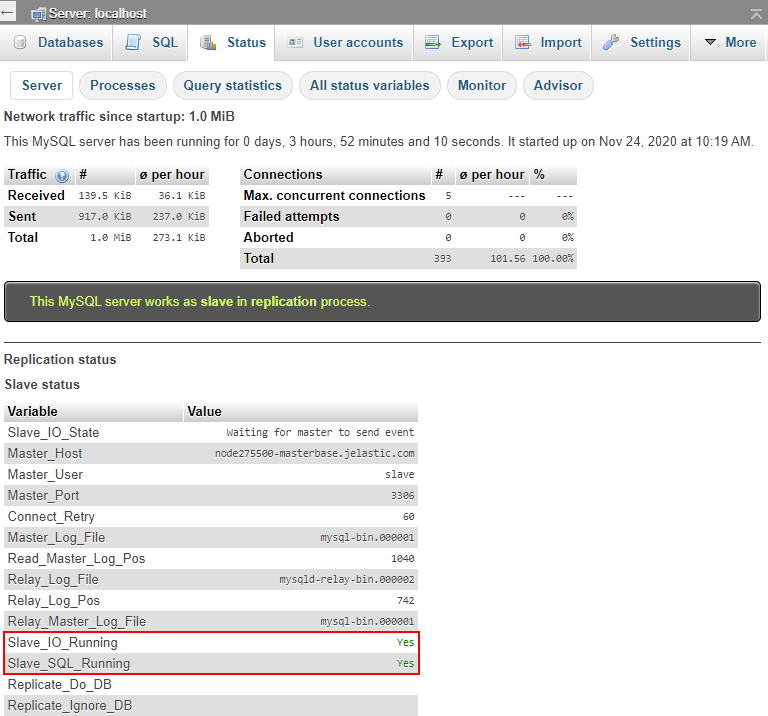

</div>

:::

## Check Results

We have to ensure now that master-slave replication works for our databases.

1. Let’s create the new database (e.g. jelastic) in our master base.

<div style={{
    display:'flex',
    justifyContent: 'center',
    margin: '0 0 1rem 0'
}}>

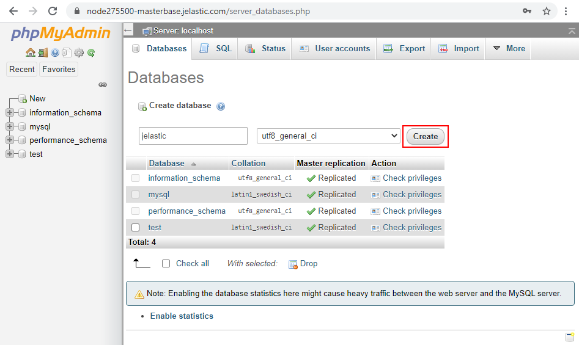

</div>

2. Navigate to the slave base, and you’ll see that the new database was successfully replicated.

<div style={{
    display:'flex',
    justifyContent: 'center',
    margin: '0 0 1rem 0'
}}>

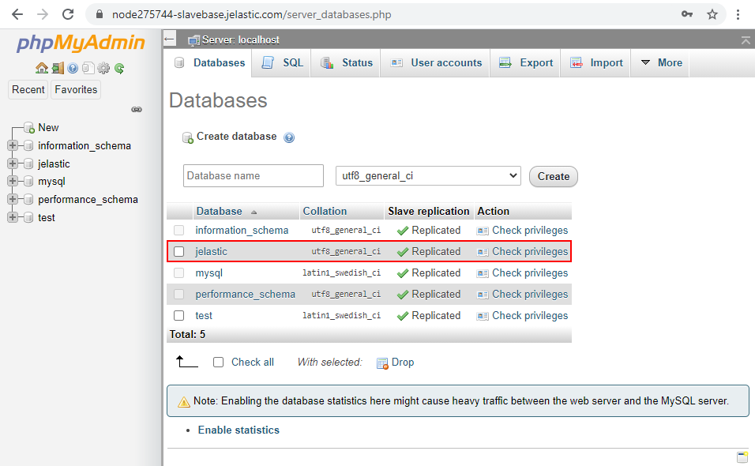

</div>

## Connection to Master-Slave

Here are two examples of connecting to your master and slave databases from **Java** and **PHP** applications.

1. As an example, you can see the code of our Java application, which connects to master and slave databases.

**Database_config.cfg**:

```bash
master_host=jdbc:mysql://mariadb-master-host/mysql
master_username=root
master_password=abcABC123

slave_host=jdbc:mysql://mariadb-slave-host/mysql
slave_username=root
slave_password=abcABC123

driver=com.mysql.jdbc.Driver
```

**Dbmanager.java**:

```bash
package com.jelastic.test;
import java.io.FileInputStream;
import java.io.IOException;
import java.sql.\*;
import java.util.ArrayList;
import java.util.List;
import java.util.Properties;
import java.util.logging.Level;
import java.util.logging.Logger;

public class DbManager {

    private final static String createDatabase = "CREATE SCHEMA IF NOT EXISTS jelastic";
    private final static String showDatabases = "SHOW DATABASES";

    public Connection createMasterConnection() throws IOException, ClassNotFoundException, SQLException {
       Connection masterConnection;
       Properties prop = new Properties();
       prop.load(new FileInputStream(System.getProperty("user.home") + "/database_config.cfg"));
       String master_host = prop.getProperty("master_host").toString();
       String master_username = prop.getProperty("master_username").toString();
       String master_password = prop.getProperty("master_password").toString();
       String driver = prop.getProperty("driver").toString();

       Class.forName(driver);
       masterConnection = DriverManager.getConnection(master_host, master_username, master_password);
       return masterConnection;
    }

    public Connection createSlaveConnection() throws IOException, ClassNotFoundException, SQLException {
       Connection slaveConnection;
       Properties prop = new Properties();
       prop.load(new FileInputStream(System.getProperty("user.home") + "/database_config.cfg"));
       String slave_host = prop.getProperty("slave_host").toString();
       String slave_username = prop.getProperty("slave_username").toString();
       String slave_password = prop.getProperty("slave_password").toString();
       String driver = prop.getProperty("driver").toString();

       Class.forName(driver);
       slaveConnection = DriverManager.getConnection(slave_host, slave_username, slave_password);
       return slaveConnection;
    }

    public boolean runSqlStatementOnMaster() {
       boolean execute = false;
       Statement statement = null;
       try {
           statement = createMasterConnection().createStatement();
           execute = statement.execute(createDatabase);
       } catch (IOException ex) {
         Logger.getLogger(DbManager.class.getName()).log(Level.SEVERE, null, ex);
       } catch (ClassNotFoundException ex) {
         Logger.getLogger(DbManager.class.getName()).log(Level.SEVERE, null, ex);
       } catch (SQLException ex) {
           ex.printStackTrace();
       } finally {
           if (statement != null) {
               try {
                   statement.close();
               } catch (SQLException e) {
                   e.printStackTrace();
               }
           }
       }
       return execute;
    }

    public List<String> runSqlStatementOnSlave() {
       List<String> stringList = new ArrayList<String>();
       Statement statement = null;
       ResultSet resultSet = null;
       try {
           statement = createSlaveConnection().createStatement();
           resultSet = statement.executeQuery(showDatabases);
           while (resultSet.next()) {
               stringList.add(resultSet.getString(1));
           }
       } catch (IOException ex) {
         Logger.getLogger(DbManager.class.getName()).log(Level.SEVERE, null, ex);
       } catch (ClassNotFoundException ex) {
         Logger.getLogger(DbManager.class.getName()).log(Level.SEVERE, null, ex);
       } catch (SQLException ex) {
           ex.printStackTrace();
       } finally {
           if (resultSet != null) {
               try {
                   resultSet.close();
               } catch (SQLException e) {
                   e.printStackTrace();
               }
           }
           if (statement != null) {
               try {
                   statement.close();
               } catch (SQLException e) {
                   e.printStackTrace();
               }
           }
       }
       return stringList;
    }

}
```

2. Connection to master and slave databases for your PHP application:

```bash
<?php
/* Master settings */
$master_server = "xx.xxx.x.xx";
$master_username = "root";
$master_password = "abcABC123";

/* Slave settings */
$slave_server = "xx.xxx.x.xx";
$slave_username = "root";
$slave_password = "abcABC123";

$link_to_master = mysqli_connect(
$master_server,
$master_username,
$master_password,
'mysql');

if (!$link_to_master) {
printf("Unable to connect master database server. Error: %s\n", mysqli_connect_error());
exit;
}

$link_to_slave = mysqli_connect(
$slave_server,
$slave_username,
$slave_password,
'mysql');

if (!$link_to_slave) {
printf("Unable to connect slave database server. Error: %s\n", mysqli_connect_error());
exit;
}

print("
Creating database with name Jelastic on Master node ");

$result = mysqli_query($link_to_master, 'CREATE DATABASE JelasticX');

sleep (3);

print("
Checking if created database was replciated to slave ");

if ($result = mysqli_query($link_to_slave, 'SHOW DATABASES LIKE "JelasticX"')) {
$result_text = mysqli_fetch_array($result);
print ("
Replicated database is ".$result_text[0]);
}

mysqli_close($link_to_master);
mysqli_close($link_to_slave);
?>
```

Now, you have your own database replication in the cloud. Enjoy!
