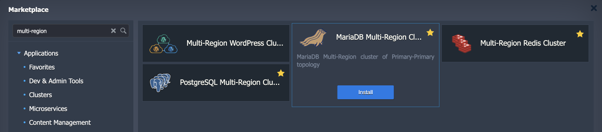
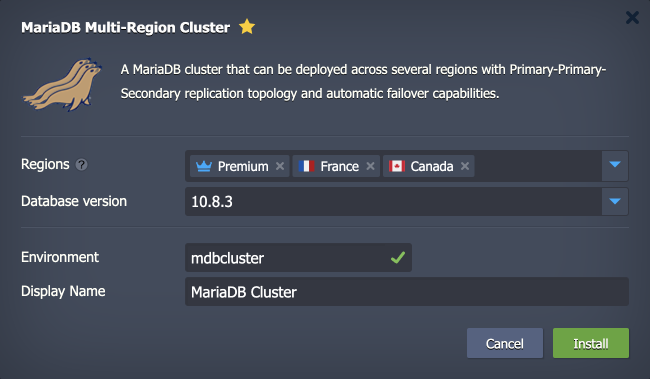
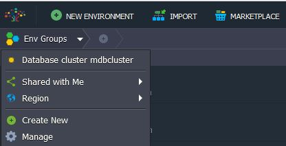
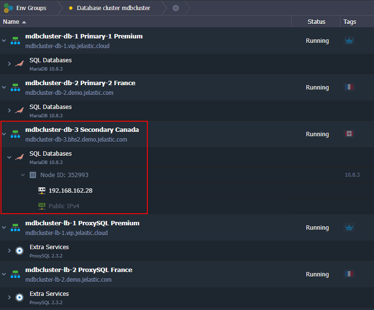

<!-- ## MariaDB Multi-Region Cluster -->

**MariaDB Multi-Region Cluster** is a pre-packaged solution that automatically creates an advanced, highly available cluster on top of platform-managed stack templates.

## Database Cluster Topology

The [MariaDB Multi-Region clustering](https://github.com/jelastic-jps/mysql-multiregion) is based on Primary-Primary topology. Its asynchronous replication allows compensating the latency influence on transaction commit. Such implementation better fits cases when regions (data centers) are significantly distanced from each other.

As for disaster recovery, one or more Secondary nodes can be added for the required cross-region deployment. For example, on the platforms with three regions, the recommended topology is Primary-Primary-Secondary.

Every database server or load balancer node in the cluster topology is created in a separate environment with a [ProxySQL Load Balancer](https://www.proxysql.com/) layer in front of the cluster to distribute requests between Primary nodes. After creation, such environments are combined into the multi-region cluster.

The package provides out-of-box high availability and failover for the database cluster. It is ensured on the data center level – the database is accessible even if one of the regions becomes unavailable. If one of the Primary regions fails, the cluster will be available and keep handling Read and Write queries. Even in case of both Primary regions become unavailable, the Secondary one can be used to handle Read and Write requests with no data loss. However, it’ll require an update of the entry point setting in the database client application (replacing ProxySQL hostnames with the Secondary database server hostname).

## Cluster Installation

1. Find the **_MariaDB Multi-Region Cluster_** application (the **Clusters** section or use the **Search** field) in the platform [Marketplace](/deployment-tools/cloud-scripting-&-jps/marketplace#marketplace).

2. In the opened installation window, specify the following data:

- **Regions** – choose platform regions where the cluster environments will be deployed. Note that regions order matters, as the first two will have Primary servers and others will be Secondary
- **Database** version – select the preferred MariaDB version
- **Environment** – provide a name for the isolation and [grouping](/environment-management/environment-groups/overview) of your database cluster environments
- **Display Name** – set a custom name for the cluster environments

Click **Install** when ready.

3. The installation process can take several minutes. After the completion, you’ll see the success window and receive emails with all the appropriate data, like entry point details and access credentials.

To easily view all the related environments, you can switch to the group specified in the previous step (mdbcluster in our case).

4. The multi-region cluster entry point comprises two items (one per Primary server). The link includes the cluster name and ProxySQL hostname. If both Primary regions are down, use the hostname or IP address of the secondary node as an entry point.

