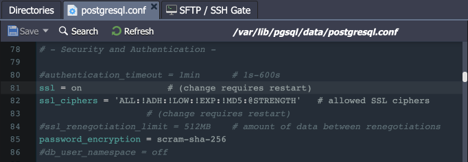
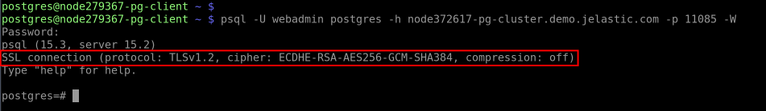
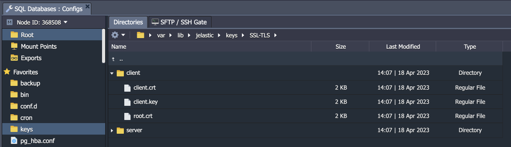

## SSL/TLS Encryption in Transit for PostgreSQL

The platform provides a built-in add-on that implements “**encryption in transit**” functionality for PostgreSQL solutions. The add-on creates SSL/TLS encrypted connection to protect data while it moves between client and database servers. The protection includes data encryption before transmission, endpoints authentication, content decryption, and verification upon arrival.

## Add-On Installation

The add-on can only be installed on top of the **PostgreSQL** and **Pgpool-II** (for database clusters) nodes.

1. Locate the appropriate PostgreSQL database layer in your dashboard, go to the **Add-Ons** section, and click **Install** for the SSL/TLS Encryption add-on.

:::tip Tip

The solution is also available from the [Marketplace](/docs/Deployment%20Tools/Cloud%20Scripting%20&%20JPS/Marketplace#marketplace) or can be imported from the [repository](https://github.com/jelastic-jps/postgres-ssl-addon/tree/main) on GitHub.

:::

<div style={{
    display:'flex',
    justifyContent: 'center',
    margin: '0 0 1rem 0'
}}>


</div>

2. Within the opened installation window, select the target **Environment** and **Node Group(s)** where the add-on will be installed.

<div style={{
    display:'flex',
    justifyContent: 'center',
    margin: '0 0 1rem 0'
}}>


</div>

:::danger Note

Both layers should be selected if installed for the **PostgreSQL cluster with Pgpool-II** load balancing nodes.

:::

Click **Install** to continue.

3. In a minute, your database will be reconfigured to work over an encrypted connection.

<div style={{
    display:'flex',
    justifyContent: 'center',
    margin: '0 0 1rem 0'
}}>


</div>

## Add-On Specifics

Below you can learn about certificates generation processes and specifics:

- Certificates are generated with the **_/usr/local/sbin/selfcertgen_** utility.
- Certificates are self-signed and issued for the hostname of the particular node. It means that each node has a set of own certificates, and you must use the ones corresponding to the accessed node for authentication.
- Certificates are stored within the **_/var/lib/jelastic/keys/SSL-TLS_** folder (accessible via the **_keys_** shortcut in the file manager). Two subfolders are present:
  - **_server_** – server certificates are used to provide the TLS encryption of connection to the PostgreSQL database
  - **_client_** – downloadable client certificates can be used to authenticate client connection to the database server (functionality is not available for the Pgpool-II nodes)

<div style={{
    display:'flex',
    justifyContent: 'center',
    margin: '0 0 1rem 0'
}}>


</div>

**PostgreSQL configurations:**

- The md5 auth is changed to **_scram-sha-256_** to provide a better security level (considered the best practice by the PostgreSQL developers) and to support SSL in cluster topologies with the Pgpool-II load balancing nodes.
- If the md5 was used as the default auth protocol before the SSL add-on installation - the setting is changed globally for the PostgreSQL daemon.
- The following changes are made to the **_/var/lib/pgsql/data/postgresql.conf_** configuration file:

```bash
ssl_cert_file = '/var/lib/jelastic/keys/SSL-TLS/server/server.crt'
ssl_ca_file = '/var/lib/jelastic/keys/SSL-TLS/server/root.crt'
ssl_key_file = '/var/lib/jelastic/keys/SSL-TLS/server/server.key'
ssl = on
```

<div style={{
    display:'flex',
    justifyContent: 'center',
    margin: '0 0 1rem 0'
}}>



</div>

- Due to algorithm change, the existing database users’ passwords must be reset. It is done automatically for the default ‘**_webadmin_**’ user (to the same password as before) but <u>must be done manually for existing custom users</u>.
- The ‘**_hostssl_**’ rule is used instead of ‘host’ in the **_/var/lib/pgsql/data/pg_hba.conf_** file to ensure the SSL auth for users.

```bash
hostssl all all 0.0.0.0/0 scram-sha-256
```

<div style={{
    display:'flex',
    justifyContent: 'center',
    margin: '0 0 1rem 0'
}}>


</div>

- If you want to enable user authentication via client certificates, you need to manually add “cert” as [auth method](https://www.postgresql.org/docs/current/auth-methods.html).

**Pgpool-II configurations:**

- The SSL option is enabled in the Pgpool-II configs (**_/etc/pgpool-II/pgpool.conf_**) automatically during the add-on installation.

```bash
ssl = on
enable_pool_hba = on
ssl_key = '/var/lib/jelastic/keys/SSL-TLS/server/server.key'
ssl_cert = '/var/lib/jelastic/keys/SSL-TLS/server/server.crt'
pool_passwd = 'pool_passwd'
```

<div style={{
    display:'flex',
    justifyContent: 'center',
    margin: '0 0 1rem 0'
}}>


</div>

The **_‘hostssl’_** rule is used instead of ‘host’ in the **_/etc/pgpool-II/pool_hba.conf_** file to ensure the SSL auth for users.

```bash
hostssl all all 0.0.0.0/0 scram-sha-256
```

<div style={{
    display:'flex',
    justifyContent: 'center',
    margin: '0 0 1rem 0'
}}>


</div>

- The appropriate records <u>must be added for custom users</u> to the **_/etc/pgpool-II/pool_passwd file_**. Two records for the default **_‘webadmin’_** and **_‘pgpool’_** users are added automatically. For all the other users, please use the **pg_enc** utility:

```bash
pg_enc -m -f /etc/pgpool-II/pgpool.conf -u $USERNAME $PASSWORD
```

<div style={{
    display:'flex',
    justifyContent: 'center',
    margin: '0 0 1rem 0'
}}>


</div>

## Add-On Configuration

After the installation, the add-on can be found under the **Add-Ons** tab for the appropriate layer(s).

<div style={{
    display:'flex',
    justifyContent: 'center',
    margin: '0 0 1rem 0'
}}>


</div>

The available configuration options are straightforward:

- **Re-issue certificates** – generates SSL certificates for secure connection anew (e.g. if compromised or accidentally removed)
- **Configuration Tutorial** – opens the manual guide on _[Establishing SSL Connection to PostgreSQL](/docs/Database/PostgreSQL/Connection%20to%20Applications/SSL%20Connection%20to%20PostgreSQL#establishing-ssl-connection-to-postgresql-db-server)_
- **Uninstall** (in the add-on’s menu in the top-right corner) - removes the add-on, custom configs, and generated SSL certificates from the layer

## Secure Connection to PostgreSQL

1. The **_“encryption in transit”_** (server-side encryption) functionality works immediately after the installation. You can check it by providing the client with the access credentials and establishing the connection. We’ll use the **_[psql](https://www.postgresql.org/docs/current/app-psql.html)_** utility for this example.

:::tip Tip

You can use an [endpoint](/docs/ApplicationSetting/External%20Access%20To%20Applications/Endpoints#endpoints-a-direct-connection-to-the-cloud) or [public IP](/docs/ApplicationSetting/External%20Access%20To%20Applications/Public%20IP#public-ip) as your database entry point for external connection. Let’s check the endpoint example (to the Pgpool-II node for the cluster):

<div style={{
    display:'flex',
    justifyContent: 'center',
    margin: '0 0 1rem 0'
}}>


</div>

:::

Connect from the client with the following command (you can get the default access credentials from the email received after the database installation):

```bash
psql -U {userName} {dbName} -h {host} -p {port} -W
```

Here:

- **_{userName}_** - database username for the connection
- **_{dbName}_** - database name to connect to
- **_{host}_** - database entry point (endpoint, in our case)
- **_{port}_** - port for the connection (from the endpoint, in our case)

<div style={{
    display:'flex',
    justifyContent: 'center',
    margin: '0 0 1rem 0'
}}>



</div>

2. Also, you can use the client certificates for authentication (**_server- and client-side encryption_**). In this case, SSL certificate files should be provided to the client. You can download them from the **/var/lib/jelastic/keys/SSL-TLS/client** directory of the required PostgreSQL node.

<div style={{
    display:'flex',
    justifyContent: 'center',
    margin: '0 0 1rem 0'
}}>



</div>

The client needs to upload the certificate files (client.crt, client.key, root.crt) to their computer/container/VM. After that, the connection to the required PostgreSQL node can be established as follows:

```bash
psql "sslmode=verify-ca sslrootcert={path/to/root.crt} sslcert={path/to/client.crt} sslkey={path/to/client.key} host={host} port={port} user={userName} dbname={dbName}"
```

<div style={{
    display:'flex',
    justifyContent: 'center',
    margin: '0 0 1rem 0'
}}>


</div>

:::tip Tip

Alternatively, you can check authentication with client certificates as described in the [SSL Connection to PostgreSQL](/docs/Database/PostgreSQL/Connection%20to%20Applications/SSL%20Connection%20to%20PostgreSQL#establish-connection-via-pgadmin) guide.

:::
