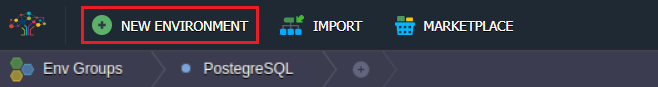

<!-- ## Remote Access to PostgreSQL -->

You have an opportunity to work with your databases remotely from your computer without having to login to our dashboard. Here’s a how-to for PostgreSQL users.

## Create Environment

The database can be accessed either via [public IP](/application-setting/external-access-to-applications/public-ip) or [endpoints](/application-setting/external-access-to-applications/endpoints) (no public IP required). Let’s take a look at both options of creating database environment.

## Environment with Public IP

1. Log into the platform.
2. Click the **New Environment** button at the top left of the dashboard.

3. In the **Environment Topology** wizard pick **PostgreSQL** as the database you want to use. In case you want to get a database cluster just slide to the right the Auto-Clustering switch. Then add a **Public IPv4**. After that enter an environment name, for example, **_remotepostgres_**, and click **Create** button.

It can take about a minute for creating your environment.

Both nodes have the public IP addresses attached to.

## Environment without Public IP

The algorithm is the same as above and clustered database environment will be created but with no public IP attached.

Once the environment is ready, go to the **Endpoints** at the **Settings** section and click on **Add** to create new port mapping.

Choose the **Node** you need to access and PostgreSQL service **Name**. The rest parameters will be generated automatically: **Private Port**, **Protocol**, **Public Port**, and **Access URL**.

A port mapping to the database master node may look like this.

If necessary do the same for the Slave node of the database cluster.

## Remote Connection to PostgreSQL

Let’s create a new connection to the database using any desktop or web client. Here we use the **pgAdmin4** which is the most popular and feature-rich Open Source administration and development platform for PostgreSQL. You can get client software that meets your platform. See the download page to get the proper link ([https://www.pgadmin.org/download/](https://www.pgadmin.org/download/)) or you may get familiar with this application in the platform by deploying it via [import](/environment-management/environment-export-and-import/environment-import) of corresponding pgAdmin4 [manifest](https://github.com/jelastic-jps/pgadmin/blob/master/manifest.yaml).

1. If you have a database cluster it will be more convenient to create a group of all servers that belong to the cluster.

2. Then enter Name of the group e.g. **_remotepostgres_**.

3. After that add one by one all of the database servers to the group. Let’s see how to do that for the Master database. Make a right-click on the group (e.g. remotepostgres) and choose **Create > Server**.

4. Enter the server name (e.g. **Master** for the primary database of your cluster) at the **General** tab.

5. At this step you have to specify server access settings depending on whether you created database with or without public IP as described above.

## Connection to Public IP

Go to the Connection tab and enter public IP of your master database at the **Host name/address** field. Specify **Username** and **Password** you have obtained while creating the database environment via email.

## Connection via Endpoints

Take the **URL** and **Public Port** from generated port mapping and set the database server connection settings. The **Username** and **Password** are the same as described above.

6. You may change other specific options if you are rather confident in your actions.

7. Finally, press the **Save** to apply the changes and you will see that connection is successfully established.

As for our example, both master and slave databases are displayed as follows:

Now PostgreSQL remote access is configured and you can start querying.
