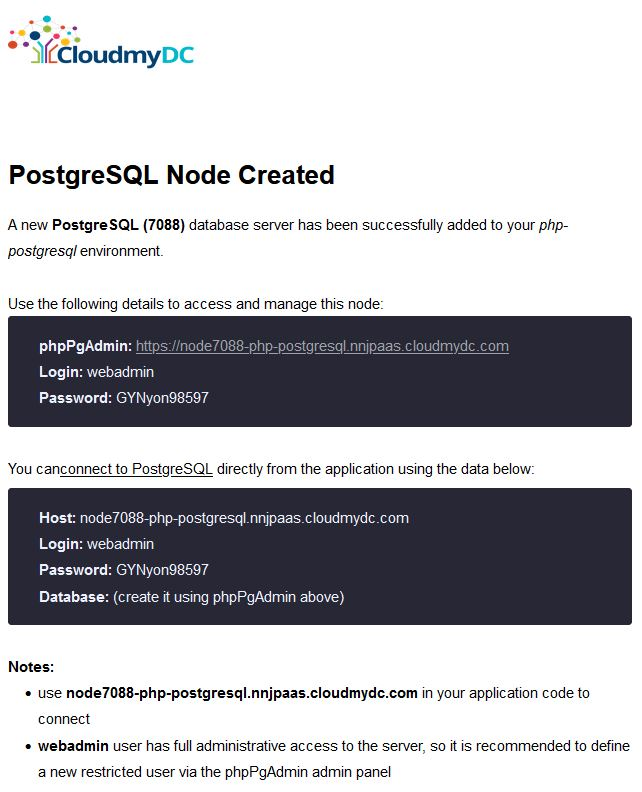

## Connection to PostgreSQL for PHP Applications

Follow the instruction below to learn how to connect your PHP application, hosted within the platform, to the PostgreSQL database server:

- [create environment](/docs/database/postgresql/connection-to-applications/php-connection-to-postgresql#create-environment)
- [configure PHP server](/docs/database/postgresql/connection-to-applications/php-connection-to-postgresql#configure-database-connection)
- [check connection](/docs/database/postgresql/connection-to-applications/php-connection-to-postgresql#connection-check-up)

## Create Environment

1. Log into the platform dashboard.
2. [Create](/docs/environment-management/setting-up-environment) an environment with the **PHP** application server (e.g. Apache PHP) and the **PostgreSQL** database.

<div style={{
    display:'flex',
    justifyContent: 'center',
    margin: '0 0 1rem 0'
}}>


</div>

3. Check your email inbox for a message with database credentials (login and password).

<div style={{
    display:'flex',
    justifyContent: 'center',
    margin: '0 0 1rem 0'
}}>



</div>

Now, you can access your database via web admin panel and connect it to your PHP application.

## Configure Database Connection

1. Click the **Config** button for your Apache server.

<div style={{
    display:'flex',
    justifyContent: 'center',
    margin: '0 0 1rem 0'
}}>


</div>

2. Navigate to the **etc** folder and open the **_php.ini_** file.

Add the **extension=pgsql.so** line like it is shown in the image below.

<div style={{
    display:'flex',
    justifyContent: 'center',
    margin: '0 0 1rem 0'
}}>


</div>

3. **Save** the changes and **Restart nodes** for your Apache server(s).

<div style={{
    display:'flex',
    justifyContent: 'center',
    margin: '0 0 1rem 0'
}}>


</div>

4. There are two main **[PG functions](https://www.php.net/manual/en/ref.pgsql.php)** for operating with a database server:

- opening PostgreSQL connection:
  _pg_connect(“host=**{host}** port=**{port}** dbname=**{dbname}** user=**{user}** password=**{password}**");_ where:

- **{host}** - the PostgreSQL server Host (i.e. access URL **_without http://_**) that you’ve received via email, for example node171206-php-postgresql.jelastic.com
- **{port}** - a connection port (the default one is 5432)
- **{dbname}** - a name of your database
- **{user}** - an account name to access database with (we’ll use the default webadmin one)
- **{password}** - a password for the appropriate user
- closing PostgreSQL connection: pg_close()

5. You need to write the necessary functions in every **\*.php** page, which should be connected to the database.

## Connection Check Up

- check the connection using this code:

```bash
<?php
$dbconn = pg_connect("host=postgres.jelastic.com port=5432 dbname=postgres user=webadmin password=passw0rd");
//connect to a database named "postgres" on the host "host" with a username and password
if (!$dbconn){
echo "<center><h1>Doesn't work =(</h1></center>";
}else
 echo "<center><h1>Good connection</h1></center>";
pg_close($dbconn);
?>
```

- execute simple request and output it into table:

```bash
<?php
$conn = pg_connect("host=postgres.jelastic.com port=5432 dbname=postgres user=webadmin password=passw0rd");
if (!$conn) {
 echo "An error occurred.\n";
 exit;
}
$result = pg_query($conn, "SELECT * FROM test_table");
if (!$result) {
 echo "An error occurred.\n";
 exit;
}
while ($row = pg_fetch_row($result)) {
 echo "value1: $row[0]  value2: $row[1]";
 echo "<br />\n";
}
?>
```

You can use the above-described examples to create your own PHP application, which utilizes connection to the **PostgreSQL** database.
