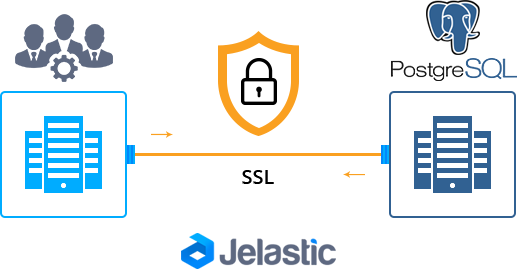
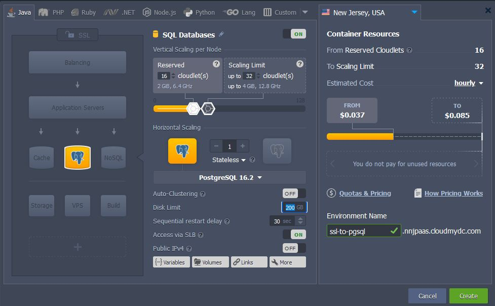
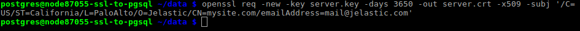
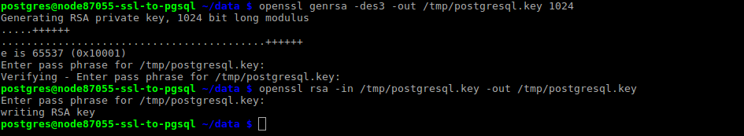
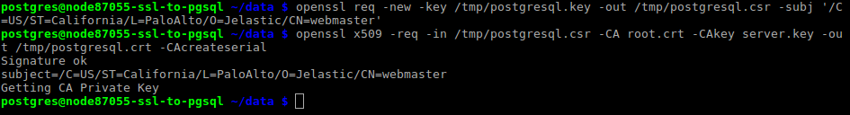
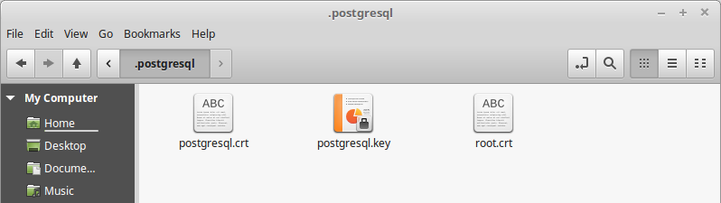
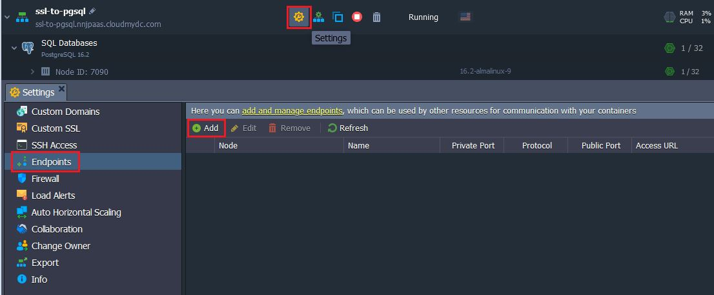
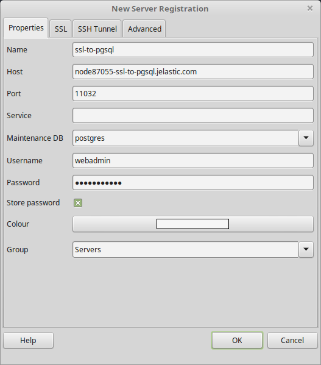
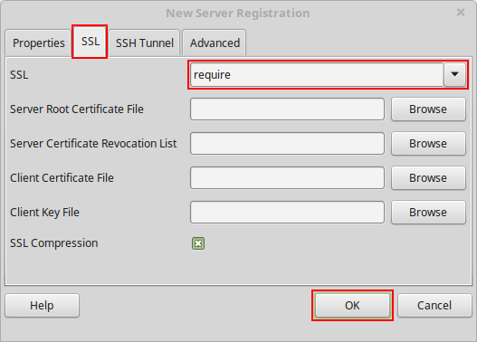

import obj from './SSLConnectiontoPostgreSQL.json'

## Establishing SSL Connection to PostgreSQL DB Server

When striving to keep information in your PostgreSQL database safe, the first thing you need to do is to encrypt all connections to it for protecting authentication credentials (usernames / passwords) and stored data from interception. This guide is intended to help you in establishing secure SSL connection to your PostgreSQL container, hosted at the platform.

<div style={{
    display:'flex',
    justifyContent: 'center',
    margin: '0 0 1rem 0'
}}>



</div>

Below, we’ll explore the appropriate [database server adjustment](/docs/Database/PostgreSQL/Connection%20to%20Applications/SSL%20Connection%20to%20PostgreSQL#postgresql-server-configuration), required for SSL enabling, and certificates generation for it. Then, we’ll create and add certs for [client](/docs/Database/PostgreSQL/Connection%20to%20Applications/SSL%20Connection%20to%20PostgreSQL#client-certificates) machine and, lastly, will establish secure [connection](/docs/Database/PostgreSQL/Connection%20to%20Applications/SSL%20Connection%20to%20PostgreSQL#establish-connection-via-pgadmin) to our server via pgAdmin tool. So, let’s go on!

## PostgreSQL Server Configuration

Obviously, for this tutorial we’ll use an environment with PostgreSQL database inside - you can easily [create](/docs/environment-management/setting-up-environment) such if you haven’t done this yet.

<div style={{
    display:'flex',
    justifyContent: 'center',
    margin: '0 0 1rem 0'
}}>



</div>

1. To start with, connect to your database server via [SSH Gate](http://localhost:3000/docs/deployment-tools/ssh/ssh-overview#ssh-gate-overview).

:::tip Tip

In case you haven’t performed similar operation before, you need to:

- [generate](http://localhost:3000/docs/deployment-tools/ssh/generate-ssh-key#generate-ssh-key) an SSH keypair
- [add your public SSH key](http://localhost:3000/docs/deployment-tools/ssh/add-ssh-key#add-ssh-key) to the dashboard
- [access your account](http://localhost:3000/docs/deployment-tools/ssh/ssh-access/overview#ssh-access) via SSH protocol

:::

<div style={{
    display:'flex',
    justifyContent: 'center',
    margin: '0 0 1rem 0'
}}>


</div>

2. Now, in order to make it work with SSL, you need to add the following three files to the **_/var/lib/pgsql/data_** server directory:

- _server.key_ - private key
- _server.crt_ - server certificate
- _root.crt_ - trusted root certificate

Within this tutorial, we’ll briefly consider how you can generate them by yourselves.

:::tip Tips

- we won’t explain commands parameters in details here, but if you’d like to know more, just refer to the [Self-Signed Custom SSL](http://localhost:3000/docs/application-setting/ssl/self-signed-custom-ssl#self-signed-custom-ssl-certificates) page in our documentation or check the official [OpenSSL](https://www.openssl.org/docs/manmaster/man1/openssl.html) site for the full list of available actions
- you can also use [custom SSL](http://localhost:3000/docs/application-setting/ssl/custom-ssl#custom-ssl-certificates) certificate similarly to the described below (follow the Generate a Custom SSL Certificate section of the linked guide to get such). In this latter case, you can skip the generation instruction and jump directly to the [6th step](/docs/Database/PostgreSQL/Connection%20to%20Applications/SSL%20Connection%20to%20PostgreSQL#postgresql-server-configuration) of this instruction

:::

So, navigate to the mentioned folder and proceed with steps below.

3. First of all, let’s create the first file - private key:

- execute the next commands:

```bash
cd /var/lib/pgsql/data
openssl genrsa -des3 -out server.key 1024
```

<div style={{
    display:'flex',
    justifyContent: 'center',
    margin: '0 0 1rem 0'
}}>


</div>

_During the server.key generation, you’ll be asked for a pass phrase - specify any and confirm it to finish creation._

- Now, in order to work with this key further, it’s required remove the pass phrase you’ve added previously. Execute the following command for this:

```bash
openssl rsa -in server.key -out server.key
```

<div style={{
    display:'flex',
    justifyContent: 'center',
    margin: '0 0 1rem 0'
}}>


</div>

Re-enter pass phrase one more time for confirmation.

- Set the appropriate permission and ownership rights for your private key file with the next commands:

```bash
chmod 400 server.key
chown postgres.postgres server.key
```

<div style={{
    display:'flex',
    justifyContent: 'center',
    margin: '0 0 1rem 0'
}}>


</div>

4. Now, you need to create server certificate based on your server.key file, e.g.:

```bash
openssl req -new -key server.key -days 3650 -out server.crt -x509 -subj '/C=US/ST=California/L=PaloAlto/O=Jelastic/CN=mysite.com/emailAddress=mail@jelastic.com'
```

<div style={{
    display:'flex',
    justifyContent: 'center',
    margin: '0 0 1rem 0'
}}>



</div>

:::danger Note

It’s required to set your personal data for the **_subj_** parameter if the certificate is intended to be used in production:

<div style={{
        width: '100%',
        margin: '0 0 1rem 0',
        borderRadius: '7px',
        overflow: 'hidden',
    }} >
    <div>
        <div style={{
            width: '100%',
            height: 'auto',
            border: '1px solid var(--ifm-toc-border-color)',
            display: 'grid', 
            fontWeight: '500',
            color: 'var(--table-color-primary)',
            background: 'var(--table-bg-primary-t2)', 
            gridTemplateColumns: '1fr 2fr 1fr',
            overflow: 'hidden',
        }}>
            <div style={{
                display: 'flex', 
                alignItems: 'center', 
                justifyContent: 'center',
                padding: '20px',
                wordBreak: 'break-all',
                borderRight: '1px solid var(--ifm-toc-border-color)',
            }}>
                Unit
            </div>
            <div style={{
                display: 'flex', 
                alignItems: 'center', 
                justifyContent: 'center',
                padding: '20px',
                borderRight: '1px solid var(--ifm-toc-border-color)',
                wordBreak: 'break-all'
            }}>
               Meaning
            </div>
            <div style={{
                display: 'flex', 
                alignItems: 'center', 
                justifyContent: 'center',
                padding: '20px',
                borderRight: '1px solid var(--ifm-toc-border-color)',
                wordBreak: 'break-all'
            }}>
                Example
            </div> 
        </div>
        {obj.data1.map((item, idx) => {
          return <div key={idx} style={{
            width: '100%',
            height: 'auto',
            border: '1px solid var(--ifm-toc-border-color)',
            display: 'grid', 
            gridTemplateColumns: '1fr 2fr 1fr',
            background: 'white',
            fontWeight: '400',
        }}>
            <div style={{
                padding: '20px',
                borderRight: '1px solid var(--ifm-toc-border-color)',
                background: 'var(--table-bg-primary-t1)',
                display: 'flex', 
                alignItems: 'center', 
                justifyContent: 'flex-start',
                wordBreak: 'break-all',
                padding: '20px',
            }}>
                {item.Unit}
            </div>
            <div style={{
                padding: '20px',
                wordBreak: 'break-all'
            }}>
                {item.Meaning}
            </div>
            <div style={{
                wordBreak: 'break-all',
                 padding: '20px',
            }}>
                {item.Example}
            </div>
        </div> 
        })}
    </div> 
</div>

You can also just skip the -subj parameter within the command and pass all these arguments in the interactive mode within the automatically opened inquiry.

:::

5. Since we are going to sign certs by ourselves, the generated server certificate can be used as a trusted root certificate as well, so just make its copy with the appropriate name:

```bash
cp server.crt root.crt
```

<div style={{
    display:'flex',
    justifyContent: 'center',
    margin: '0 0 1rem 0'
}}>


</div>

Now, as you have all three certificate files, you can proceed to PostgreSQL database configurations, required for SSL activation and usage.

6. Open the **_pg_hba.conf_** file, located in the same folder, for editing with any preferable terminal editor (vim for example) or directly via dashboard.

Replace its default content with the following lines:

```bash
# TYPE  DATABASE    USER        CIDR-ADDRESS          METHOD
# "local" is for Unix domain socket connections only
local   all         all                               trust
# IPv4 local connections:
host    all         all         127.0.0.1/32          trust

# IPv4 remote connections for authenticated users
hostssl all         webadmin    0.0.0.0/0             md5 clientcert=verify-full
```

<div style={{
    display:'flex',
    justifyContent: 'center',
    margin: '0 0 1rem 0'
}}>


</div>

:::danger Notes

- If you want to work with a database as a user other than the default **_webadmin_**, change the appropriate value within the last line of the config to the required name. In this case, you’ll need to use the same username for all the further commands (we’ll denote where this is required).
- Also, for the older PostgreSQL versions (10 and lower), you need to change the clientcert value to one “**_md5 clientcert=1_**” in the last line of the config:

```bash
hostssl all         webadmin    0.0.0.0/0             md5 clientcert=1
```

:::

Save the updated file.

7. To finish configurations, you need to apply some more changes to the **_postgresql.conf_** file.

Navigate to its Security and Authentication section (approximately at the 80th line) and activate **SSL** usage itself, through uncommenting the same-named setting and changing its value to “on”. Also, add the new **ssl_ca_file** parameter below:

```bash
ssl = on
ssl_ca_file = 'root.crt'
```

<div style={{
    display:'flex',
    justifyContent: 'center',
    margin: '0 0 1rem 0'
}}>


</div>

Don’t forget to save these changes.

8. Lastly, restart your PostgreSQL container in order to apply new settings:

```bash
sudo service postgresql restart
```

<div style={{
    display:'flex',
    justifyContent: 'center',
    margin: '0 0 1rem 0'
}}>


</div>

## Client Certificates

Now, let’s create one more set of SSL certificate files for client instance, in order to support secure connection on both sides.

1. Return to the terminal window with SSH connection to your PostgreSQL server you’ve operated through during [server setup](/docs/Database/PostgreSQL/Connection%20to%20Applications/SSL%20Connection%20to%20PostgreSQL#postgresql-server-configuration) (or reconnect to it) - you’ll need your server certificates for further actions.

Once inside, generate a private key for client (also without a pass phrase, just as it was done in the previous section), for example within the **tmp** directory:

```bash
openssl genrsa -des3 -out /tmp/postgresql.key 1024
openssl rsa -in /tmp/postgresql.key -out /tmp/postgresql.key
```

<div style={{
    display:'flex',
    justifyContent: 'center',
    margin: '0 0 1rem 0'
}}>



</div>

2. Next, create SSL certificate for your PostgreSQL database user (webadmin by default) and sign it with our trusted **_root.crt_** file on server.

```bash
openssl req -new -key /tmp/postgresql.key -out /tmp/postgresql.csr -subj '/C=US/ST=California/L=PaloAlto/O=Jelastic/CN=webadmin'
openssl x509 -req -in /tmp/postgresql.csr -CA root.crt -CAkey server.key -out /tmp/postgresql.crt -CAcreateserial
```

:::tip Notes

- while commonly data for the **_subj_** parameter can be changed to your personal data here, its **Common Name (/CN=)** must be equal to database user name you’ve set during the first certificate generation in server configuration file (webadmin in our case)
- **_root.crt_** and **_server.key_** files should be located in the same folder the 2nd command is executed from; otherwise, the full path to them should be specified

:::

<div style={{
    display:'flex',
    justifyContent: 'center',
    margin: '0 0 1rem 0'
}}>



</div>

3. After the files - postgresql.key, postgresql.crt, root.crt - are ready, you need to move them to to the .**postgresql** folder at your client machine (for that, you can use [FTP add-on](/docs/Deployment%20Tools/FTP-FTPS%20Support#ftpftps-support) or just copy and paste files content).

:::tip Tip

If such directory does not exist yet, create it with mkdir _~/.postgresql_ or similar command according to your OS distribution.

:::

<div style={{
    display:'flex',
    justifyContent: 'center',
    margin: '0 0 1rem 0'
}}>



</div>

Also, if needed, you can set the key read permission for owner only with the chmod 0400 ~/.postgresql/postgresql.key command to achieve more security.

:::tip Tip

Don’t forget to remove keys from the **tmp** directory on your DB server afterwards.

:::

## Establish Connection via PgAdmin

Eventually, after server and client configurations are done, you are ready to establish the connection. In our case, we’ll use the **[pgAdmin 3](https://www.pgadmin.org/)** tool as an example, so get this application (or any other preferred one) installed beforehand.

1. In order to connect to the DB server via SSL, you need either [public IP](http://localhost:3000/docs/application-setting/external-access-to-applications/public-ip#public-ip) or [endpoint](http://localhost:3000/docs/application-setting/external-access-to-applications/endpoints#endpoints-a-direct-connection-to-the-cloud) being attached for your PostgreSQL database container.

We’ll consider the latter case - access environment **Settings**, switch to the **_Endpoints_** section and **Add** new endpoint with the same-named button at the top pane.

<div style={{
    display:'flex',
    justifyContent: 'center',
    margin: '0 0 1rem 0'
}}>



</div>

2. Now, when you have an access point, run your **pgAdmin 3** client and select the **New Server Registration** option.

<div style={{
    display:'flex',
    justifyContent: 'center',
    margin: '0 0 1rem 0'
}}>



</div>

In the **_Properties_** tab of the opened window, specify the following data:

- **Name** - any desired connection name (e.g. ssl-to-pgsql)
- **Host** - access point you’ve added in the first step (Public IP address or endpoint Access URL without port number)
- **Port** - use the default port 5432 for External IP or endpoint’s Public port (denoted in the same-named section of the appropriate column)
- **Username** - database user you’ve set the SSL certificate and configurations for (i.e. webadmin by default)
- **Password** - the corresponding user’s password (sent via email for webadmin or the one you’ve set otherwise)
  The rest of the fields can be left unchanged or adjusted according your requirements.

3. Next, switch to the **SSL** tab and, for the same-named line, select the require option from the drop-down list.

<div style={{
    display:'flex',
    justifyContent: 'center',
    margin: '0 0 1rem 0'
}}>



</div>

That’s all! The required certificates will be loaded automatically during the first connection establishment, so just click **OK** to start managing your database via secure connection.

Now you can connect your application to database (use the [Connect to Database](/docs/Database/Database%20Hosting/Database%20Connection%20Strings#database-connection-strings) guide as an example) and enable SSL configurations for your project to encrypt your data while fetching/transferring.

:::tip Tip

If you face any issues while configuring your SSL connection, feel free to appeal for our technical experts' assistance at [Stackoverflow](https://stackoverflow.com/questions/tagged/jelastic).

:::
