## PostgreSQL Database Replication

**Replication** is a fundamental technology for any database server because downtime or data loss can result in reduced accessibility, productivity, and product confidence. Using data replication from a primary to one or more standby servers decreases the possibility of any data loss. With PostgreSQL, you can easily create a database cluster of **Primary-Secondary** (formerly known as master-slave replication) topology with one or more standby servers.

<div style={{
    display:'flex',
    justifyContent: 'center',
    margin: '0 0 1rem 0'
}}>

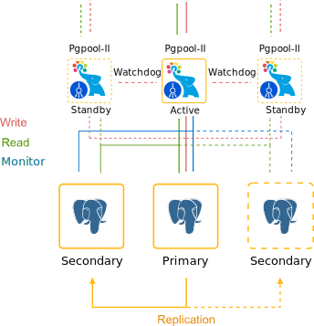

</div>

Using WAL (Write-Ahead Logging) data is the fastest available way of replication with a great performance, so-called **asynchronous replication**. In this case, the primary database server works in archiving mode, just writing the WAL files to the storage and propagating them to the standby database server that operates in recovery mode. These files are transferred to the standby database promptly after writing is completed.

So, let’s see how the Primary-Secondary PostgreSQL database cluster can be installed and configured.

## Creating PostgreSQL Primary-Secondary Cluster

The platform provides two automated ways to get a PostgreSQL cluster:

- [Pre-Packaged Marketplace Solution](/docs/Database/PostgreSQL/High%20Availability%20Cluster/Auto-Clustering#pre-packaged-marketplace-solution)
- [Topology Wizard Auto-Clustering](/docs/Database/PostgreSQL/High%20Availability%20Cluster/Auto-Clustering#topology-wizard-auto-clustering)

## Pre-Packaged Marketplace Solution

The quickest and most straightforward way to create a PostgreSQL cluster is to use the pre-packaged solution from the [marketplace](/docs/Deployment%20Tools/Cloud%20Scripting%20&%20JPS/Marketplace#marketplace).

1. Click the **Marketplace** button at the top-left of the dashboard and search for the **_PostgreSQL Primary-Secondary Cluster_** package.

<div style={{
    display:'flex',
    justifyContent: 'center',
    margin: '0 0 1rem 0'
}}>

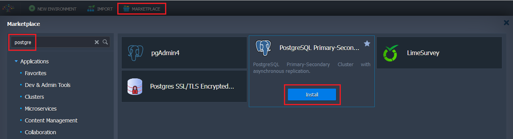

</div>

Hover over the solution and click **Install** to proceed.

2. Within the opened dialog, you can select the preferred PostgreSQL version and enable Pgpool-II load balancers.

<div style={{
    display:'flex',
    justifyContent: 'center',
    margin: '0 0 1rem 0'
}}>

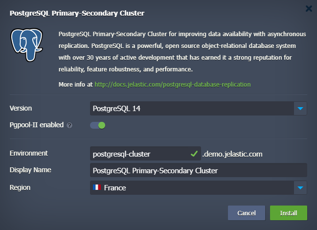

</div>

3. Wait a few minutes for the platform to prepare your environment and set up the required replication configurations.

<div style={{
    display:'flex',
    justifyContent: 'center',
    margin: '0 0 1rem 0'
}}>

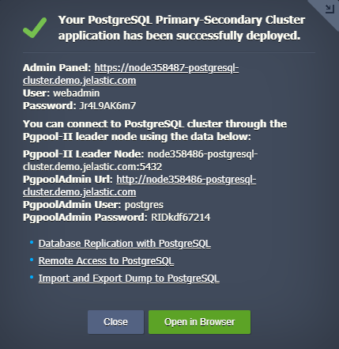

</div>

When finished, you’ll be shown the appropriate notification with data for PostgreSQL administration interface access (also sent via email).

## Topology Wizard Auto-Clustering

PostgreSQL database cluster can be enabled via the embedded **Auto-Clustering** feature at the dashboard. It provides more customization options compared to the marketplace option while still automating all the configuration processes.

1. Open a new environment [topology wizard](/docs/EnvironmentManagement/Setting%20Up%20Environment), pick the **_PostgreSQL_** database software stack and just turn on a dedicated **Auto-Clustering** switch. If needed, you can enable Pgpool-II load balancer for your cluster.

<div style={{
    display:'flex',
    justifyContent: 'center',
    margin: '0 0 1rem 0'
}}>

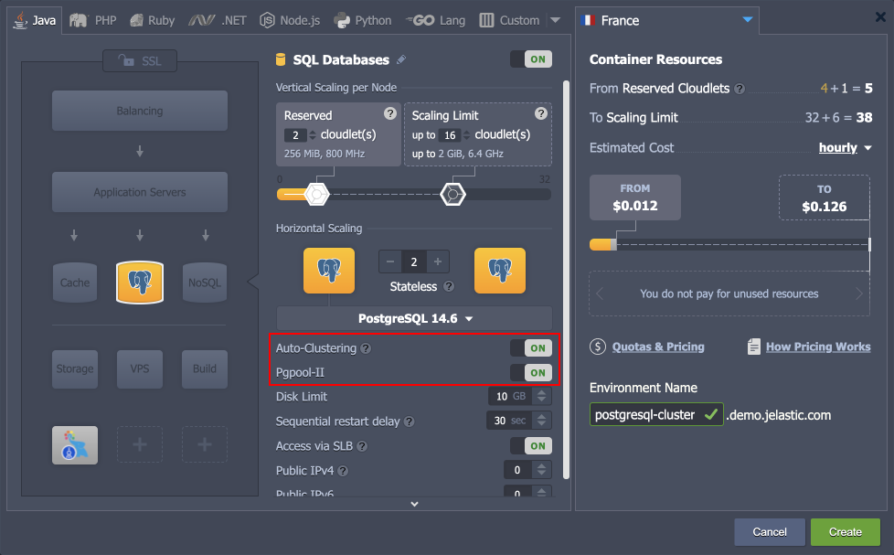

</div>

Next, you can fully utilize the customization power of the wizard to change the number of nodes per layer, allocate additional resources, add other software stacks to your environment, etc.

2. When ready, click **Create** and wait a few minutes for the platform to create your environment.

<div style={{
    display:'flex',
    justifyContent: 'center',
    margin: '0 0 1rem 0'
}}>

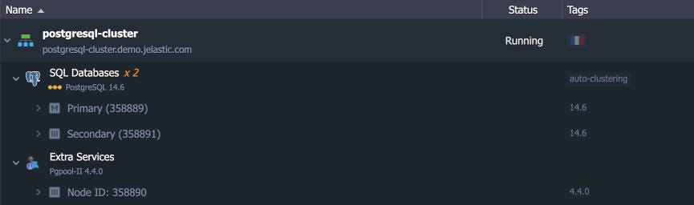

</div>

## Managing PostgreSQL Cluster

Below, we’ll provide some helpful information on PostgreSQL cluster management:

- [Cluster Entry Point](/docs/Database/PostgreSQL/High%20Availability%20Cluster/Auto-Clustering#cluster-entry-point)
- [Cluster Admin Panels](/docs/Database/PostgreSQL/High%20Availability%20Cluster/Auto-Clustering#cluster-admin-panels)
- [Primary PostgreSQL Configuration](/docs/Database/PostgreSQL/High%20Availability%20Cluster/Auto-Clustering#primary-postgresql-configuration)
- [Configuring Standby](/docs/Database/PostgreSQL/High%20Availability%20Cluster/Auto-Clustering#configuring-standby)
- [Replication Check](/docs/Database/PostgreSQL/High%20Availability%20Cluster/Auto-Clustering#replication-check)
- [Automatic Failover Scenario](/docs/Database/PostgreSQL/High%20Availability%20Cluster/Auto-Clustering#automatic-failover-scenario)
- [Manual Failover Scenario](/docs/Database/PostgreSQL/High%20Availability%20Cluster/Auto-Clustering#manual-failover-scenario)

## Cluster Entry Point

If Pgpool-II nodes were not added to the cluster topology, use the Primary node to access the cluster. If the load balancing layer was deployed in front of the database cluster, you could use any of the Pgpool-II nodes as the entry point.

## Cluster Admin Panels

In PaaS, the PostgreSQL cluster components can be managed either via CLI or UI.

- **Database Management**
  Database nodes have a built-in management administration panel phpPgAdmin. Use the only one on Primary node.

<div style={{
    display:'flex',
    justifyContent: 'center',
    margin: '0 0 1rem 0'
}}>


</div>

If required, the separate node can be installed with more advanced PostgreSQL database management software [pgAdmin4](hhttps://www.pgadmin.org/) via importing the following [manifest](https://github.com/jelastic-jps/pgadmin/blob/master/manifest.yaml).

<div style={{
    display:'flex',
    justifyContent: 'center',
    margin: '0 0 1rem 0'
}}>

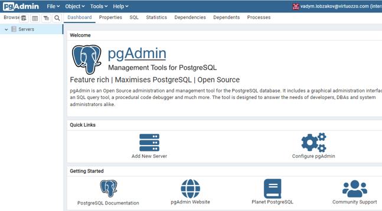

</div>

- **Pgpool-II Management**
  Pgpool-II nodes can be also managed via user-friendly built-in Administration Panel [pgpoolAdmin](https://www.pgpool.net/docs/pgpoolAdmin/index_en.html).

<div style={{
    display:'flex',
    justifyContent: 'center',
    margin: '0 0 1rem 0'
}}>


</div>

Pgpool-II admin panel provides an ability to tune:

- load balancing and distribution at database level (how the requests to every database should be processed and balanced)
- connection pools
- logging
- replication
- debugging
- failover and failback

## Primary PostgreSQL Configuration

Let’s take a look at the primary node configuration parameters used in auto-clustering.

1. Find the environment with the primary database in your environments list. Click the **Config** button next to the PostgreSQL Primary node.

<div style={{
    display:'flex',
    justifyContent: 'center',
    margin: '0 0 1rem 0'
}}>

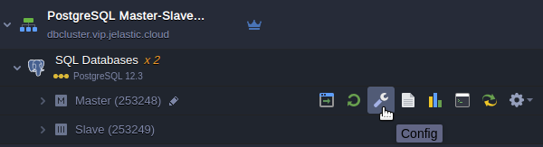

</div>

2. Open the **conf** directory and navigate to the **_postgresql.conf_** file.

<div style={{
    display:'flex',
    justifyContent: 'center',
    margin: '0 0 1rem 0'
}}>


</div>

The following lines related to the WAL files can be changed if necessary:

```bash
wal_level = hot_standby
max_wal_senders = 10
archive_mode = on
archive_command = 'cd .'
```

Where:

- The **wal_level** parameter determines how much information is written to the WAL. There are three possible values:
  - _minimal_ - leaves only the information needed to recover from a failure or emergency shutdown.
  - _replica_ - default value, which writes enough data to support WAL archiving and replication, including running read-only queries on the standby server. In releases prior to 9.6, the archive and hot_standby values were allowed for this parameter. In later releases they are acceptable but mapped to the replica.
  - _logical_ - value adds the information required to support logical decoding to the replica logging level.
- **max_wal_senders** sets the maximum number of simultaneously running WAL transfer processes.
- **archive_mode** allows WAL archiving along with **wal_level** parameter (all values enable archiving except for minimal value).
- **archive_command** - the local shell command that will be executed to archive the completed WAL segment. By default it does nothing by executing ‘**cd .**' that means the archiving actually disabled. You may try to change it as follows to copy WAL archives to the destination directory you prefer (e.g **/tmp/mydata**):

```bash
archive_command = 'test ! -f /var/lib/pgsql/data/pg_wal/%f && cp %p /tmp/mydata/%f'
```

<div style={{
    display:'flex',
    justifyContent: 'center',
    margin: '0 0 1rem 0'
}}>

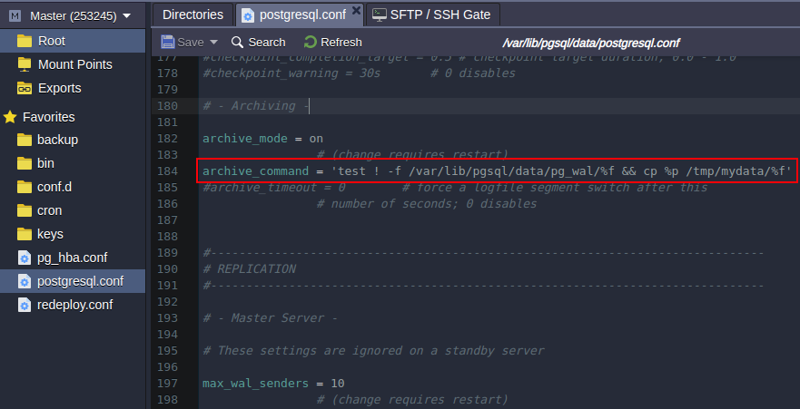

</div>

Press the **Save** button above the editor.

3. Open the **_pg_hba.conf_** configuration file. The standby database connection is permitted by stating the following parameters:

```bash
host replication all {standby_IP_address}/32 trust
```

<div style={{
    display:'flex',
    justifyContent: 'center',
    margin: '0 0 1rem 0'
}}>

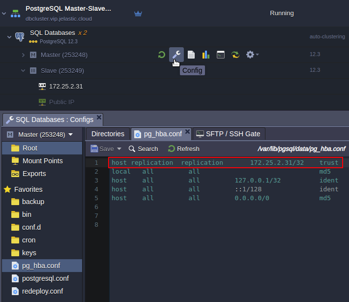

</div>

That’s all for primary! Let’s proceed to the standby server’s configuration.

## Configuring Standby

Let’s inspect configuration files at the Secondary node. There are only three options that distinguish secondary from primary:

1. Open the **_postgresql.conf_** file, find the Standby Servers section. As you can see this server is acting as standby since the **_hot_standby_** parameter is **_on_** unlike the primary node where this parameter is commented out.

<div style={{
    display:'flex',
    justifyContent: 'center',
    margin: '0 0 1rem 0'
}}>

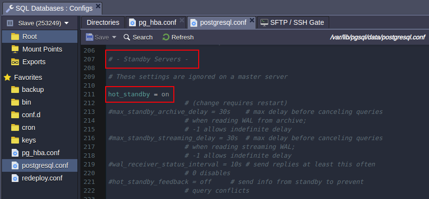

</div>

2. Scroll down to the end of the config file. There is a **_primary_conninfo_** parameter that specifies the connection string which the standby server will use to connect to the sending server. The connection string must indicate the host name (or address) of the sending server, as well as the port number. The username corresponding to the role with the appropriate privileges on the sending server is also provided. The password must also be specified in the primary_conninfo or in a separate ~/.pgpass file on the backup server if the sender requires password authentication.

<div style={{
    display:'flex',
    justifyContent: 'center',
    margin: '0 0 1rem 0'
}}>

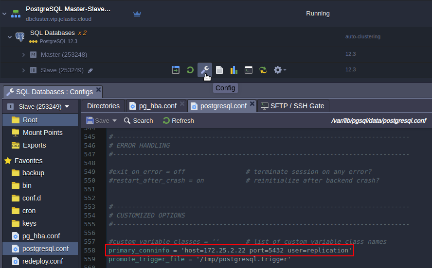

</div>

3. The last option that makes database server as secondary is **standby.signal** file availability, which indicates the server should start up as a hot standby. File must be located in the PostgreSQL data directory and it can be empty or contain any information. Once a secondary is promoted to primary this file will be deleted.

:::danger Note

Keep in mind that most of the options that are being changed require the server should be restarted. It can be done it in two ways:

1. From the dashboard you can restart either one or both nodes.

<div style={{
    display:'flex',
    justifyContent: 'center',
    margin: '0 0 1rem 0'
}}>

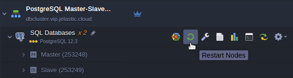

</div>

2. Through a command line interface via Web SSH client. To do this click on the Web SSH button at the required node, e.g. secondary.

<div style={{
    display:'flex',
    justifyContent: 'center',
    margin: '0 0 1rem 0'
}}>

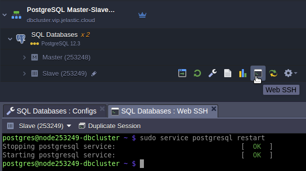

</div>

And issue a command to restart database server:

```bash
sudo service postgresql restart
```

:::

## Replication Check

1. Open the **phpPgAdmin** panel for your **primary** database by clicking **Open in Browser** button next to it.

<div style={{
    display:'flex',
    justifyContent: 'center',
    margin: '0 0 1rem 0'
}}>

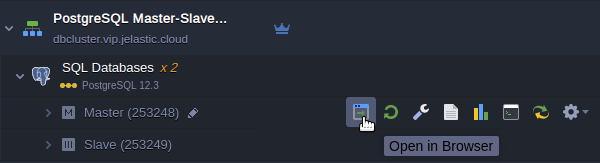

</div>

2. Log in with the database credentials you’ve got via email earlier and create a new database.

<div style={{
    display:'flex',
    justifyContent: 'center',
    margin: '0 0 1rem 0'
}}>

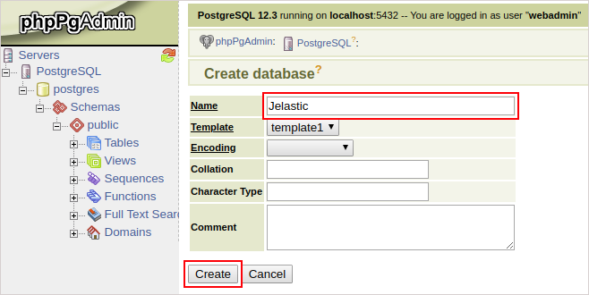

</div>

3. Then you should open the admin panel of your **standby** database server (in the same way as for primary one) and check whether the new database was replicated successfully or not.

<div style={{
    display:'flex',
    justifyContent: 'center',
    margin: '0 0 1rem 0'
}}>

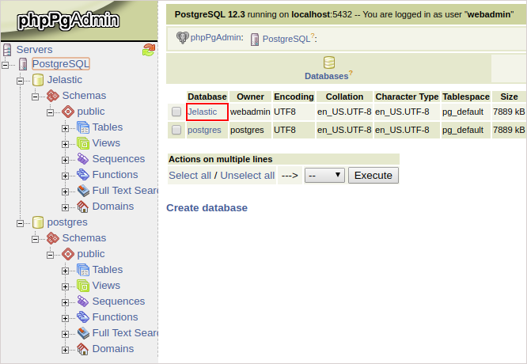

</div>

## Automatic Failover Scenario

The **_automatic failover_** for the PostgreSQL cluster is implemented with the help of the Pgpool-II node and is not available for the topologies without it ([manual configuration](/docs/Database/PostgreSQL/High%20Availability%20Cluster/Auto-Clustering#manual-failover-scenario) is required). The load balancing node automatically detects if the primary database is down and promotes one of the available secondaries. Once the problematic node is back, it will be automatically re-added to the cluster (as secondary) with all the missing data restored using the pgrewind utility.

## Manual Failover Scenario

PostgreSQL has no native automatic failover scenario for database cluster. On the other hand since there are many third-party solutions that you can use to implement to ensure high-availability for your system. At the same time you may create your own solution to overcome failures of your database cluster. The multiple situations of cluster failure are possible in real life. Here we consider only one most common workflow that can help you to automate failover scenario.

The default topology comprises two nodes:

<div style={{
    display:'flex',
    justifyContent: 'center',
    margin: '0 0 1rem 0'
}}>


</div>

Once the primary node fails the secondary node must be promoted to a new primary. It can be done with the utility pg_ctl which is used to initialize, start, stop, or control a PostgreSQL server. To do this log in to the standby server via Web SSH and issue command as follows:

```bash
/usr/pgsql-12/bin/pg_ctl promote -D /var/lib/pgsql/data
```

where _/var/lib/pgsql/data_ is a database data directory.

<div style={{
    display:'flex',
    justifyContent: 'center',
    margin: '0 0 1rem 0'
}}>

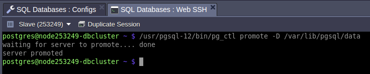

</div>

Once the secondary database is promoted to the primary, you should change your application connection string in order to change database cluster entry point to a new hostname or IP address.

Failover process can rely on **pg_isready** utility that issues a connection check to a PostgreSQL database.

You may create a simple script which checks primary database server availability and promotes the standby in case of primary failure. Run the script through a [crontab](https://en.wikipedia.org/wiki/Cron) at the secondary node with an appropriate interval. The script may look like below. Let’s call it as **_failover.sh_**:

```bash
#!/bin/bash
primary="172.25.2.22"
secondary="172.25.2.31"
status=$(/usr/pgsql-12/bin/pg_isready -d postgres -h $primary)
response="$primary:5432 - no response"
if [ "$status" == "$response" ]
then
/usr/pgsql-12/bin/pg_ctl promote -D /var/lib/pgsql/data
echo "Secondary promoted to new Primary. Change your app connection string to new Primary address $secondary"
else
echo "Primary is alive. Nothing to do."
fi
```

Once script is triggered the secondary promotion to primary, the script output should look like:

<div style={{
    display:'flex',
    justifyContent: 'center',
    margin: '0 0 1rem 0'
}}>

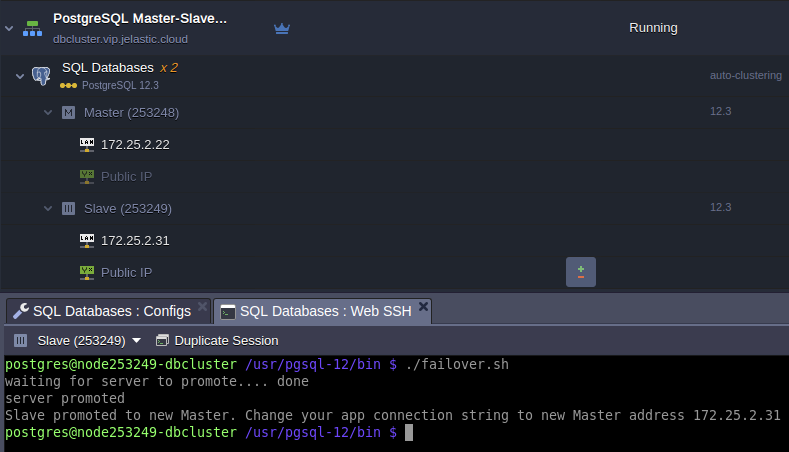

</div>

Now your database got back to work and ready to handle read/write requests by the new primary address.

## Cluster Restoration

With a new primary address you can easily avoid tuning your application connection string changing IP addresses of the primary database. To do this you have to put a [load balancer](/docs/Database/PostgreSQL/High%20Availability%20Cluster/Auto-Clustering#manual-failover-scenario) in front of the cluster that will monitor the status of its components and route traffic to the current primary. Below, we will demonstrate how to restore original cluster topology and thus no changes will be required at the frontend.

Another reason the topology should be restored is related to ensuring a scaling ability of the cluster. Only original topology can be scaled in/out horizontally.

Let’s see how to perform PostgreSQL database cluster restoration after the former primary was dropped off from the cluster and the former secondary was promoted to the primary.

So, the task is: the dropped-off primary should become the actual primary and the current primary (former secondary) should become the actual secondary.

The initial data are:

- Database cluster comprises two nodes primary (IP: 172.25.2.22) and secondary (IP: 172.25.2.31).
- Primary node went down and the primary database was stopped.
- Standby database was promoted to the primary role.
- Now the secondary retains the reads/writes.
- Former primary node was fixed out and is ready to be reintroduced to the replication as primary.
  Do the steps as follows to get the cluster of initial topology:

1. Enter former primary node via Web SSH and issue command:

```bash
rm -rf /var/lib/pgsql/data/*
```

<div style={{
    display:'flex',
    justifyContent: 'center',
    margin: '0 0 1rem 0'
}}>

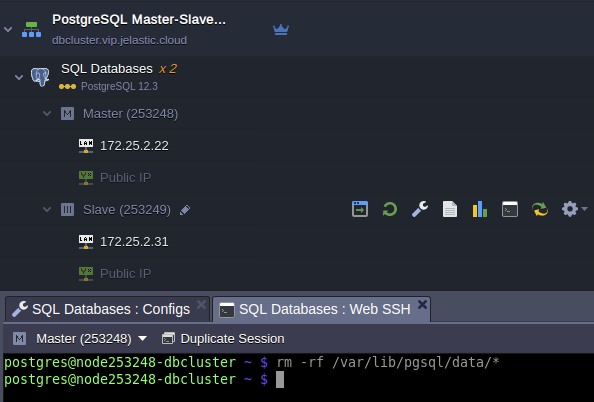

</div>

2. Add former primary IP address 172.22.2.22 to **pg_hba.conf** at the current primary node:

```bash
host replication replication 172.22.2.22/32 trust
```

<div style={{
    display:'flex',
    justifyContent: 'center',
    margin: '0 0 1rem 0'
}}>

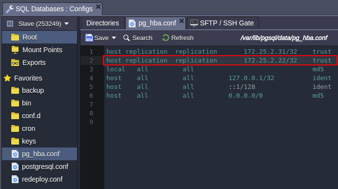

</div>

Restart current primary database to apply the changes:

```bash
sudo service postgresql restart
```

3. Enter the former primary node via Web SSH and issue command:

```bash
pg_basebackup -U replication -h 172.25.2.31 -D /var/lib/pgsql/data -Fp -Xs -P -R
```

<div style={{
    display:'flex',
    justifyContent: 'center',
    margin: '0 0 1rem 0'
}}>

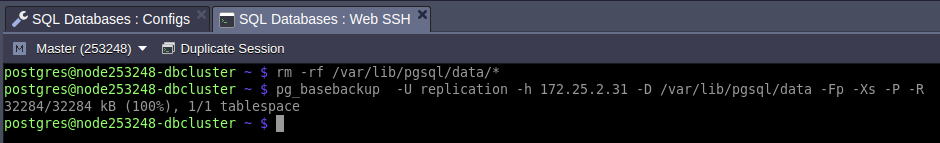

</div>

Where:

- _[pg_basebackup](https://www.postgresql.org/docs/current/app-pgbasebackup.html)_ - is used to take base backups of a running PostgreSQL database cluster.
- _172.25.2.31_ - IP address of the current primary node.
- _/var/lib/pgsql/data_ - PostgreSQL data directory.

4. Make sure the IP address in the **_host_** parameter described in thesecond step of [Configuring Standby](/docs/Database/PostgreSQL/High%20Availability%20Cluster/Auto-Clustering#configuring-standby) contains proper IP address of the former primary.

<div style={{
    display:'flex',
    justifyContent: 'center',
    margin: '0 0 1rem 0'
}}>

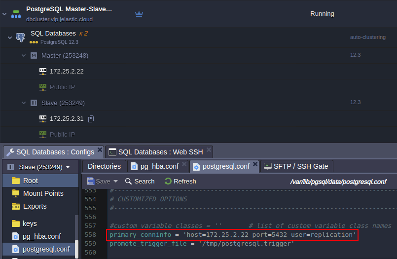

</div>

5. Create **_standby.signal_** file at the current primary:

```bash
touch /var/lib/pgsql/data/standby.signal
```

<div style={{
    display:'flex',
    justifyContent: 'center',
    margin: '0 0 1rem 0'
}}>

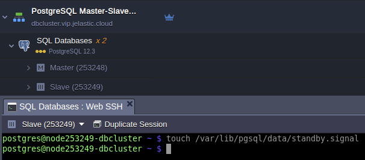

</div>

And restart the node to get new secondary database:

```bash
sudo service postgresql restart
```

Remove the standby.signal file at the former primary:

```bash
rm /var/lib/pgsql/data/standby.signal
```

<div style={{
    display:'flex',
    justifyContent: 'center',
    margin: '0 0 1rem 0'
}}>

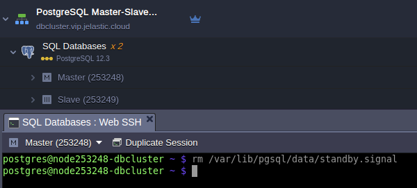

</div>

And restart the node to get new primary database:

```bash
sudo service postgresql restart
```

6. Finally, in order to reach a consistent recovery state for both primary and standby databases the final restart is required that can be done via dashboard as follows:

<div style={{
    display:'flex',
    justifyContent: 'center',
    margin: '0 0 1rem 0'
}}>

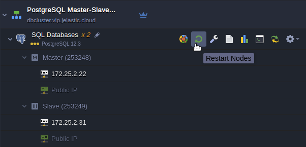

</div>

Once the restart process is completed the cluster comes back to original topology and may be scaled horizontally.
