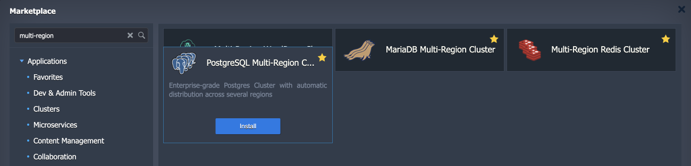
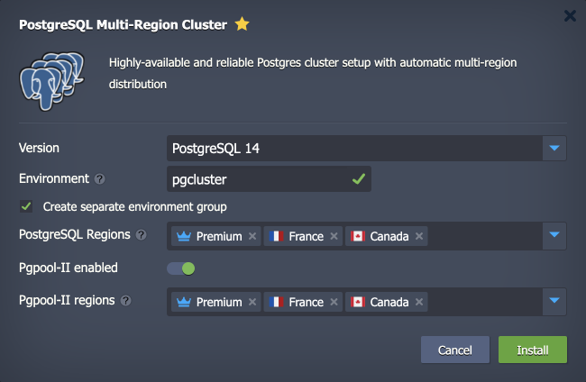

## PostgreSQL Multi-Region Cluster

**PostgreSQL Multi-Region Cluster** is a pre-packaged solution that automatically creates an advanced, highly available database cluster on top of platform-managed stack templates.

## Database Cluster Topology

The [PostgreSQL Multi-Region Cluster](https://github.com/jelastic-jps/postgres-multiregion) package uses the only officially supported PostgreSQL Cluster topology - **Primary-Secondary**. However, one more secondary node is added for disaster recovery. As a result, the final topology is _Primary-Secondary-Secondary_.

Additionally, the package includes a highly available [Pgpool-II Load Balancer](https://www.pgpool.net/mediawiki/index.php/Main_Page) layer to distribute requests and manage PostgreSQL replication topology.

The sum of these implementations ensures out-of-box high availability and failover for the database cluster. It is ensured on the data center level – the database is accessible even if one of the regions becomes unavailable.

## Cluster Installation

1. Find the **_PostgreSQL Multi-Region Cluster_** application (the **Clusters** section or use the **Search** field) in the platform [Marketplace](/docs/Deployment%20Tools/Cloud%20Scripting%20&%20JPS/Marketplace#marketplace).

2. In the opened installation window, specify the following data:

- **Version** - select the preferred PostgreSQL version
- **Environment** - provide a name for [grouping](/docs/EnvironmentManagement/Environment%20Groups/Overview) your database cluster environments
- **Create separate environment group** – tick to [isolate](/docs/EnvironmentManagement/Environment%20Isolation#private-network-isolation) the environment group
- **PostgreSQL Regions** - choose platform regions where the cluster environments will be deployed. Note that regions order matters, as the first one will be the Primary server and the others will be Secondary
- **Pgpool-II enabled** – enable to add load-balancing, monitoring, and management node (Pgpool-II) in front of database nodes in each region
- **Pgpool regions** - choose platform regions where the load balancing nodes will be deployed

Click **Install** when ready.

3. The installation process can take several minutes. After the completion, you’ll see the success window and receive emails with all the appropriate data, like entry point details and access credentials.

To easily view all the related environments, you can switch to the group specified in the previous step (pgcluster in our case).

4. The default entry point for your multi-region cluster is a leader Pgpool-II node (the one deployed into the first region). If it fails, you can use any other Pgpool-II node using either [hostname](/docs/ApplicationSetting/Domain%20Name%20Management/Container%20DNS%20Hostnames#hostnames-for-specific-containers) or IP address.

In case your client software supports multiple entry points, you can set up all of them in a connection string to ensure automatic failover.
