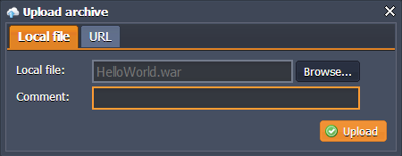
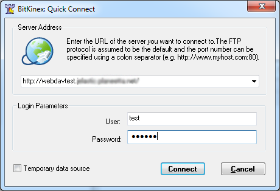

## Remote Access to Your Files via WebDAV

While setting up a website you can face the need to build some complicated method of viewing and updating the information on the site. **Web-based Distributed Authoring and Versioning (WebDAV)** is a set of extensions to HTTP that allows clients to perform remote web authoring operations. Some of these extensions overwrite protection by locking, name-space management and properties (metadata) are fully implemented. Other offered extensions include version management, advanced collections and access control with HTTP Digest Authentication. XML is used to encode method parameters and responses.

**WebDAV** is based on HTTP that already has widely deployed infrastructure. It means that any application built on top of WebDAV can use cryptographically strong authentication, proxying, caching and encryption with SSL, if so desired. Another advantage is that WebDAV uses XML, which means that the protocol itself can be extended without fragmenting it.

You can use **WebDAV** in the platform to create, change, copy and move files on your server and create and manage file directories right in the cloud, simply by accessing them via HTTP/HTTPS. By using WebDAV, you can have free, instant, and secure access to your application files anywhere you have a network connection.

So, let’s see how to use this great solution for your Java applications in the cloud!

## A. Create an environment

1. Log into the PaaS account.

2. While in the platform dashboard, click the **Create environment** button:

<div style={{
    display:'flex',
    justifyContent: 'center',
    margin: '0 0 1rem 0'
}}>


</div>

3. In the **Environment Topology** dialog, pick your application server (for example, **Tomcat 7 or 6**). Then type your environment name, for example, _webdavtest_.

<div style={{
    display:'flex',
    justifyContent: 'center',
    margin: '0 0 1rem 0'
}}>


</div>

It will take just a minute for your environment to be created.

<div style={{
    display:'flex',
    justifyContent: 'center',
    margin: '0 0 1rem 0'
}}>


</div>

## B. Upload Java package

1. Upload your Java WAR package to the **Deployment manager**.

<div style={{
    display:'flex',
    justifyContent: 'center',
    margin: '0 0 1rem 0'
}}>



</div>

2. Once the package is in the platform, deploy it to the environment you have created earlier.

<div style={{
    display:'flex',
    justifyContent: 'center',
    margin: '0 0 1rem 0'
}}>


</div>

Open in browser your application to ensure that everything is ok.

<div style={{
    display:'flex',
    justifyContent: 'center',
    margin: '0 0 1rem 0'
}}>


</div>

## C. Configure Tomcat

Tomcat implements the WebDAV specification using WebDAV Servlet, which is included with all standard Tomcat distributions. Follow the next steps to configure and test WebDAV connection.

1. Click **config** button for Tomcat.

<div style={{
    display:'flex',
    justifyContent: 'center',
    margin: '0 0 1rem 0'
}}>


</div>

2. Tomcat comes prebundled with a WebDAV Level 2 servlet. To enable your Tomcat WebDAV connection, add the following to web.xml (server directory):

```bash
<servlet>
<servlet-name>webdav</servlet-name>
<servlet-class>org.apache.catalina.servlets.WebdavServlet</servlet-class>
<init-param>
    <param-name>debug</param-name>
    <param-value>0</param-value>
</init-param>
<init-param>
    <param-name>listings</param-name>
    <param-value>true</param-value>
</init-param>
<!-- The following for read-write access -->
<init-param>
    <param-name>readonly</param-name>
    <param-value>false</param-value>
</init-param>
</servlet>
<servlet-mapping>
<servlet-name>webdav</servlet-name>
<url-pattern>/webdav/*</url-pattern>
</servlet-mapping>
```

<div style={{
    display:'flex',
    justifyContent: 'center',
    margin: '0 0 1rem 0'
}}>


</div>

3. Make sure that only authorized users can access WebDAV to your context. Navigate to **tomcat-users.xml**, create a new user and designate a new role, for example:

```bash
<tomcat-users>
<user name="test" password="tomcat" roles="role1" />
</tomcat-users>
```

<div style={{
    display:'flex',
    justifyContent: 'center',
    margin: '0 0 1rem 0'
}}>


</div>

4. Define the role you have just created in the **auth-constraint** section of the **web.xml**:

```bash
<auth-constraint>
<role-name>role1</role-name>
</auth-constraint>
```

<div style={{
    display:'flex',
    justifyContent: 'center',
    margin: '0 0 1rem 0'
}}>


</div>

5. Save the changes and restart **Tomcat**.

<div style={{
    display:'flex',
    justifyContent: 'center',
    margin: '0 0 1rem 0'
}}>


</div>

## D. Connection to the server

1. Create a new connection using any desktop client for WebDav (we’ll use BitKinex as an example).

<div style={{
    display:'flex',
    justifyContent: 'center',
    margin: '0 0 1rem 0'
}}>


</div>

2. Enter the URL of your server (_http://{your_env_name}.{[hoster_domain](https://cloudmydc.com/)}/{context}/webdav_), specify login and password to your Tomcat user (in our case credentials are test/tomcat).

<div style={{
    display:'flex',
    justifyContent: 'center',
    margin: '0 0 1rem 0'
}}>



</div>

3. As you can see we have successfully connected to our server.

<div style={{
    display:'flex',
    justifyContent: 'center',
    margin: '0 0 1rem 0'
}}>


</div>

As a result you’ll see your files and will be able to edit them, update, add some new files etc.

Enjoy with WebDAV and PaaS!
