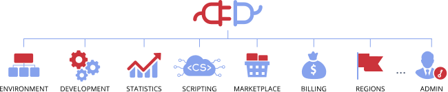

<!-- Box1 -->

<a href="https://docs.jelastic.com/api/" style={{
    textDecoration: "none",
}}>
    

        

        <h3>Public API for Developers</h3>
        
Lets manage hosted environments and automate applications lifecycle within the platform. Using these API methods, you can create new workloads, deploy applications, automatically perform tasks available via CloudMyDC Application Platform dashboard.

    

</a>

<!-- Box2 -->

<a href="https://docs.jelastic.com/api/private/" style={{
    textDecoration: "none",
}}>
    

        

        <h3>Private API for Cluster Admins</h3>
        
Gives full platform access, which allows managing every aspect of the cloud hosting. Only cluster admins can perform sensitive methods that can potentially influence the whole installation (e.g. billing, security, infrastructure and accounts management).

    

</a>

