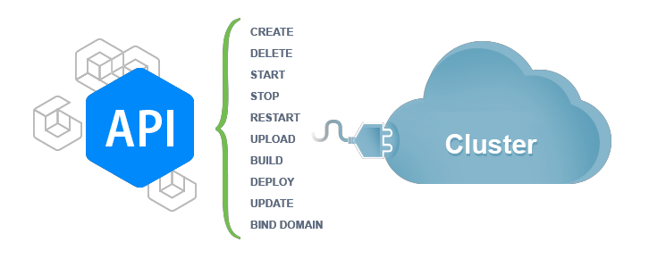
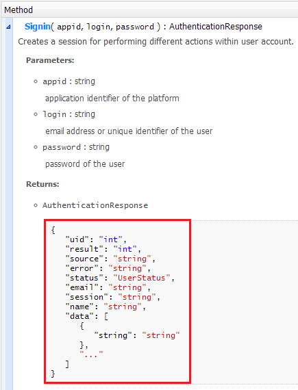

##CONTEXT CODE

##error in executing the text - Note: Signup

## Platform API

[Platform API](https://cloudmydc.com/) lets developers automate a set of actions required for an application’s lifecycle and extends our platform functionality by combining other services. Using our API, you can programmatically create environments, deploy apps and perform other tasks that could be earlier accomplished only via the platform’s dashboard, but not limited to them.

<div style={{
    display:'flex',
    justifyContent: 'center',
    margin: '0 0 1rem 0'
}}>



</div>

Platform API follows REST principles. **REST API** determines a set of functions which can be requested by a developer, who then receives a response. The interaction is performed via HTTPS protocol. The advantage of such method is a wide extension of the HTTPS protocol. That’s why REST API can be used with almost any programming language.

## Platform API Request

All requests of API methods are GET or POST HTTPS-requests to the URL with a set of parameters:

**_https://_**[**_{hoster-api-host}_**](http://localhost:3000/docs/quickstart/hosters-list-&-info)**_/1.0/_**

The type of the URL which should be used, is stated in the description of each method (REST field).

<div style={{
    display:'flex',
    justifyContent: 'center',
    margin: '0 0 1rem 0'
}}>


</div>

The data of the request can be sent as a query string (after the “?” sign) while using the GET method, or in the body of the POST request. Remember, that in case of a GET request, the parameters must be [percent encoded](https://en.wikipedia.org/wiki/Percent-encoding) (URL encoding).

:::tip Note

Since PaaS 5.1 version, the GET method is no longer supported within the following API requests due to security reasons:

- Signin - _https://[hoster-api-host]/1.0/users/authentication/rest/signin?login=[string]&password=[string]_
- Signup -
- Change password - _https://[hoster-api-host]/1.0/users/account/rest/changepassword?oldPassword=[string]&newPassword=[string]session=[string]_

:::

As a reminder, there is a limitation on the length of the URL request - 2048 characters. That is why we recommend using:

- GET request for receiving the information which easily fits within the length limitation
- POST request for changing the data (creating environment, changing config files, etc.)

In such a way, you won’t be restricted with the request length. Also, such usage is more relevant for the HTTPS protocols specifications. All of the platform API methods requires authentication and action target details, which are provided through the **_session_** and **_envName_** parameters respectively.

:::tip Note

If there is no **_envName_** argument in the method description, it is applied to the whole account/platform. Herewith, the deprecated **_appid_** parameter, which was previously used to define action target, should be ignored.

:::

The text value of the parameters should be provided in UTF-8 code. The sequence of the parameters in the request is not important.

## Platform API Response

The request response is UTF-8 encoded. The response for all API functions is given in [JSON](https://en.wikipedia.org/wiki/JSON) format. An example of the result is described in the documentation of the method.

<div style={{
    display:'flex',
    justifyContent: 'center',
    margin: '0 0 1rem 0'
}}>



</div>

## Platform API in Action

To start automation of the required processes with platform API you have to face the following requirements:

- You must be registered on any [hosting provider](http://localhost:3000/docs/quickstart/hosters-list-&-info)
- You need to download the appropriate [Platform Client Library](https://mvnrepository.com/artifact/com.jelastic/jelastic-public-j2se) (according to the version of used platform) and add it to classpath

If you are using Maven, add the following dependency to **_pom.xml_**

```bash
<dependency>
   <groupId>com.jelastic</groupId>
   <artifactId>jelastic-public-j2se</artifactId>
   <version>3.1</version>
</dependency>
```

To call any API function you need to be authenticated. The parameter _“session”_ is responsible for authentication, i.e. identifying the user with the request. The session is achieved by calling the **Users > Authentication > Signin** method.

```bash
https://[{hoster-api-host}](/paas-hosting-providers/)/1.0/users/authentication/rest/signin?login=[string]&password=[string]
```

Where **login** and **password** are the credentials of your PaaS account.

The further calling of the API functions should be performed with the received session value.To complete the working session with API, call the **Users > Authentication > Signout** method.

```bash
https://[{hoster-api-host}](/paas-hosting-providers/)/1.0/users/authentication/rest/signout?session=[string]
```

With the help of the platorm Java Client Library you can automate various actions connected with your application lifecycle management, for example: creating an environment, changing its status, deleting, restarting nodes, deploying applications, etc.

Let’s examine how to create an environment with your custom topology and settings using Platform Client Library.

## Create Environment

A full version of the example on environment creation you can find in [platform API documentation](https://cloudmydc.com/) (**_Java Samples_** tab). And here is some step-by-step explanation of the main points:

1. Declare a new **CreateEnvironmen**t public class which will include all the following blocks and parameters. The first parameters block should contain the next strings:

```bash
private final static String HOSTER_URL = "<hoster-url>";
private final static String USER_EMAIL = "<email>";
private final static String USER_PASSWORD = "<password>";
private final static String ENV_NAME = "test-api-environment-" + new Random().nextInt(100);
```

where:

- URL of your hosting provider (_Hoster’s URL / API_ column in [this](http://localhost:3000/docs/quickstart/hosters-list-&-info) document)
- your PaaS account’s email (login)
- your PaaS account’s password

2. Then the authentication is configured, which will use login and password you’ve specified above.

```bash
public static void main(String[] args) {
System.out.println("Authenticate user...");
AuthenticationResponse authenticationResponse = authenticationService.signin(USER_EMAIL, USER_PASSWORD);
System.out.println("Signin response: " + authenticationResponse);
if (!authenticationResponse.isOK()) {
    System.exit(authenticationResponse.getResult());
}
final String session = authenticationResponse.getSession();
```

After authentication, a new unique session is created. It will be used for performing the necessary operations within user’s account. All the further API function calls should be performed within this session, which remains valid until Signout method calling.

3. The next step is getting the list of engines available for the specified **_<engine_type>_** (can be _java, php, ruby, js_, etc.).

```bash
System.out.println("Getting list of engines...");
ArrayResponse arrayResponse = environmentService.getEngineList(session, "<engine_type>");
System.out.println("GetEngineList response: " + arrayResponse);
if (!arrayResponse.isOK()) {
    System.exit(arrayResponse.getResult());
}
```

4. After that get the list of available node templates according to the specified **_<templates_type>_**, which can be:

- ALL - all available at platform templates, i.e. native and cartridges
- NATIVE - default node templates
- CARTRIDGE - custom templates, that were added to the platform as cartridges by hosting provider

```bash
System.out.println("Getting list of templates...");
arrayResponse = environmentService.getTemplates(session, "<templates_type>", false);
System.out.println("GetTemplates response: " + arrayResponse);
if (!arrayResponse.isOK()) {
    System.exit(arrayResponse.getResult());
}
```

5. The next block is devoted to the custom configurations and settings of your new environment and servers it will contain. More details on JSON parameters, used in the platform manifests for defining environment’s topology, can be seen [here](/docs/Deployment%20Tools/Cloud%20Scripting%20&%20JPS/Application%20Manifest).

```bash
JSONObject env = new JSONObject()
            .put("ishaenabled", false)
            .put("engine", "php5.5")
            .put("shortdomain", ENV_NAME);
JSONObject apacheNode = new JSONObject()
        .put("nodeType", "apache2")
        .put("extip", false)
        .put("count", 1)
        .put("fixedCloudlets", 1)
        .put("flexibleCloudlets", 4);
JSONObject mysqlNode = new JSONObject()
        .put("nodeType", "mysql5")
        .put("extip", false)
        .put("fixedCloudlets", 1)
        .put("flexibleCloudlets", 4);
JSONObject memcachedNode = new JSONObject()
        .put("nodeType", "memcached");
JSONArray nodes = new JSONArray()
        .put(apacheNode)
        .put(mysqlNode)
        .put(memcachedNode);
```

6. Finally, initiate the creation of a new environment with all the specified settings:

```bash
System.out.println("Creating environment...");
ScriptEvalResponse scriptEvalResponse = environmentService.createEnvironment(session,
"createenv", env.toString(), nodes.toString());
System.out.println("CreateEnvironment response: " + scriptEvalResponse);
```

That’s all. Following such steps you can automate the creation of various environments. Find a full version of this example in [**platform API docs**](https://cloudmydc.com/) **> Java Samples > CreateEnvironment**. Also among those **Java Samples** you can find other examples of Platform Client Library usage for automation different actions pertaining to your application lifecycle management. Enjoy!
