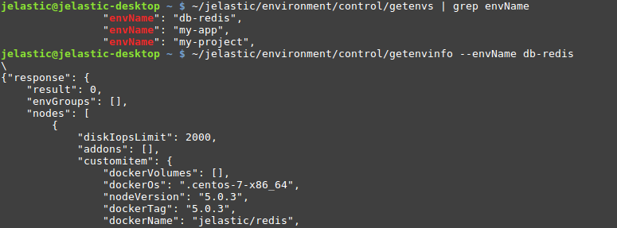
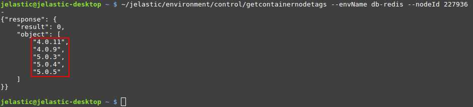
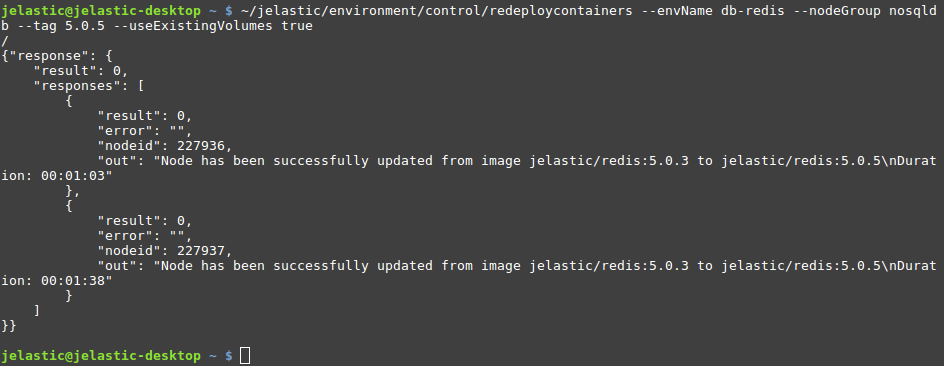

<!-- ## CLI Tutorial: Container Redeploy -->

In this guide, we’ll show how to [redeploy](/category/container-deployment) a container from one image tag to another. Herewith, if needed, an option for whole layer redeployment is supported.

1. At first, locate the environment name and node ID/layer of the container(s) that should be redeployed. You can either view the required info via the dashboard or use the **_GetEnvs_** and **_GetEnvInfo_** methods to get the data directly from the terminal (for all or particular environment respectively).

<div style={{
    display:'flex',
    justifyContent: 'center',
    margin: '0 0 1rem 0'
}}>



</div>

Here, you can get all the info on the environment - _layer names, node IDs, Docker images, tags, etc._

2. Once you’ve got the container’s ID and layer (_nodeGroup name_), you can view the list of tags available for the image. We’ll use the **_GetContainerNodeTags_** method with environment name and node ID as parameters:

```bash
~/jelastic/environment/control/getcontainernodetags --envName {envName} --nodeId {nodeId}
```

<div style={{
    display:'flex',
    justifyContent: 'center',
    margin: '0 0 1rem 0'
}}>



</div>

In our case, a list of tags for the _jelastic/redis_ image is displayed.

3. Now, you have all the data required for container redeploy via CLI. Call the appropriate **_RedeployContainers_** method:

```bash
~/jelastic/environment/control/redeploycontainers --envName {envName} [--nodeGroup {nodeGroup}] [--nodeId {nodeId}] --tag {tag} [--useExistingVolumes {useExistingVolumes}] [--login {login}] [--password {password}]
```

The following parameters are used:

- **_{envName}_** - name of the environment, where container(s) should be redeployed

- **_{nodeGroup}_** - identifier of the [environment layer](https://docs.cloudscripting.com/creating-manifest/selecting-containers/#all-containers-by-group) to update (_optional_)

- **_{nodeId}_** - identification number of the particular container to be redeployed (_optional_)

:::danger Note

You need to state either **_{nodeGroup}_** or **_{nodeId}_** parameter to define the operation target. The method ignores **_{nodeGroup}_** if both are provided and fails if neither is specified.

:::

- **_{tag}_** - image version to be deployed

- **_{useExistingVolumes}_** - set it to true to keep data in the mounted volumes present within the updated container(s) (_optional_)

- **_{login}_** and **_{password}_** - credentials to access an image from the private registry (_optional_)

<div style={{
    display:'flex',
    justifyContent: 'center',
    margin: '0 0 1rem 0'
}}>



</div>

The process can take several minutes and should respond with _“result”_: 0 (i.e. operation success). The response includes versions before and after redeploy, as well as the duration of each container’s update.
