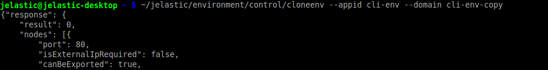

## CLI Tutorial: Environment Cloning

The [environment cloning](/docs/environment-management/cloning-environment) feature is also supported by CLI and can be easily called to help you in creation of new branches/multiple versions of your application. So, to duplicate your environment, just execute the next line:

```bash
~/jelastic/environment/control/cloneenv --appid  {src_env} --domain  {new_env}
```

where:

- **_{src_env}_** - name of the environment you’d like to clone
- **_{new_env}_** - name for your the environment copy

<div style={{
    display:'flex',
    justifyContent: 'center',
    margin: '0 0 1rem 0'
}}>



</div>

In a few minutes, you’ll get a new environment within your account, that is similar to the source one.
