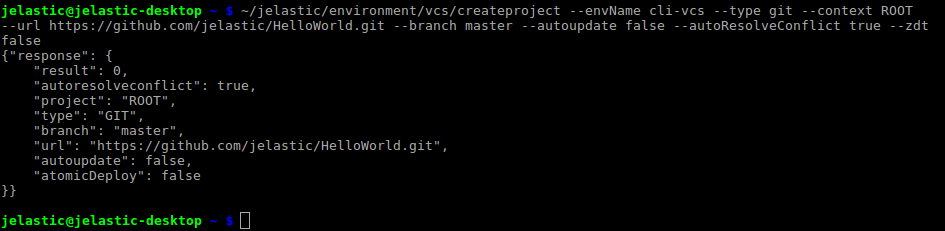
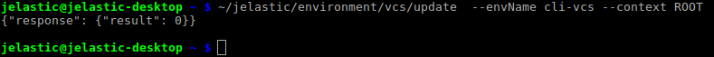
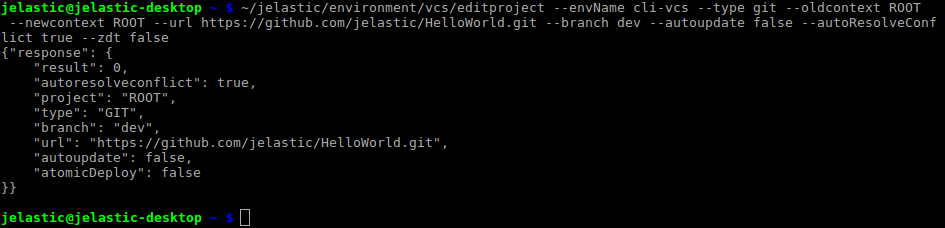

## CLI Tutorial: VCS Project Deployment

Deployment via VCS is a rather popular and convenient way for project’s integration into the Cloud, as it simplifies operating with app’s sources and allows to easily update its version (either manually or automatically with a certain interval). And the variety of options, available for the VCS deployment management via CLI, gives you the full control on your app.

1. For example, in order to <u>create a new project</u>, the following command should be run:

```bash
~/jelastic/environment/vcs/createproject --envName  {env_name} --type  {type} --context  {context} --url  {url} [--branch  {branch}] --autoupdate {true/false} [--interval  {interval}] --autoResolveConflict {true/false} --zdt {true/false}
```

Here, the list of parameters can be divided into the following groups:

- main configurations

  - **_{env_name}_** - name of your environment
  - **_{type}_** - VCS type, either _git or svn_; in the first case, the additional **_{branch}_** parameter is needed to point to the corresponding projects' version
  - **_{context}_** - context name for a new project
  - **_{url}_** - link to the appropriate repository

- additional options (their activation is defined with the **_{true/false}_** values)
  - _autoupdate_ - enables regular [autoupdate](/docs/Deployment/Git%20&%20SVN%20Auto-Deploy/Auto-Deploy%20Overview) of your deployed project; if activated, requires the additional **_{interval}_** parameter for setting the frequency of redeployments
  - _utoResolveConflict_ - switches on the corresponding same-named option
  - _zdt_ - allows to activate [ZDT deployment](/docs/PHP/ZDT%20Deployment%20for%20PHP) for PHP projects

:::tip Note

In case you need to connect to a private repository, the additional authentication parameters [*–login* ***{login}***] _[–password_ **_{password}_**] _[–keyId_ **_{keyId}_**] should be added to the main command. Here, you need to obligatory state the **_{login}_** option (to specify your VCS account login) and append one of the following settings depending on the desired (_password_ or _SSH key_) access types:

- **_{password}_** - the corresponding VCS account password
- **_{keyId}_** - name of the private SSH key you’ve specified while its addition to the dashboard; this allows to establish a [secure connection](/docs/Deployment/SSH%20Access%20to%20GIT%20Repository) to the repo with the paired public SSH key is attached

:::

<div style={{
    display:'flex',
    justifyContent: 'center',
    margin: '0 0 1rem 0'
}}>



</div>

After executing, you’ll be shown a brief info on the created project within the received response.

:::tip Tip

The above described command correspond to the **_Add project_** dashboard frame’s functionality, so in case you return to the GUI panel and click the **Edit** button next to the newly appeared project, you’ll see all the appropriate options applied within its settings. _If the project is not displayed, just refresh the page with your dashboard._

:::

2. The next step is running the update command in order to apply these settings and, actually, <u>deploy your project</u>.

```bash
~/jelastic/environment/vcs/update  --envName  {env_name} --context  {context}
```

Set the same parameters' values as in the previous step.

<div style={{
    display:'flex',
    justifyContent: 'center',
    margin: '0 0 1rem 0'
}}>



</div>

Subsequently, this command can be also used for manual redeployment of your app based on the updated VCS sources.

3. In case you need to <u>edit project settings</u> (e.g. to switch the version branch), the _editproject_ method should be executed:

```bash
~/jelastic/environment/vcs/editproject --envName  {env_name} --type  {type} --oldcontext  {oldcontext} --newcontext  {newcontext} --url  {url} [--branch  {branch}] --autoupdate {true/false} [--interval  {interval}] --autoResolveConflict {true/false} --zdt {true/false}
```

The majority of parameters are already familiar for you, except the following ones that have substituted the previously used {project} property:

- **_{oldcontext}_** - name of the project (i.e. context) that should be changed
- **_{newcontext}_** - new context for the project (it’s obligatory for specifying; however, could be stated the same as **_{oldcontext}_**)

The rest of options' values can be changed based on your needs.

<div style={{
    display:'flex',
    justifyContent: 'center',
    margin: '0 0 1rem 0'
}}>



</div>

:::tip Note

This command just updates the corresponding project’s settings, while for their appliance the **_update_** method should be called (we’ve considered it in the _2nd_ step).

:::

That’s all! Now you can create and manage your own VCS projects at the platform right through your terminal.
