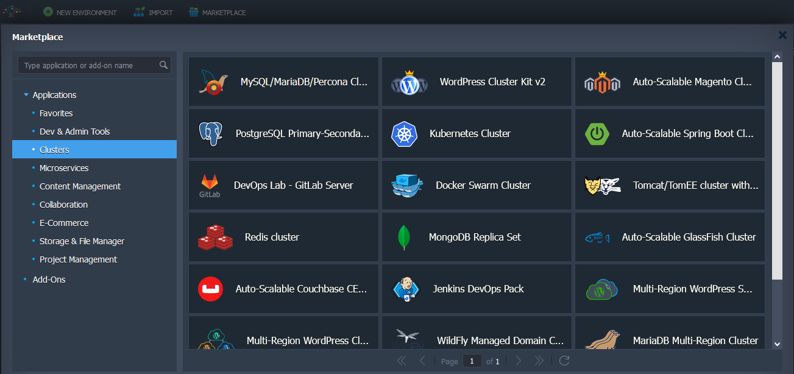
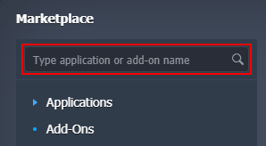
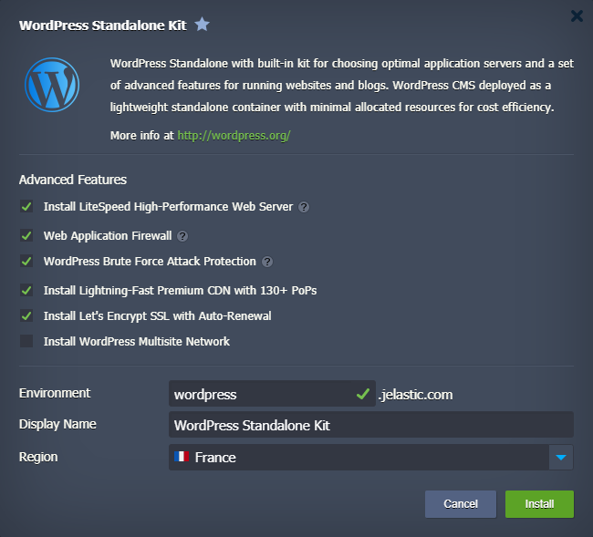
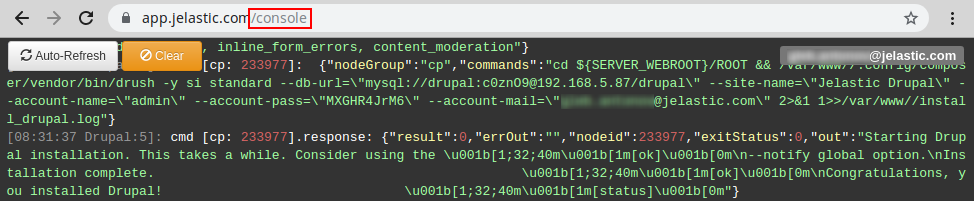
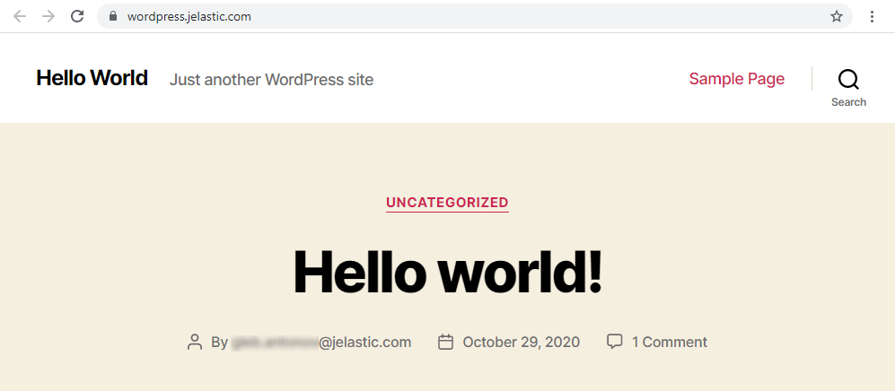

import obj from './Marketplace.json'

Platform Marketplace is a library of the most popular and requested applications, which are configured and optimized in the most beneficial way via the platform [Packaging Standard](/deployment-tools/cloud-scripting-&-jps/jps-overview). These packaged solutions can be installed automatically directly from the dashboard, skipping many steps of manual deployment and optimization.

You can access the **Marketplace** via the appropriate button at the top-left corner of the dashboard.

<div style={{
    display:'flex',
    justifyContent: 'center',
    margin: '0 0 1rem 0'
}}>



</div>

Within the opened section, you can find a list of categorized solutions to install new **Applications** from scratch and configuration **Add-Ons** to update your existing environments. Currently, the platform manages and maintains the following JPS packages, providing them for one-click installation at all platforms:

<div style={{
        width: '100%',
        margin: '0 0 1rem 0',
        borderRadius: '7px',
        overflow: 'hidden',
    }} >
    <div>
        <div style={{
            width: '100%',
            height: 'auto',
            border: '1px solid var(--ifm-toc-border-color)',
            display: 'grid', 
            fontWeight: '500',
            color: 'var(--table-color-primary)',
            background: 'var(--table-bg-primary-t2)', 
            gridTemplateColumns: '1fr',
            overflow: 'hidden',
        }}>
            <div style={{
                display: 'flex', 
                alignItems: 'center', 
                justifyContent: 'center',
                padding: '20px',
                wordBreak: 'break-all',
                borderRight: '1px solid var(--ifm-toc-border-color)',
            }}>
                Applications
            </div>
        </div>
         <div style={{
            width: '100%',
            height: 'auto',
            border: '1px solid var(--ifm-toc-border-color)',
            display: 'grid', 
            gridTemplateColumns: '1fr 1fr 1fr',
            fontWeight: '400',
        }}>
            <div style={{
                padding: '20px',
                borderRight: '1px solid var(--ifm-toc-border-color)',
                background: 'var(--table-bg-primary-t1)',
                display: 'flex', 
                alignItems: 'center', 
                justifyContent: 'flex-start',
                wordBreak: 'break-all',
                padding: '20px',
            }}>
                <ul>
                    {obj.Applications.slice(0, Math.ceil(obj.Applications.length / 3)).map((item) => {
                        return <li>{item}</li>
                    })}
                </ul>
            </div>
            <div style={{
                padding: '20px',
                wordBreak: 'break-all'
            }}>
                <ul>
                    {obj.Applications.slice(Math.ceil(obj.Applications.length / 3), 2*Math.ceil(obj.Applications.length / 3)).map((item) => {
                        return <li>{item}</li>
                    })}
                </ul>
            </div>
            <div style={{
                wordBreak: 'break-all',
                 padding: '20px',
            }}>
            <ul>
                {obj.Applications.slice(2*Math.ceil(obj.Applications.length / 3)).map((item) => {
                    return <li>{item}</li>
                })}
            </ul>
            </div>
        </div>
    </div>
</div>

<div style={{
        width: '100%',
        margin: '0 0 1rem 0',
        borderRadius: '7px',
        overflow: 'hidden',
    }} >
    <div>
        <div style={{
            width: '100%',
            height: 'auto',
            border: '1px solid var(--ifm-toc-border-color)',
            display: 'grid', 
            fontWeight: '500',
            color: 'var(--table-color-primary)',
            background: 'var(--table-bg-primary-t2)', 
            gridTemplateColumns: '1fr',
            overflow: 'hidden',
        }}>
            <div style={{
                display: 'flex', 
                alignItems: 'center', 
                justifyContent: 'center',
                padding: '20px',
                wordBreak: 'break-all',
                borderRight: '1px solid var(--ifm-toc-border-color)',
            }}>
                Add-Ons
            </div>
        </div>
         <div style={{
            width: '100%',
            height: 'auto',
            border: '1px solid var(--ifm-toc-border-color)',
            display: 'grid', 
            gridTemplateColumns: '1fr 1fr 1fr',
            fontWeight: '400',
        }}>
            <div style={{
                padding: '20px',
                borderRight: '1px solid var(--ifm-toc-border-color)',
                background: 'var(--table-bg-primary-t1)',
                display: 'flex', 
                alignItems: 'center', 
                justifyContent: 'flex-start',
                wordBreak: 'break-all',
                padding: '20px',
            }}>
                <ul>
                    {obj.AddOns.slice(0, Math.ceil(obj.AddOns.length / 3)).map((item) => {
                        return <li>{item}</li>
                    })}
                </ul>
            </div>
            <div style={{
                padding: '20px',
                wordBreak: 'break-all'
            }}>
                <ul>
                    {obj.AddOns.slice(Math.ceil(obj.AddOns.length / 3), 2*Math.ceil(obj.AddOns.length / 3)).map((item) => {
                        return <li>{item}</li>
                    })}
                </ul>
            </div>
            <div style={{
                wordBreak: 'break-all',
                 padding: '20px',
            }}>
                <ul>
                    {obj.AddOns.slice(2*Math.ceil(obj.AddOns.length / 3)).map((item) => {
                        return <li>{item}</li>
                    })}
                </ul>
            </div>
        </div>
    </div>
</div>

:::tip Note

The provisioned set of JPS packages can vary on each particular platform as it depends on the hosting provider settings.

For example, the **_HTTP/3 Premium CDN_** add-on is supported on the following [platform installations](https://cloudmydc.com/) only.

:::

The PaaS team frequently implements new solutions to extend this list. The majority of such updates are highlighted within the [platform blog](https://cloudmydc.com/), so if you are interested, you can subscribe to be notified about all of the new utilities.

:::tip Tip

For more solution examples refer to the [JPS Collection](https://github.com/jelastic-jps/) on GitHub, where you can find multiple packages to be used with the platform:

- [Enterprise WordPress Cluster for Auto Scaling, High Performance and High Availability](https://github.com/jelastic-jps/wordpress-cluster)
- [Scalable MySQL Cluster with ProxySQL Load Balancer and Orchestrator](https://github.com/jelastic-jps/mysql-cluster)
- [Free Let’s Encrypt SSL Certificates Integration for the Most Popular Software Stacks](https://github.com/jelastic-jps/lets-encrypt)
- [Highly Available and Auto-Scalable Magento Cluster](https://github.com/jelastic-jps/magento-cluster)
- C[yclos - a Payment Platform for Large Businesses and Organisations](https://github.com/jelastic-jps/cyclos)
- [Cron-Based Scheduler for Automatic Environment Hibernation](https://github.com/jelastic-jps/start-stop-scheduler)
- [Minio Cluster - S3 Compatible Object Storage](https://github.com/jelastic-jps/minio)
- [Auto-Scalable Docker Engine and Docker Swarm Cluster](https://github.com/jelastic-jps/docker-native)
- [Simple Automated CI/CD Pipeline for GitHub and GitLab Projects](https://github.com/jelastic-jps/git-push-deploy)
- [Java Memory Agent for Container RAM Usage Optimization](https://github.com/jelastic-jps/java-memory-agent)

[import](/environment-management/environment-export-and-import/environment-import) the appropriate manifest file via the dashboard to instantly get your solution. Also, you can explore the source code of any package, fork repository for yourself and customize it up to your particular needs before installation.

:::

## Installing Solution from Marketplace

Below, we’ll provide an example of a packaged solution installation.

1. To find a particular application, use a special **Search** box at the top-left corner of the **_Marketplace_** section. Type a phrase, and it will be looked for within solutions' names and descriptions (both for applications and add-ons).

<div style={{
    display:'flex',
    justifyContent: 'center',
    margin: '0 0 1rem 0'
}}>



</div>

2. We’ll use the **WordPress Standalone Kit** as an example. Select it from the proposed search results to instantly open the installation frame. Alternatively, you can locate the required solution manually within the categorized list (_Content Management_ section in our case), hover over to unfold additional details, and click **Install**.

<div style={{
    display:'flex',
    justifyContent: 'center',
    margin: '0 0 1rem 0'
}}>


</div>

3. Based on the particular package, you may need to provide some additional data to customize the solution up to your needs. For example, it could be the preferable nodes count or specific option availability.

For a detailed overview of the [WordPress Standalone Hosting](https://cloudmydc.com/) peculiarities, refer to the linked article on our blog. In general, the basic settings (i.e. required by any application) are environment name, [alias](/environment-management/environment-aliases), and, if available, [region](/environment-management/environment-regions/choosing-a-region).

<div style={{
    display:'flex',
    justifyContent: 'center',
    margin: '0 0 1rem 0'
}}>



</div>

Click **Install** to continue.

4. The installation process may require up to several minutes, based on the selected solution.

<div style={{
    display:'flex',
    justifyContent: 'center',
    margin: '0 0 1rem 0'
}}>


</div>

:::tip Tip

You can track the JPS package installation process in detail via the Cloud Scripting console. While logged into your dashboard account, add the **_/console_** suffix to URL:

```bash
https://app.xapp.cloudmydc.com/console
```

<div style={{
    display:'flex',
    justifyContent: 'center',
    margin: '0 0 1rem 0'
}}>



</div>

:::

5. After all the required configurations, you’ll see a success frame. In our case, it additionally provides the corresponding administration data (which is also sent via the appropriate email notification).

<div style={{
    display:'flex',
    justifyContent: 'center',
    margin: '0 0 1rem 0'
}}>


</div>

Click the **Open in Browser** button.

6. Your ready-to-work application will be opened in a new browser tab.

<div style={{
    display:'flex',
    justifyContent: 'center',
    margin: '0 0 1rem 0'
}}>



</div>

That’s all! Now, you can enjoy using your application.
