<!-- ## Integration with IntelliJ IDEA: The Java IDE for Professional Developers -->

[IntelliJ IDEA](https://www.jetbrains.com/idea/) is a code-centric IDE focused on developer productivity. The editor deeply understands your code and knows its way around the codebase, makes great suggestions right when you need them, and is always ready to help you shape your code.

This Java IDE is provided within the following edition types:

- **Ultimate** is the full-featured commercial IDE with a complete set of tools and integrations with the most important modern technologies and frameworks needed for effective Web and Java EE development
- **Community** is an open-source version of the IDE that is used for JVM and Android development

:::tip Tip

To learn more on provisioned features and **Ultimate** vs **Community** editions differences, refer to [official IDEA documentation](https://www.jetbrains.com/products/compare/?product=idea&product=idea-ce).

:::

IntelliJ IDEA has a robust ecosystem with lots of available plugins, including the dedicated **PaaS plugin** support. It’s compatible with IDEA 107.105 version and higher, of both **Ultimate** and **Community** editions. To get the plugin for IntelliJ IDEA up and running in a matter of minutes, check out a short video tutorial below.

[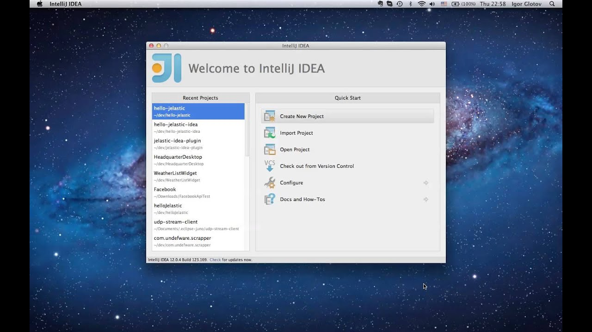](https://youtu.be/6i73wWak1Oc)
<!-- 
To explore the topic in more details, read the guide below where we’ll describe the platform integration with IntelliJ IDEA through the following steps:

- [Install Plugin](/deployment-tools/plugins/idea-plugin#install-intellij-idea-plugin)
- [Access PaaS from IDEA](/deployment-tools/plugins/idea-plugin#access-platform-from-idea)
- [Deploy Application to PaaS](/deployment-tools/plugins/idea-plugin#deploy-application-to-the-cloud)
- [Work with Environments and Log Files](/deployment-tools/plugins/idea-plugin#work-with-environments-and-view-log-files)
- [Create Web Project](/deployment-tools/plugins/idea-plugin#create-web-project-in-idea) -->

## Install IntelliJ IDEA Plugin

To install plugin, launch your IDEA, navigate to **Settings > Plugins** and click **Browse repositories**.

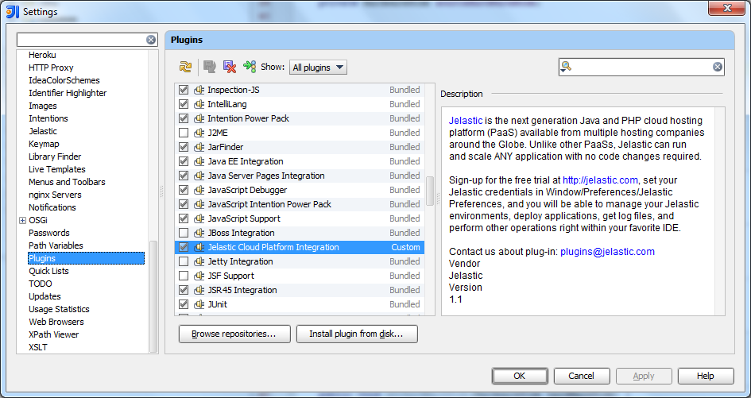

In the opened window, select Cloud Platform Integration, **Download and install** the plugin and restart your IDEA.

## Access Platform from IDEA

To access PaaS from your IDEA, navigate to **Settings > Jelastic**, type your account credentials (email & password) and select your hosting provider from the list.

:::danger Note

On accounts with [two-factor authentication](/account-and-pricing/two-factor-authentication) enabled, a dedicated **_IDE Plugins_** [access token](/account-and-pricing/personal-access-tokens) should be used instead of the password.

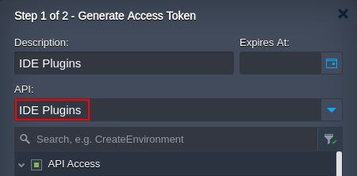

:::

When you are finished, proceed to the following section to deploy your application to the platform.

## Deploy Application to the Cloud

After installing the plugin, you can see a button with the platform logo in the main IDEA toolbar or in the pop-up menu for the **Projects** tool window. Click this button to deploy your Java web project.

In the opened window, choose the appropriate artifact (**_.ear_**, **_.jar_** or **_.war_** archive), state the **Context**, select the destination [environment](/environment-management/setting-up-environment) from the list and confirm your choice.

The selected project will be displayed within the **PaaS Tool Window** in IDEA. Click the **Deploy** button for the plugin to run a build of the provided artifact and deploy it to the platform.

## Work with Environments and View Log Files

The **PaaS Tool Window** in IDEA displays a list of your current environments that you can expand to see the added nodes and deployed applications.

Using context menu, you can manage your environment (_Stop/Start_, _Restart/Refresh_) and deployed project (_Destroy_, _Open in browser_ or _Refresh_).

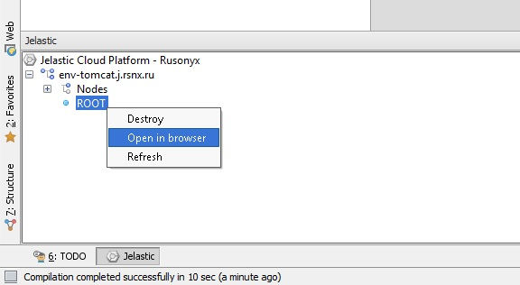

To see log files of a container, click on a destination node and select the **Get logs** option. Choose the file you are interested in and click **View log** (or just double-click the required file).

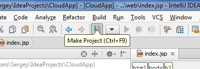

In such a way you can view other log files that are available for a destination node.

## Create Web Project in IDEA

You can create your own IDEA project and deploy it directly to environment by following the next steps.

1. Choose **Java Module** to create your new project, fill in all required fields and click **Next**.

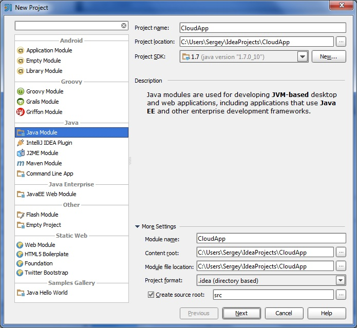

2. Select the desired technologies, namely, **_Web Application_** since your project should support this framework and click **Finish**.

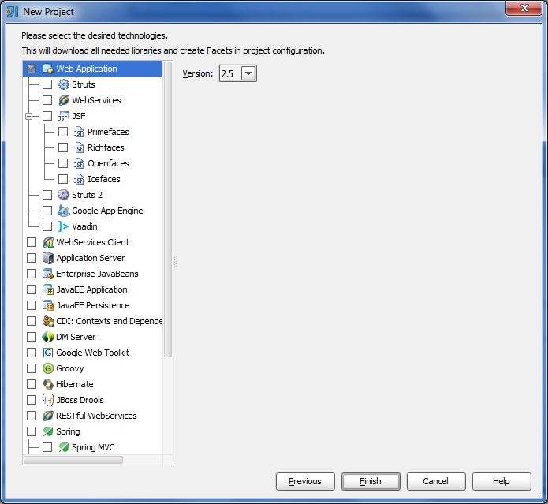

When the project is created, the default artifact will be generated, which is an exploded WAR package with executable files and static pages.

:::tip Tip

To view the existing artifacts for your project, navigate to **File > Project structure > Artifacts**. Select an artifact from the list to see its structure and more detailed information.

:::

3. Select the required artifact and tick the **Build on make** checkbox that allows to generate the current artifact each time after building the project.

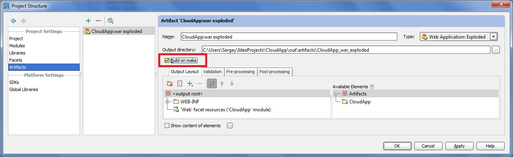

4. For deploying to the server a new EAR, JAR or WAR artifact should be created with the **Build on make** option enabled.

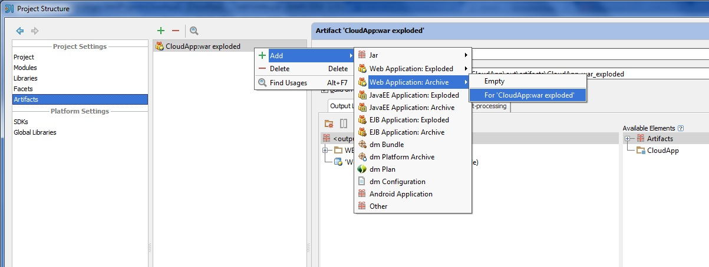

5. When the project is configured and the code is written, the only thing left is to click **Make Project**.

At this point, the artifacts are built and ready for deployment that you can run as described in the [previous section](/deployment-tools/plugins/idea-plugin#deploy-application-to-the-cloud).

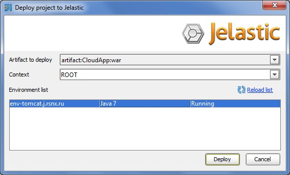

6. To launch your application, click **Open in browser** on the menu for the appropriate context.

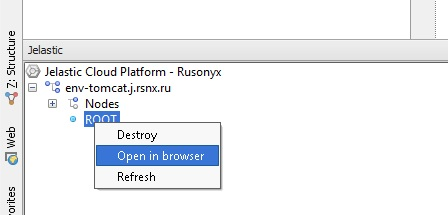

As a result, your application will be opened in a new browser tab.

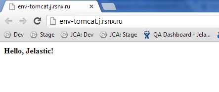

That’s it! In such a way, you can create your Java application via IntelliJ IDEA of either Ultimate or Community edition and deploy it to the platform all in one place, without the necessity to interrupt the development process.

:::tip Tip

Have any questions or suggestions on integrating IntelliJ IDEA with PaaS? Feel free to get in touch
with our technical experts at [Stackoverflow](https://stackoverflow.com/questions/tagged/jelastic).

:::
