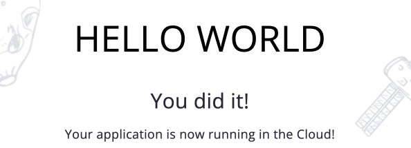

## Maven Plugin

[Maven plugin](https://github.com/jelastic/jelastic-maven-plugin) by the platform is a tool that can be used for building and managing Java projects. It complements the native Maven features of standardizing and simplifying the build process through implementation of the best deployment and development practices to deploy local projects directly into the cloud.

:::tip Tip

Alternatively, you can manage your project remotely (i.e. from anywhere over the Internet) by creating [Maven build node](/docs/Java/Build%20Node/Java%20VCS%20Deployment%20with%20Maven) at the platform and storing project at any preferable GIT version control system.

:::

Follow the next steps to deploy your Java applications into the platform with the help of the Maven plugin:

1. Ensure you have a running Java environment to deploy your project into. If needed, [create](/docs/EnvironmentManagement/Setting%20Up%20Environment) a new one by following the linked guide.

2. Prepare Java project using the [Maven](https://maven.apache.org/download.cgi) build tool (manually or using any IDE).

3. Adjust your project’s **_pom.xml_** configuration file by adding/extending the and sections. Herewith, you need to pass the correct values to placeholders (see the comments in the code below):

```bash
<plugin>
 <groupId>com.jelastic</groupId>
 <artifactId>jelastic-maven-plugin</artifactId>
 <version>1.9.3</version>
 <configuration>
    <apiToken>${token}</apiToken> <!--an access token is used instead of a login/password, see note below-->
    <artifact>{artifact}</artifact> <!--artifact to be deployed-->
    <context>{context}</context> <!--preferable context name (ROOT if skipped)-->
    <environment>{envName}</environment> <!--name of a target environment-->
    <nodeGroup>{groupName}</nodeGroup> <!-- (optional) name of a target layer (node group) within the environment, e.g. cp,bl,cp2 -->
    <comment>{comment}</comment> <!--custom comment, if needed-->
   <api_hoster>{hosterDomain}</api_hoster> <!--domain name of your platform-->
 </configuration>
</plugin>
<pluginRepository>
     <id>sonatype-oss-public</id>
     <url>https://oss.sonatype.org/content/groups/public</url>
     <releases>
         <enabled>true</enabled>
     </releases>
     <snapshots>
         <enabled>true</enabled>
     </snapshots>
</pluginRepository>
```

:::danger Note

You can generate [access token](/docs/Account&Pricing/Personal%20Access%20Tokens) for **_Maven Plugin_** via the dashboard.

<div style={{
    display:'flex',
    justifyContent: 'center',
    margin: '0 0 1rem 0'
}}>


</div>

:::

Don’t forget to save the changes.

4. Open the command line on your local machine and navigate to the folder with your maven project. Here, you can perform the following commands:

```bash
mvn jelastic:deploy -Djelastic.password={password}
```

Initiates your application deployment, substitute the **_{password}_** placeholder with your actual PaaS account password (token).

```bash
mvn jelastic:publish
```

Builds and uploads **_.war_** file to your account [deployment manager](/docs/Deployment/Deployment%20Manager) without actually deploying project.

```bash
mvn clean install jelastic:deploy
```

Redeploys your project, use it after applying some changes to the code.

5. After successful deployment, you can navigate to your platform dashboard to ensure its addition to the target environment.

<div style={{
    display:'flex',
    justifyContent: 'center',
    margin: '0 0 1rem 0'
}}>


</div>

To access the deployed application, click the **Open in Browser** button. In our case it is Hello World application.

<div style={{
    display:'flex',
    justifyContent: 'center',
    margin: '0 0 1rem 0'
}}>



</div>

As you can see, the project is successfully built and deployed via Maven.
