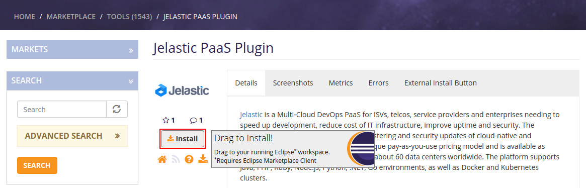
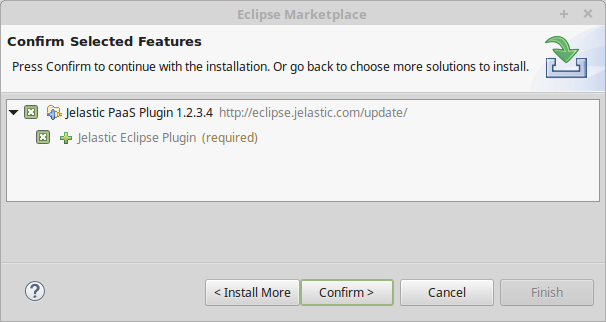
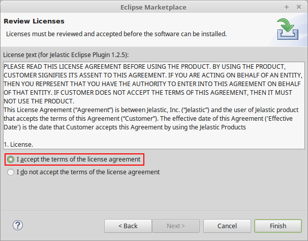
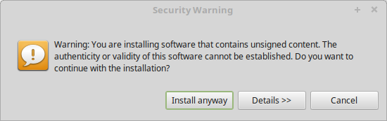
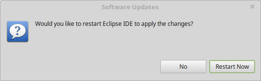
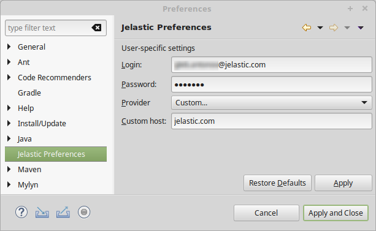

!Image Missing

## Eclipse Plugin Installation

In order to start working with the Eclipse Plugin, you need to [get it installed](/docs/deployment-tools/plugins/eclipse-plugin/eclipse-plugin-installation) and [authenticated to your PaaS account](/docs/deployment-tools/plugins/eclipse-plugin/eclipse-plugin-installation#authentication-with-account-credentials) within its settings. So, launch your Eclipse IDE and proceed with the instructions below.

## Plugin Installation

1. Open the Eclipse [**Marketplace**](https://marketplace.eclipse.org/content/jelastic-paas-plugin) page with the platform Plugin in a browser. Click on and drag the plugin installation button (circled in the image below) into your running Eclipse workspace.

2. In the opened frame you can check and edit the list of installed software. In our case, there is only _Eclipse Plugin_ listed, so just click on **Confirm**.

3. At the next step, you’ll need to read and accept the license agreement.accept plugin license agreement.

Click on **Finish** in order to proceed with installation.

4. If you receive a security warning, click the Install anyway button to proceed and wait a minute for this operation to be completed.

5. Restart your Eclipse IDE by clicking **Restart Now** on the last frame to apply the changes and finish installation.

## Authentication with Account Credentials

To get started with PaaS, you need to connect the plugin with your account at a platform. For that, navigate to **Window > Preferences > PaaS Preferences.
**
In the opened tab, fill in the _Login_ and _Password_ fields with the corresponding values and either select the required hosting _Provider_ from the list of available ones (for Public Cloud) or type the _Custom host_ manually (for Private Cloud).

Select the A**pply and Close** button to confirm the entered data.
That’s all the required configurations! Now, having the **Eclipse plugin** installed, you can [manage environments](/docs/deployment-tools/plugins/eclipse-plugin/environment-management) and [deploy new projects](/docs/deployment-tools/plugins/eclipse-plugin/application-deployment) easily without switching between IDE and browser.
