## NetBeans Plugin Installation

In order to start working with the NetBeans plugin, you need to [get it installed](/docs/Deployment%20Tools/Plugins/NetBeans%20Plugin/NetBeans%20Plugin%20Installation#plugin-installation) and [connect to your platform account](/docs/Deployment%20Tools/Plugins/NetBeans%20Plugin/NetBeans%20Plugin%20Installation#connect-to-platform-account) within its settings.
So, launch your NetBeans IDE and proceed with the instructions below.

## Plugin Installation

1. Run the latest version of **NetBeans IDE** (Java EE or All bundle) and navigate to the **Tools > Plugins** menu item.

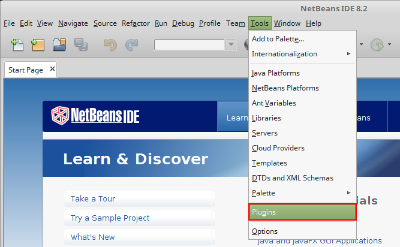

2. Switch to the **Available Plugins** tab and enter jelastic in the **Search** field. Choose **_NetBeans Plugin_** in the list and click the **Install** button.

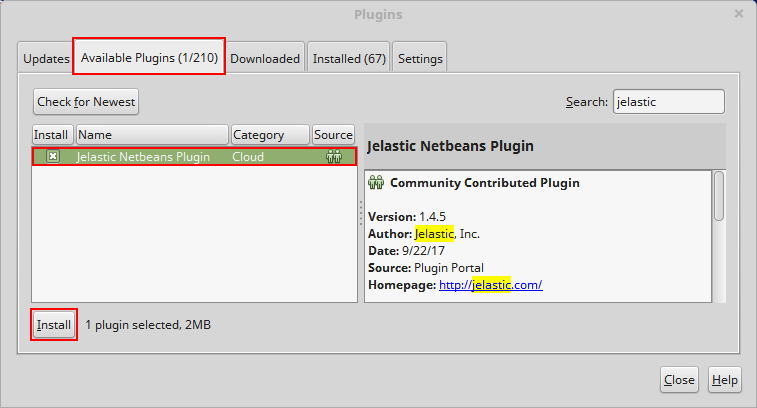

3. Click the **Next** button in the appeared window.

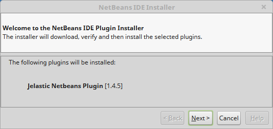

4. Read and accept the terms of the license agreement with the appropriate check box.

Click **Install** to proceed.

5. After installation success, close the window with the **Finish** button.

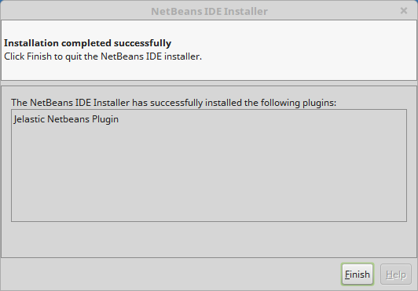

:::tip Tip

Before the last step you may need to Verify Certificate for the plugin, click the **Continue** button to proceed.

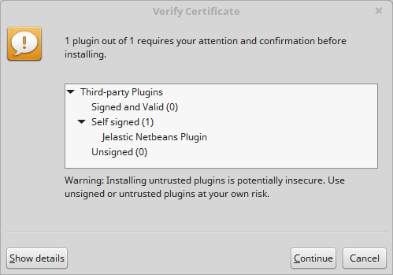

:::

Now, you have **PaaS Plugin** in your NetBeans IDE.

## Connect to Platform Account

1. Navigate to the **Window > Services** menu item.

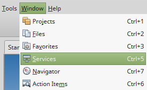

2. Within the opened section, right-click on the **Cloud** line and add a new cloud.

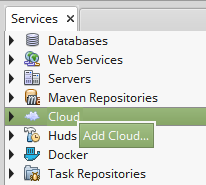

3. Choose **_Jelastic_** in the list of cloud providers and click **Next**.

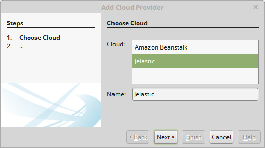

4. In the opened window specify **Display name** (any preferable name, for example, myjelastic), choose (from the drop-down list) or type your hosting **Provider** domain, and fill in **Login** and **Password** fields with the platform credentials.

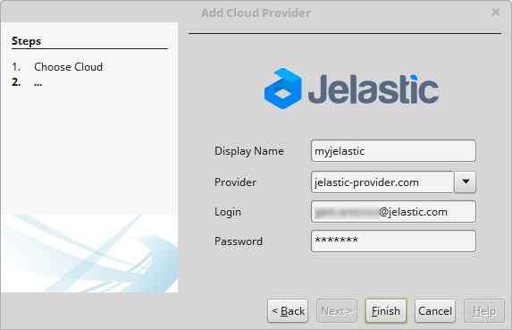

Click **Finish** to establish connection.

5. Now, if you expand the **Cloud** list, you will see a new one with the name you’ve specified.

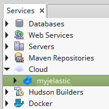

:::tip Note

To delete your cloud from NetBeans IDE, navigate to **Tools > Cloud Providers**. Within the opened window, choose PaaS installation and click the **Remove Cloud** button.

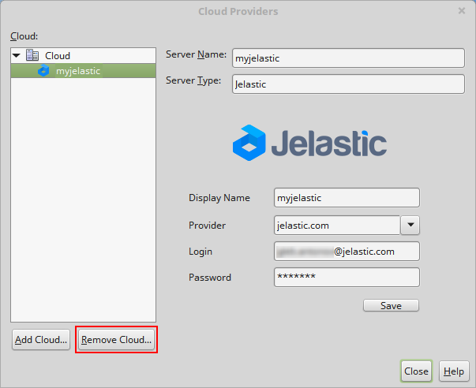

:::

Now, as you have the NetBeans plugin installed and connection established, you can proceed to [environments management](/docs/Deployment%20Tools/Plugins/NetBeans%20Plugin/NetBeans%20Plugin%20Management) and [projects deployment](/docs/Deployment%20Tools/Plugins/NetBeans%20Plugin/Application%20Deploy%20via%20NetBeans).
