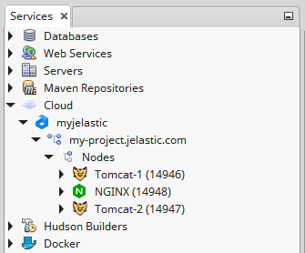
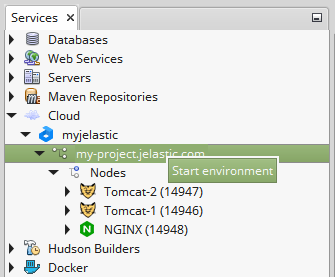
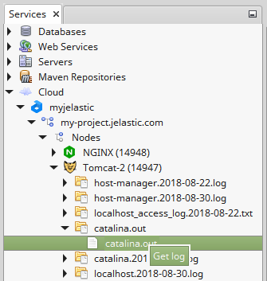
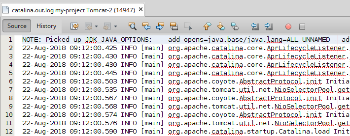
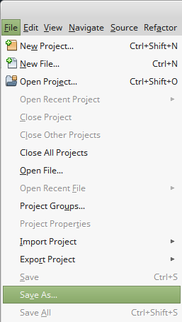
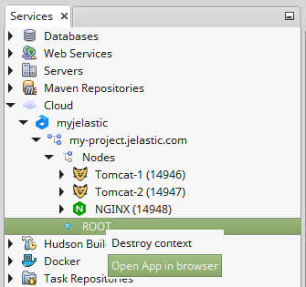

## NetBeans Plugin Management

You can easily manage your existing Java environments through the **Services** tab.
For that expand your **Cloud** list and choose the desired environment.

## Stop/Start Environment

1. To stop an environment right-click on it and choose **Stop environment**.

2. If you want to run already stopped environment, right-click on it and choose **Start environment**.

## Log files

1. You can easily manage log files on your platform instances directly in IDE. Expand the required node to find the log file you are interested in, right-click it and choose **Get log** (or just double click).

2. Log file will be automatically opened.

3. If you want to save log file, choose the **File > Save As** menu item.

## Application Context

If you have a deployed application, you can right-click on the appropriate context in the environment to open your application in the browser.

Also, using this menu you can delete the chosen context.
In order to learn how to [deploy NetBeans projects](/docs/deployment-tools/plugins/netbeans-plugin/application-deploy-via-netbeans) into the platform directly from IDE read the linked document.
