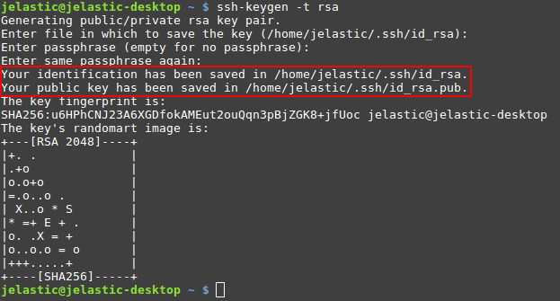
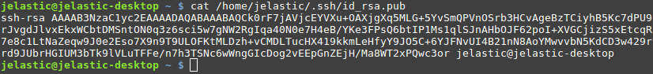
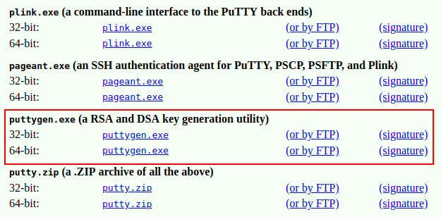
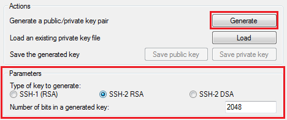
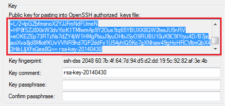
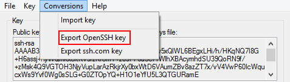

## Generate SSH Key

The instructions below walk you through the steps of generating an SSH key. Since the _8.0.2_ version, the platform supports the following key types:

- _ECDSA_
- _EdDSA_
- _RSA_

Follow the steps in one of the following sections (based on your operating system):

- [Linux/MacOS](/docs/deployment-tools/ssh/generate-ssh-key#for-linuxmacos)
- [Windows](/docs/deployment-tools/ssh/generate-ssh-key#for-windows)

## For Linux/MacOS

Generate a new SSH key (for example, the RSA type) using the [**_ssh-keygen_**](https://linux.die.net/man/1/ssh-keygen) tool:

1. Initiate generation with the following command:

        

        

          1
        

        

           ssh-keygen -t rsa
        

    

If needed, adjust the desired keys location and passphrase (we’ll proceed with the default values).

2. You can view the value of both public and private SSH keys with the **_cat_** command (the exact location is circled in the image above). For example:

        

        

          1
        

        

           cat /home/jelastic/.ssh/id_rsa.pub
        

    

3. Now, you can [add the generated SSH key](/docs/deployment-tools/ssh/add-ssh-key) to your PaaS account:

- _the public key_ for access via [SSH Gate](/docs/deployment-tools/ssh/ssh-access/ssh-gate)
- _the private key_ for [authentication](/docs/deployment/ssh-access-to-git-repository) at your remote GIT repository via SSH

## For Windows

1. Download and run an SSH keygen tool, for example, [PuTTYgen](https://www.chiark.greenend.org.uk/~sgtatham/putty/latest.html):

2. For example, specify the following parameters:

- choose the SSH-2 RSA key type
- enter the desired number of bits (e.g. 2048)

Click **Generate**.

3. Now, depending on the type of key you need:

- to get the **_public key_** for SSH access to your account via [local client](/docs/deployment-tools/ssh/ssh-access/ssh-gate) - copy the generated key from the output field at the top of the window

- to get the **_private key_** for [authentication](/docs/deployment/ssh-access-to-git-repository) at your remote GIT repository via SSH - expand the **Conversions** menu and select the **Export OpenSSH key** option

Afterward, you can open this file in any text editor and copy the key body for being [added](https://cloudmydc.com/) to the platform dashboard.
