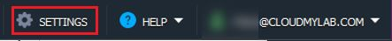
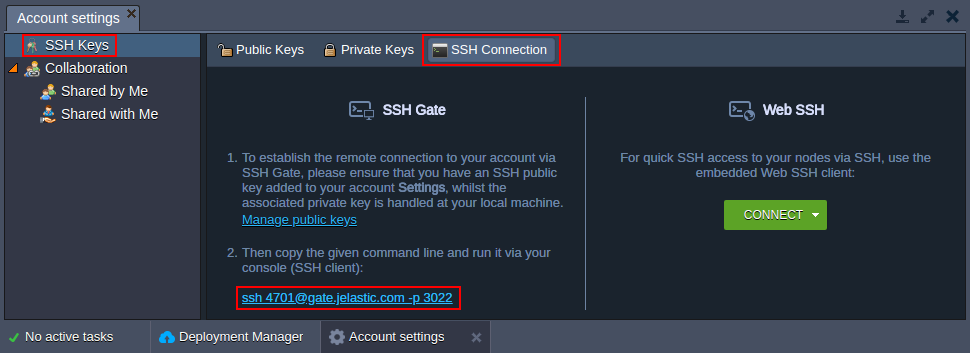
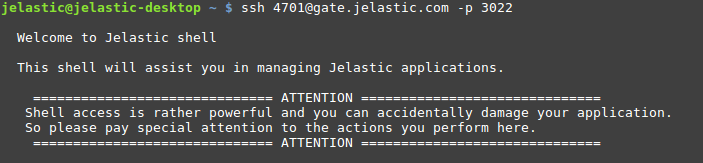
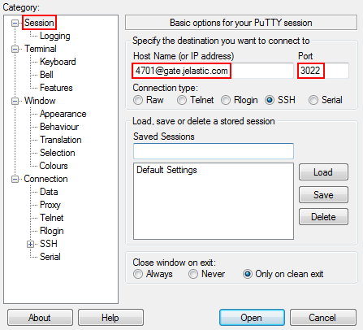
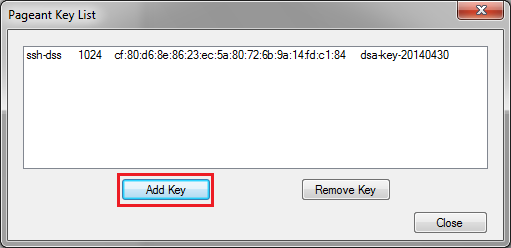
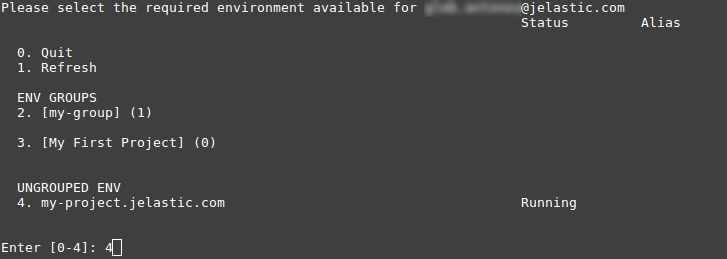
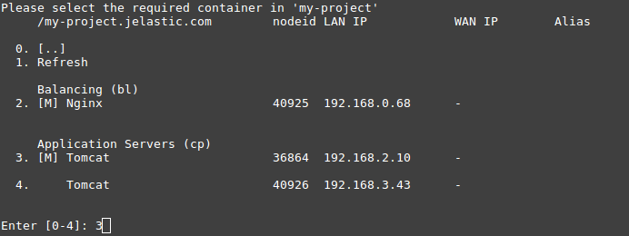
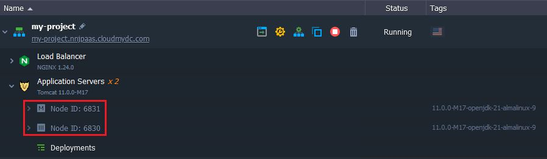

## Access via SSH Gate

In order to establish connection via SSH Gate, you need to [generate SSH key pair](/docs/deployment-tools/ssh/generate-ssh-key) and to [add public key](/docs/deployment-tools/ssh/add-ssh-key) to your account at the dashboard (if needed, read the linked step-by-step guides for assistance).

Next, get an SSH connection string for your account by clicking the **Settings** button at the top panel of the dashboard.

In the opened **Account settings** window, the **SSH Keys > SSH Connect** tab will be opened by default. Here, you can see information required for accessing an account, including an SSH connection string (circled in the image below).

:::tip Tip

Within the right part of the section you can establish [Web SSH](/docs/deployment-tools/ssh/ssh-access/web-ssh) connection to any node directly in browser.

:::

Now, you can access either [whole PaaS account](/docs/deployment-tools/ssh/ssh-access/ssh-gate#ssh-access-to-platform-account) or just a [particular container](/docs/deployment-tools/ssh/ssh-access/ssh-gate#direct-access-to-container) with your local SSH client.

## SSH Access to Platform Account

Depending on your OS, you need to perform the following steps:

- **_Linux/MacOS/FreeBSD_**

Open your terminal and execute the SSH connection string.

- **_Windows_**

Download and run your SSH client ([PuTTY](https://www.chiark.greenend.org.uk/~sgtatham/putty/latest.html) as an example).

Navigate to the **Session** tab in the left-hand list and fill in the **Host Name (or IP address)** and **Port** fields in accordance with your SSH connection string.

:::danger Note

In order to add your private SSH key with PuTTY, download and run [Pageant](https://www.chiark.greenend.org.uk/~sgtatham/putty/latest.html) tool, click the **Add Key** button and choose the appropriate SSH key file.

:::

1. Once connected, you will see a list of [environment groups](/docs/environment-management/environment-groups/overview) (with a number of containers within provided in brackets) and ungrouped environments available for your account. Select the required point by entering the appropriate number.

:::tip Note

_Only running_ environments can be accessed.

:::

2. After selecting an environment, you’ll see a full list of its containers, which are grouped by layers. Herewith, the master node (required for clustering, scaling, cloning, etc.) is designated with the [*M*] mark.

Also, each container is provided with **nodeid**, **LAN IP**, **WAN IP** and **Alias** data. In order to access the required node just enter its number.

## Direct Access to Container

You can “jump” directly to the necessary container, skipping the steps of choosing the appropriate environment and node. Just state the appropriate container ID (can be seen at the dashboard next to the corresponding node) at the beginning of the connection string.

For example, in order to access the Tomcat container, which is shown in the image above, you should add the 36864- prefix to the default account connection string in the following way:

        

        

          1
        

        

           ssh 36864-4701@gate.jelastic.com -p 3022
        

    

Such a possibility can be useful for automatization scripts or for setting up application configurations (for example, [Capistrano](/docs/deployment-tools/ssh/capistrano)).
