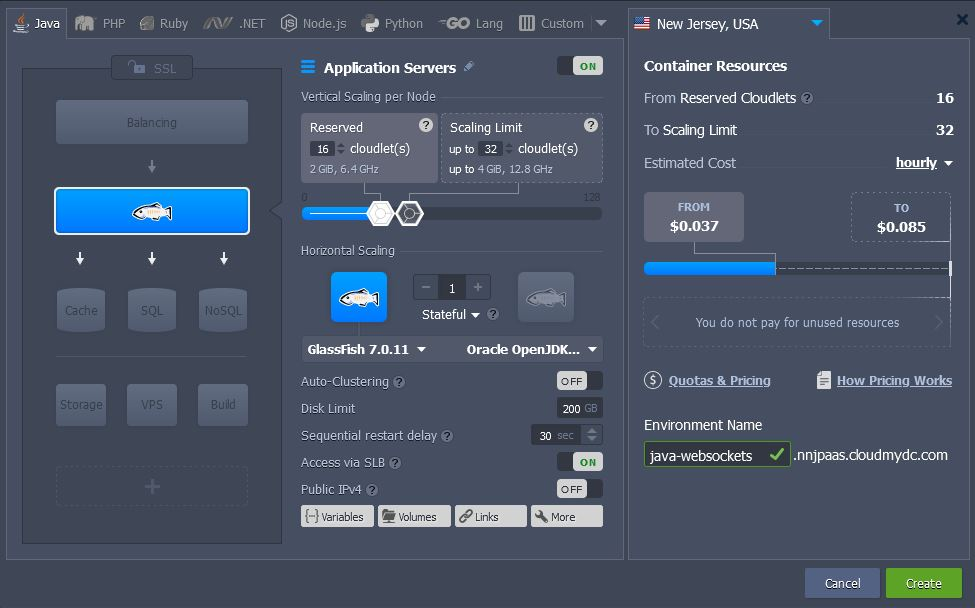
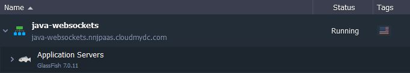
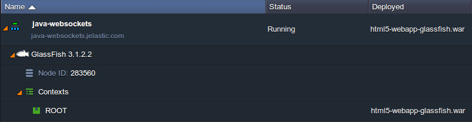
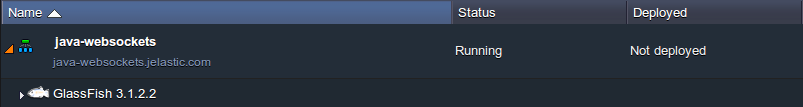
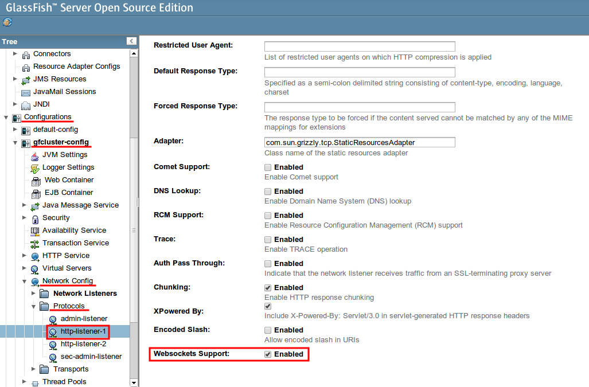
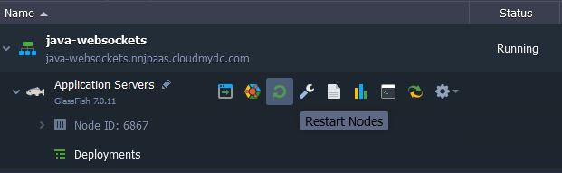

## WebSockets Support for Java

The **WebSocket protocol** was implemented to replace the existing bi-directional communication mechanisms that uses HTTP as a transport layer, as HTTP was not initially meant to be used for these purposes. This new technology ensures establishment of a single full-duplex TCP connection between client and server, where messages are instantly transmitted with little overhead, both upstream and downstream at once. At the same time, WebSockets technology is designed to work over the standard HTTP ports (80 and 443) and to support HTTP proxies and intermediaries, representing a trade-off between efficiency and reliability

The platform provides you with an advanced and complemented WebSockets support by means of integrating this technology to the [Shared Load Balancer](/docs/application-setting/external-access-to-applications/shared-load-balancer) and [NGINX balancer node](/docs/load-balancers/load-balancing), so you can use it even without external IP address attached to your server. The easiest way to configure the WebSockets support for your application is to place an NGINX balancer in front of it - the detailed workflow can be seen [here](/docs/deployment-tools/web-sockets/websockets-support).

Nevertheless, if this method contradicts your requirements, the WebSockets protocol usage is also supported by all the **Java application servers**, provided at the platform. Herewith, implementation of WebSockets for Java is commonly performed through configuring your application itself and does not require any special server configurations, thus you are only limited by your current programming skills, persistence and imagination.

The only exception is **GlassFish**, as it requires some server-side configurations for the WebSockets support activation. So, let’s find out how this can be done - just follow the simple instruction below.

## Create an Environment and Deploy a Project

1. Log into the platform dashboard with your login and password..

2. Click **New environment** at the top-left section of the dashboard.

3. In the opened environment topology window, switch to the **Java** tab and select **GlassFish** as your application server. Then set resources limits for it with the help of cloudlet sliders in the _Vertical scaling_ wizard section, type your environment name (for example, _java-websockets_) and click **Create**.

4. In a few minutes your environment with the GlassFish server will be created and will appear at the dashboard.

5. Now, you can deploy your application, which requires the WebSockets protocol support, to your environment. This can be done via [local archive/URL](/docs/deployment/deployment-guide), or, if you prefer to use the remote VCS repository, simply add the **Maven** node to your environment topology and follow this [guide](/docs/java/build-node/java-vcs-deployment-with-maven).

As a result, your deployed application will be listed in the appropriate panel column:

## Enable GlassFish WebSockets Support

The next step you need to do is to activate the WebSockets support for your GlassFish application server. This should be performed through its **Administration Console**, so the required steps are the following:

1. Navigate to the GlassFish admin panel, which can be accessed through the dashboard (by clicking the **Additionally** button for this server in your environment and choosing the **Admin panel > Login** option in the appeared list) or direct link (which the platform sent you via email after the environment creation).

2. In the newly opened browser tab, specify the credentials you’ve received in the corresponding email and proceed with the **Login** button.

3. Once entered, navigate to the **Configurations > gfcluster-config > Network Config > Protocols > http-listener-1** section within the left-hand menu. Then switch to the **HTTP** tab and tick the checkbox for the _Websockets Support_ option at the bottom of the page.

Don’t forget to **Save** the new settings!

4. Return to your dashboard panel and **Restart** GlassFish to apply the changes.

As all the configurations are done now, you can **Open** your application **in Browser** and ensure that it works fine. Enjoy!
