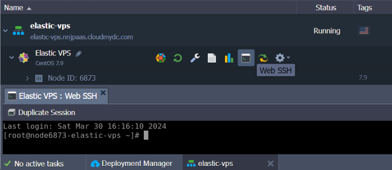
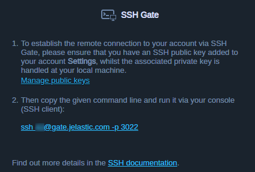

In order to manage the required software inside your Elastic VPS container, you need to connect to it via SSH protocol. A connection can be performed through the dedicated [SSH Gate](/docs/deployment-tools/ssh/ssh-overview), which provides a single access point to configure all environments and servers within your account remotely.

:::tip Note

For the Windows VPS management, utilize the [remote desktop protocol](/docs/windows-and-.NET/windows-rd-access) (RDP) support.

:::

The process of [SSH access](http://localhost:3000/docs/deployment-tools/ssh/ssh-access/overview) to the Elastic VPS nodes is the same as for any other container on the platform but provides full root access.

- [Web SSH](/docs/deployment-tools/ssh/ssh-access/web-ssh)

A one-click connection to your VPS container from the platform dashboard without any configuration required.

- **_[SSH Gate](/docs/deployment-tools/ssh/ssh-access/ssh-gate)_**

An SSH connection to VPS from the console on your local machine. Access is based on your custom SSH key pair.

:::tip Note

If you haven’t established a connection via SSH Gate before, you’ll need to perform the following steps beforehand:

- [generate](http://localhost:3000/docs/deployment-tools/ssh/generate-ssh-key) an SSH key pair
- [add your public SSH key](/docs/deployment-tools/ssh/add-ssh-key) to the dashboard

In case you prefer to operate your VPS container with the help of external SSH tools, consider establishing [access via Public IP](/docs/Elastic%20VPS/Elastic%20VPS%20Management/Linux%20VPS%20Access%20via%20Public%20IP) address. Regardless of the chosen approach, the provided functionality and management capabilities are the same.
