## Windows Remote Desktop Access

<div style={{
    display: 'grid',
    gridTemplateColumns: '0.15fr 1fr',
    gap: '10px'
}}>
<div style={{
    display: 'flex',
    alignItems: 'center',
    justifyContent: 'cetner',
}}>


</div>

<div>

All the Windows-based nodes at the platform provide the embedded **Remote Desktop Protocol** support, which allows you to connect to the virtual desktop of your Windows machine and perform any required server configurations through it.

In order to ensure the maximum convenience while using the Windows hosting services, our platform is equipped with the integrated RDP tool - **Guacamole**. It represents a clientless remote desktop gateway, which is run from within the web-browser by virtue of HTML5 and does not require any additional plugins or client software installed.

</div>

</div>

Besides this default connection scenario, you can also use your preferred local remote desktop client. So, below we’ll describe both ways of the remote desktop connections' establishment in more details:

- [RDP Connection via Web Client](/docs/Windows&.NET/Windows%20RD%20Access#rdp-connection-via-web-client)
- [RDP Connection via Local Client](/docs/Windows&.NET/Windows%20RD%20Access#rdp-connection-via-local-client)

## RDP Connection via Web Client

The required workflow for accessing the server’s desktop is similar for all Windows VM nodes. For instant access just after the node’s creation, you can use the direct one-time Guacamole link in the received email. Otherwise, the required operations should be performed through the dashboard.

Let’s consider it on the example of the Windows VM server.

1. Expand the dedicated **Remote Desktop** list next to the Windows-based node (or layer) and click the **Open in Browser** button.

<div style={{
    display:'flex',
    justifyContent: 'center',
    margin: '0 0 1rem 0'
}}>

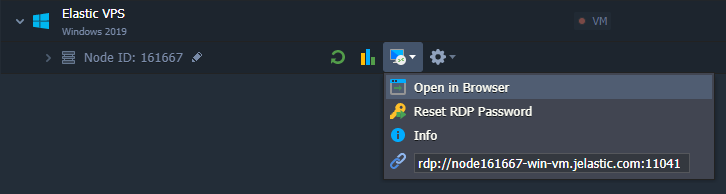

</div>

The other available options are required for connection via the [local RDP client](/docs/Windows&.NET/Windows%20RD%20Access#rdp-connection-via-local-client):

- **Reset RDP Password** to reset and resend Administrator credentials
- **Info**, which displays short information on establishing the RDP connection manually
- **RDP link** for establishing the RDP connection via your local client

2. Remote desktop connection will be established in a new browser tab.

<div style={{
    display:'flex',
    justifyContent: 'center',
    margin: '0 0 1rem 0'
}}>

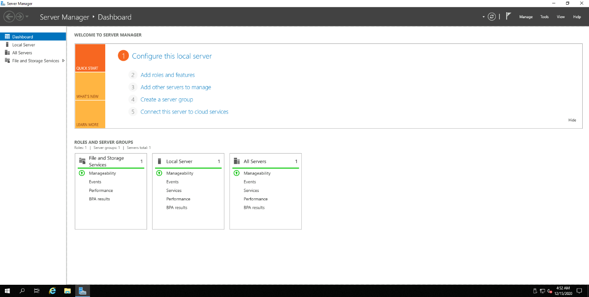

</div>

Once the connection is established, you’ll see the **Server Manager** window opened. Now, you can start [managing your server](/docs/Windows&.NET/Managing%20Server%20Roles%20&%20Features).

## RDP Connection via Local Client

In case you prefer to work with a local remote desktop client, you’ll need to use the credentials from the email notification sent to you during the corresponding environment creation. The tools you may want to use are: Remote Desktop (for Windows), KRDC, Remina or RDesktop (for Linux), Microsoft Remote Desktop (for Mac OS X).

Below, we’ll describe the examples of working with the most common RDP clients for Windows and UNIX-based operating systems:

- [For Windows](/docs/Windows&.NET/Windows%20RD%20Access#for-windows)
- [For Linux/MacOS/FreeBSD](/docs/Windows&.NET/Windows%20RD%20Access#for-linuxmacosfreebsd)

## For Windows

1. Get the **[Microsoft Remote Desktop](https://apps.microsoft.com/detail/9WZDNCRFJ3PS?hl=en-us&gl=US#activetab=pivot:overviewtab)** application and launch it.

2. Click **Add > PC** at the top of the opened window.

<div style={{
    display:'flex',
    justifyContent: 'center',
    margin: '0 0 1rem 0'
}}>

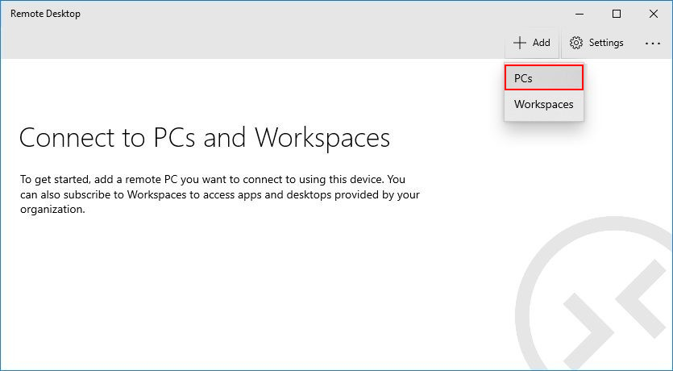

</div>

3. Provide the RDP connection link ([endpoint](/docs/application-setting/external-access-to-applications/endpoints)) into the **PC name** field.

:::danger Note

If [public IP](/docs/application-setting/external-access-to-applications/public-ip) is attached to the Windows VM node, it <u>must</u> be used instead of the endpoint.

:::

<div style={{
    display:'flex',
    justifyContent: 'center',
    margin: '0 0 1rem 0'
}}>

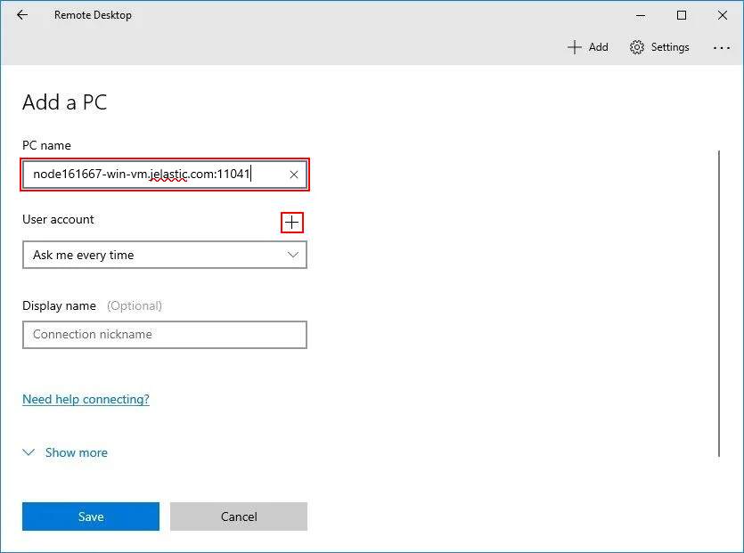

</div>

:::tip Tip

You can get the required link from the after-creation email or via the dashboard:

- **environment settings > endpoints**

<div style={{
    display:'flex',
    justifyContent: 'center',
    margin: '0 0 1rem 0'
}}>

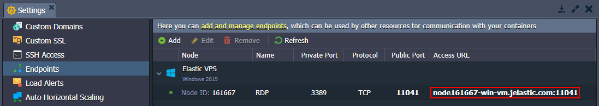

</div>

- **Remote Desktop** menu for node

<div style={{
    display:'flex',
    justifyContent: 'center',
    margin: '0 0 1rem 0'
}}>

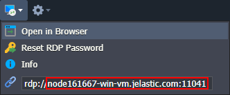

</div>

4. Click the + button next to **User account** and specify your account credentials (view the appropriate email).

<div style={{
    display:'flex',
    justifyContent: 'center',
    margin: '0 0 1rem 0'
}}>

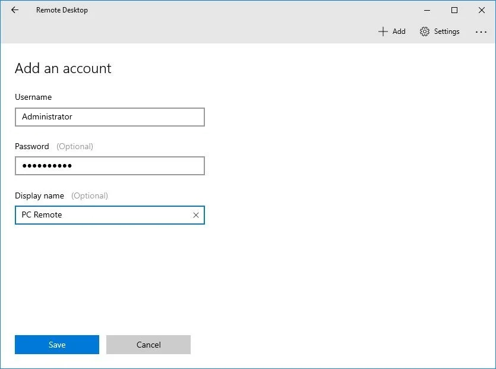

</div>

Click **Save** and adjust any additional setting, if needed.

That’s all, your connection is saved under the “**Saved Desktops**” section. Click it to start a remote session.

## For Linux/MacOS/FreeBSD

We’ve chosen the **_rdesktop_** utility as an example of the RD client, but you can use other ones (e.g. **_freerdp_**). If you haven’t got this tool installed at your local computer, get it using the appropriate command according to your OS package manager (e.g. _yum -y install rdesktop or sudo apt-get install rdesktop_).

:::danger Note

In order to establish remote connection via the **_rdesktop_** tool, you need to disable the Network Level Authentication in the **Remote Desktop** configs of the Windows VM node.

<div style={{
    display:'flex',
    justifyContent: 'center',
    margin: '0 0 1rem 0'
}}>

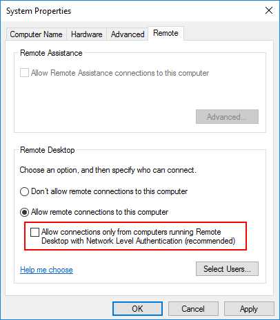

</div>

If you want to keep this setting enabled, you can use other tools, like **_freerdp_**.

:::

Then open your terminal emulator and follow the next steps:

1. The easiest way to connect to the remote desktop is to execute the next command:

```bash
rdesktop {access_url}
```

where **_{access_url}_** is a connection URL for RDP access (can be seen at the dashboard or inside the received email), specified without the protocol-defining part.

<div style={{
    display:'flex',
    justifyContent: 'center',
    margin: '0 0 1rem 0'
}}>

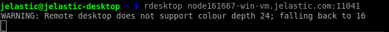

</div>

:::danger Note

An environment with the required server should have the Running status; otherwise, you’ll receive the Unable to connect error.

:::

2. In the opened window, you’ll need to log in with the credentials from the same email.

<div style={{
    display:'flex',
    justifyContent: 'center',
    margin: '0 0 1rem 0'
}}>

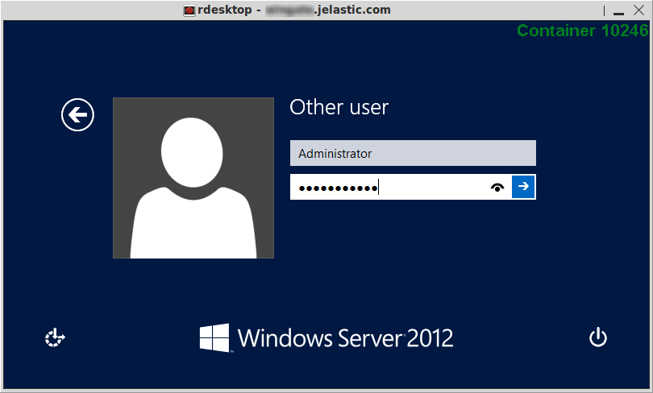

</div>

:::tip Note

Another way is to specify your login and password directly in the connection string:

```bash
rdesktop -u {username} -p {password} {access_url}
```

<div style={{
    display:'flex',
    justifyContent: 'center',
    margin: '0 0 1rem 0'
}}>

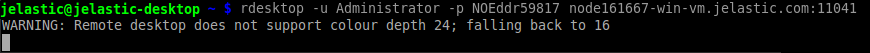

</div>

In such a way, you’ll bypass the login screen and will access the desktop immediately.

:::

Once the authentication is done, you’ll see the remote virtual desktop of the required node opened.

Now, you can start configuring your server using the in-built **Server Manager**.
