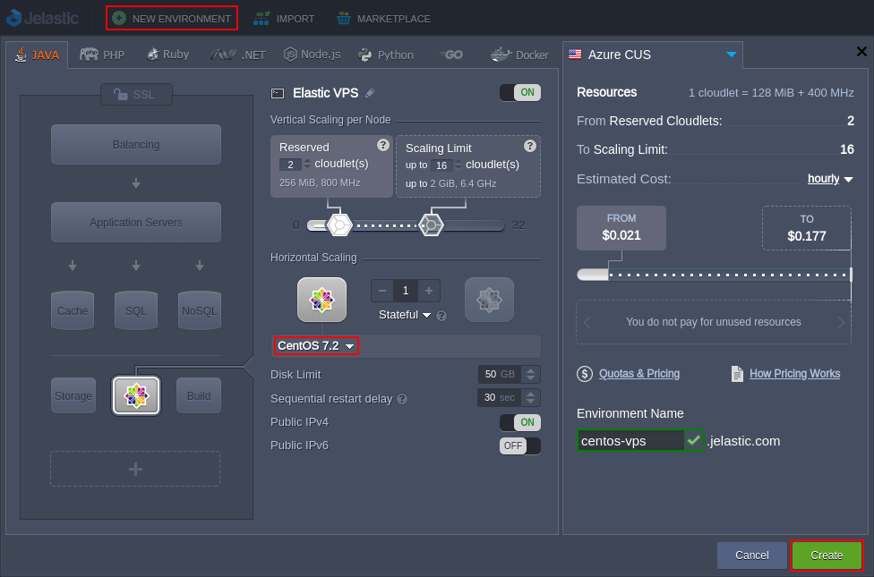

<!-- ## Elastic CentOS VPS -->

**[CentOS](https://www.centos.org/)** (Community ENTerprise Operating System) is a free community-driven project, with open source code delivered from RHEL Linux distribution.

Due to continuous community contribution, CentOS offers enterprise-level stability strengthened by robust performance and represents a reliable, low-maintenance, secure option for running virtual private servers.

## CentOS VPS Hosting

So, to effortlessly set up your own CentOS [Elastic VPS](/elastic-vps/elastic-vps-overview/general-information) inside the platform, log in to your PaaS account and access environment topology wizard.

The appropriate instance (i.e. **_CentOS 6.8_** or **_CentOS 7.2_**) can be found within the appropriate VPS section at the bottom left wizard corner (for the detailed installation guidance, refer to the [VPS Configuration](/elastic-vps/elastic-vps-management/vps-configuration) page).

:::danger Note

By default, the VPS node is delivered with the automatically attached [**Public IP**](/application-setting/external-access-to-applications/public-ip) address (one [per instance](/application-setting/scaling-and-clustering/horizontal-scaling)).

:::

The platform provides a set of [inbuilt tools](/elastic-vps/elastic-vps-management/vps-configuration#elastic-vps-inbuilt-tools) for applying some basic settings to your VPS instance right via the dashboard UI. For more complicated configs, you’ll need to access it via SSH - this can be accomplished through the [SSH Gate](/elastic-vps/elastic-vps-management/linux-vps-access-via-ssh-gate) or via any [3d-party software](/elastic-vps/elastic-vps-management/linux-vps-access-via-public-ip) (i.e. external SSH client) using Public IP address.

Once your virtual private server on top of CentOS is set up and properly configured, consider exploring the following example tutorials:

- [How to Run Java Console Application](/elastic-vps/linux-vps-use-cases/run-java-console-application)
- [How to Set Up Mail Server Inside VPS](/elastic-vps/linux-vps-use-cases/setting-mail-server-inside-vps)
