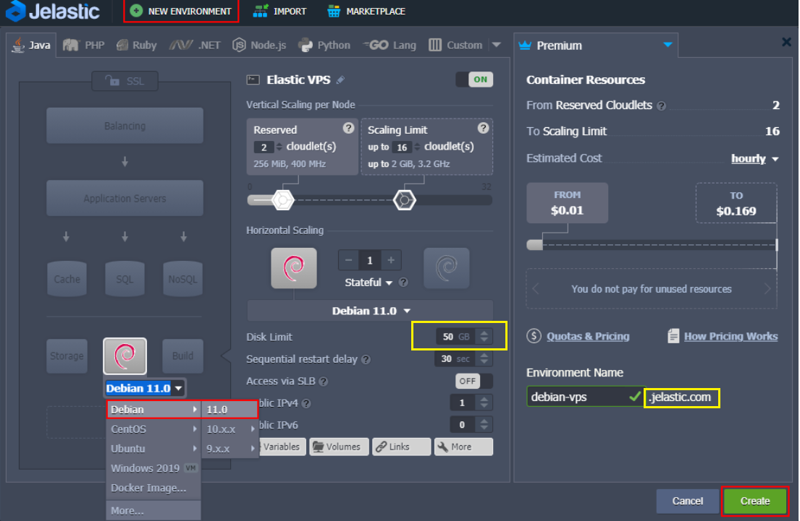

## Elastic Debian VPS

[Debian](https://www.debian.org/) VPS logoDebian is a free operating system that commits to the principles of open-source software and offers a continually developing solution with flexible, secure, and versatile performance capabilities. Debian provides a set of basic programs and utilities to run an OS and a wide variety of supplementary application software packages. Such a solution has a lightweight core that can easily be customized up to your particular needs using the dedicated package manager for the required software and bundles installation.

The platform delivers Debian with all the benefits of [Elastic VPS](/docs/Elastic%20VPS/Elastic%20VPS%20Overview/General%20Information) (security guarantees, cost efficiency, root permissions, etc.).

## Debian VPS Hosting

The creation of the Debian VPS is as simple as any other certified stacks and can be done in a matter of minutes.

Open the topology wizard by clicking the **New Environment** button at the top of the platform dashboard. Expand the VPS section and choose the **_Debian_** template of the required version from the available options.

:::danger Note

Elastic VPS instances require [public IP](/docs/application-setting/external-access-to-applications/public-ip) addresses (one per node) by default.

:::

Adjust other options up to your needs ([vertical](/docs/application-setting/scaling-and-clustering/automatic-vertical-scaling) and [horizontal scaling](/docs/ApplicationSetting/Scaling%20And%20Clustering/Horizontal%20Scaling), disk limit, etc.) and click the **Create** button.

In a moment, your fully isolated virtual server with Debian operating system will be ready to work, allowing you to proceed with the required software and services installation.
