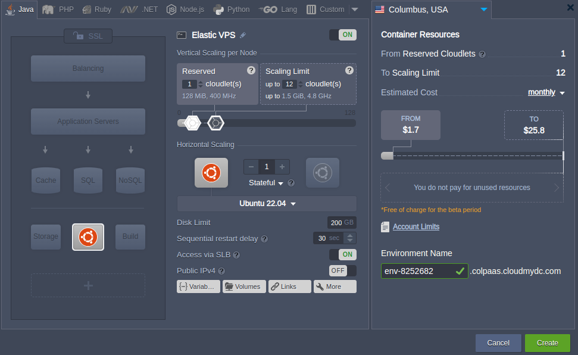

<!-- ## Elastic Ubuntu VPS -->

**[Ubuntu](https://ubuntu.com/)** appears to be one of the most popular operating systems for running virtual private servers inside the Cloud. Being built over the Debian Linux distribution, Ubuntu shares its commitment to principles of open-source software and offers continually developing solutions with flexible, secure, and versatile performance capabilities.

At the platform, Ubuntu-based Elastic VPS is delivered with all the functionality of [an independent virtual machine](/elastic-vps/elastic-vps-overview/general-information) (like security guarantees, cost efficiency, and root permissions granted), combining it with the Ubuntu’s reliable and robust ecosystem.

## Ubuntu VPS Hosting

With the platform, Ubuntu VPS installation represents an entirely automated process, performed in a matter of minutes.

Log into your platform dashboard and open the topology wizard by clicking the **New Environment** button. Within the dialog, enable the VPS section at the bottom left corner and select the **_Ubuntu_** template from the expendable options list.

Adjust the rest options (cloudlet limits, [number](/application-setting/scaling-and-clustering/horizontal-scaling) of server instances and name for your environment) and click the **_Create_** button.

:::danger Note

Working with **VPS** presupposes usage of [external IP](/application-setting/external-access-to-applications/public-ip) addresses (one per instance), which are automatically attached to the corresponding container(s).

:::

That’s it! Your fully isolated virtual server is ready to work so that you can proceed with the required software and services set up.

For quick access to container file system, an appliance of some basic configurations and tracking logs via comprehensive UI use the platform dashboard [inbuilt tools](/elastic-vps/elastic-vps-management/vps-configuration#elastic-vps-inbuilt-tools). For the more advanced Ubuntu VPS management, consider connecting to virtual private server via [SSH Gate](/elastic-vps/elastic-vps-management/linux-vps-access-via-ssh-gate) or [Public IP address](/elastic-vps/elastic-vps-management/linux-vps-access-via-public-ip).
