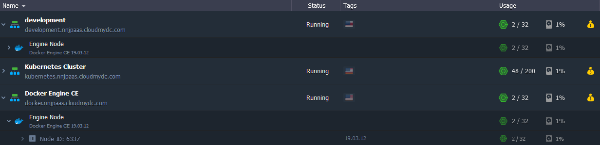

    Sooner or later, every developer faces the necessity to branch the application he is working on, e.g. to try out new functionality before actually implementing it into production. For such cases, the platform provides a special option - <b>environment cloning</b>, which allows creating a complete copy of an already existing project in just a couple of clicks.

Also, if talking about more complex and sophisticated projects (which implies the involvement of the whole development team), multiple copies of your application (dedicated to a specific task) are recommended. The most common application [lifecycle](/application-setting/application-lifecycle-management) implementation involves the following stages:

- **development** - for developers to create and modify features
- **testing** - for quality assurance to discover and analyze possible issues
- **production** - the latest actual application version, provisioned for end-customers use

Below, we’ll provide information on [how to make an environment copy](/environment-management/cloning-environment#how-to-clone-environment) and [some common use cases](/environment-management/cloning-environment#common-use-cases).

:::tip
**Take into consideration** the following specific points of environment cloning at the platform:

- based on the layer [scaling mode](/application-setting/scaling-and-clustering/horizontal-scaling), cloned containers will be either created from the appropriate base image (_stateless_) or copied from the master container (_stateful_)
- you may experience a short-term freeze on source containers due to memory state migration to the cloned nodes (the implementation specifics is similar to live migration)
- while cloning a Windows-based environment, containers will be temporarily stopped, so be ready for a short downtime

:::

## How to Clone Environment

In order to create an environment copy, follow the steps below:

1. Click the appropriate **Clone Environment** button next to your environment, as it’s shown in the image below:

2. Within the appeared pop-up, specify a name for the environment clone or leave the default one and click **Clone**.

3. In a few minutes, the environment will be duplicated and ready for use.

:::tip Tip

For some specific cases, additional adjustments are required to make your environment copy operable:

- nodes' IP addresses and hostnames will differ from the initial ones and, in case of being “hardcoded” within config files, should be re-adjusted manually
- if you’ve faced a problem when cloning a massive environment (i.e. with more than 1TB of data being stored in containers), please contact your hosting provider for assistance
- an environment in [collaboration](/account-and-pricing/accounts-collaboration/collaboration-overview) can be cloned only by its owner; herewith, the created copy won’t be available to collaborators by default

:::

Now, you can re-configure it, deploy new application versions, and apply any topology or application modifications - this won’t affect the original environment.

## Common Use Cases

Consequently, you can use your environment in the following ways:

- rename (change internal domain) your environment
- [swap domains](/application-setting/domain-name-management/swap-domains) to redirect your clients to the upgraded project
- implement [blue-green deployment](/application-setting/traffic-distributor/use-cases/blue-green-deploy) to allow so-called “invisible” updates, which will not cause any downtime for your application

- perform applications [A/B testing](/application-setting/traffic-distributor/use-cases/a-b-testing) (i.e. compare different versions) to designate which one provides better user appeal

achieve advanced _[failover protection](/application-setting/traffic-distributor/use-cases/failover-protection)_ of your application

- configure data storing from several environments in a single [Dedicated Storage Container](/data-storage-container/use-cases/dedicated-container) to utilize disk space more efficiently
- clone environment to create a “snapshot” of the whole setup
- you can configure replication or synchronization of data from the production to clone, ensuring that data on your testing/staging environment remains actual

These use cases can help you get the most from your original environment and its copy.
