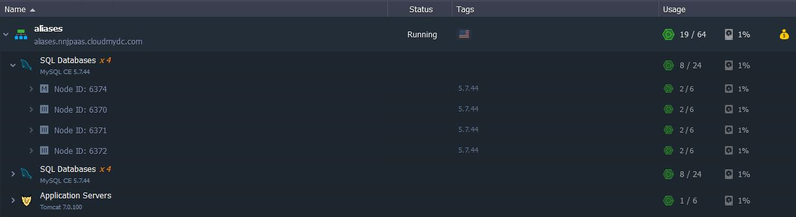
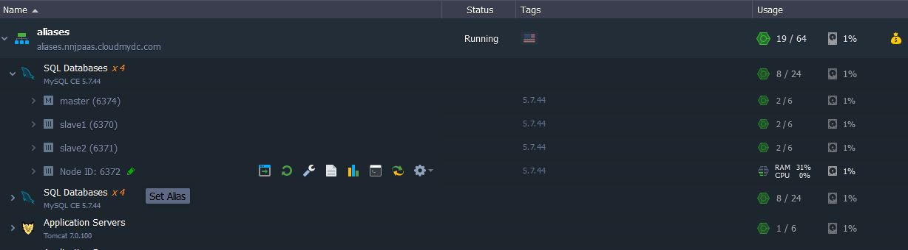
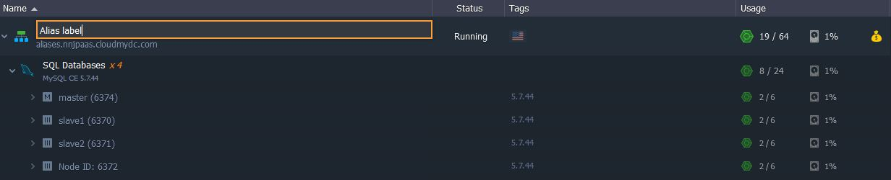
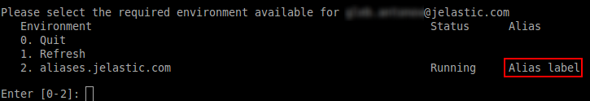
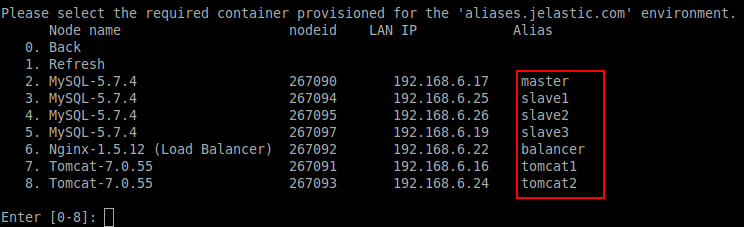

Specifying the alias (alternative name) for an environment or a separate node can greatly facilitate the process of their management. It clarifies which item you are working with, so you’ll never make a mistake while choosing the environment/node that needs to be adjusted.

This ability is especially useful while working with numerous nodes of the same type, possibly due to the [multi nodes](/application-setting/scaling-and-clustering/horizontal-scaling) feature. Let’s consider this on the example of defining the master and slave nodes in a DB cluster.

1. Select the necessary environment with a set of same-type nodes and expand the instances list:

2. Choose the node you would like to add the label for and click the **Set Alias** pencil pictogram next to it (or simply double-click on the **Node ID: xxx** string). Whatever you enter into the appeared input field, the value will be automatically saved.

3. In the same way you can add a label for a whole environment (wherein the domain name will remain the same).

Such a custom name will define the corresponding item in all the appropriate lists:

- at the dashboard

- in the [SSH](/deployment-tools/ssh/ssh-overview) console

Also, these labels are visible for other users [in collaboration](/account-and-pricing/accounts-collaboration/collaboration-overview) and remain attached after environment’s [cloning](/environment-management/cloning-environment), [transferring](/environment-management/environment-transferring), etc.

Deleting the alias name anytime will return the default value.
