The first step of any application hosting is a creation of the [environment](/docs/PlatformOverview/Basics%20&%20Terminology#environment) with the required isolated containers. The platform provides a powerful and intuitive UI to create and configure environments up to your specific needs. This document will guide you through all the needed steps, giving an extended explanation of available specifics and features.

1. Log in to the platform dashboard and click the **New Environment** button in the upper-left corner.

2. Within the opened **_topology wizard_** dialog, you can set up all the necessary customizations. We recommend performing adjustments in the following order:

- [choose programming language](/docs/EnvironmentManagement/Setting%20Up%20Environment#choosing-programming-language-or-specific-deployment-option) or specialized deployment solution (Docker Engine or Kubernetes Cluster)
- [set up topology](/docs/EnvironmentManagement/Setting%20Up%20Environment#configuring-topology) by adding required software stacks
- [configure nodes](/docs/EnvironmentManagement/Setting%20Up%20Environment#configuring-nodes-resources-and-specifics) resources and specifics
  review estimations, name the environment and [confirm the creation](/docs/EnvironmentManagement/Setting%20Up%20Environment#reviewing-and-confirming-environment-creation)

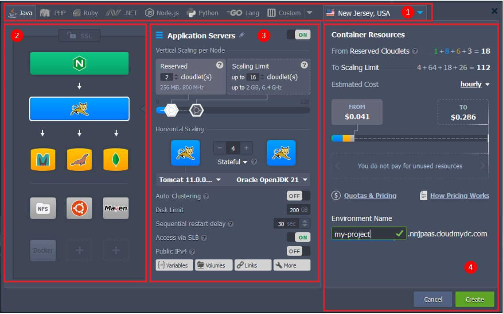

Below, we’ll review each of these points in detail, providing explanations on all of the available possibilities. The process may seem complex at first, but after familiarizing yourself, you’ll be able to configure a new (or adjust existing) environment in under a minute.

## Choosing Programming Language or Specific Deployment Option

As the first step of your environment creation, you need to select the deployment solution required for your project. PaaS is an extremely versatile platform that supports multiple options for application development and hosting thus it suits even the most demanding clients.

1. The most common and recommended choice (unless you are pursuing a specific application/architecture) is **certified containers**. These [stacks](/docs/QuickStart/Software%20Stack%20Versions) are specifically configured and managed by the platform (e.g. version updates, security patches). By default, they support all platform features (scaling, automated deployment, redeploy, SSL, etc.) for the most smooth and convenient hosting and development.

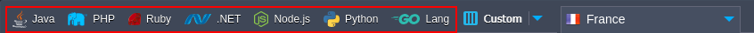

Click on the tab with the required programming language (Java, PHP, Ruby, .NET, Node.js, or Python) tab to proceed with the platform certified containers.

2. The other deployment options are available via the Custom tab. All the variants listed below utilize the basic platform’s [system container](/docs/PlatformOverview/System%20Container) (so-called OS container), which makes them compatible with the most (but not all) of the platform-distinguishing features (e.g. vertical and horizontal scaling).

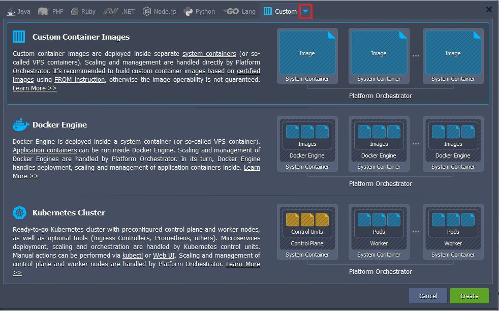

- **Custom Container Images** - any Docker image (based on the [supported OS](/docs/Container/Container%20Image%20Requirements)) deployed into the system container. Compared to the **managed containers**, this option provides access to a greater variety of solutions, search the entire Docker Hub registry or use your private repository. However, the software operability and compatibility with the platform cannot be guaranteed as the content is managed by respective image maintainers. It’s recommended to build custom container images based on [platform certified images](https://hub.docker.com/u/jelastic) using [FROM instruction](https://docs.docker.com/engine/reference/builder/#from).

- **Docker Engine** - a Docker Engine CE deployed into the system container. It provides access to all the Docker native functionality, including deployment, scaling, and management of multiple [application containers](/docs/PlatformOverview/Application%20Container) inside.

- **Kubernetes Cluster** - ready-to-go _[Kubernetes cluster](/docs/Kubernetes%20Hosting/Kubernetes%20Cluster/Kubernetes%20Overview)_ with a preconfigured control plane and worker nodes created based on the system containers. The deployment, scaling, and orchestration of the microservices inside are handled by Kubernetes control units, while the platform scales and manages control plane and worker nodes.

3. Also, it is recommended to select the preferred [region](/docs/EnvironmentManagement/Environment%20Regions/Choosing%20a%20Region) (if available) before proceeding further.

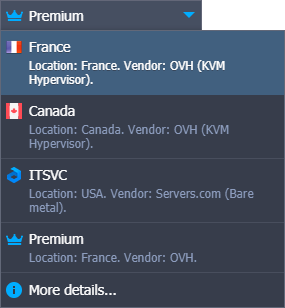

## Configuring Topology

You can configure environment topology ([layers](/docs/PlatformOverview/Basics%20&%20Terminology#layer) structure) via the left part of the wizard. Сonsider it as a constructor that helps you to create your environment. Here, the following blocks are available:

- **[Load Balancers](/docs/Load%20Balancers/Load%20Balancing)** - stacks that operate as an entry point for the environment to distribute incoming request and create even load on other nodes
- **[Application Servers](/docs/Java/Java%20App%20Servers/Tomcat%20and%20TomEE/Tomcat%20Server)** (compute nodes) - web servers that run your application
- **[Databases](/docs/Database/Database%20Hosting/DB%20Hosting%20Overview)** (SQL & NoSQL) - database solutions to store and manage data
- **[Cache Node](/docs/Memcached/Memcached%20System)** - a Memcached object caching system for speeding up web applications through alleviating database load
- **[Shared Storage](/docs/Data%20Storage%20Container/Shared%20Storage%20Container)** - dedicated storage node with NFSv4 support, enlarged disk space and optimized performance
- **[Elastic VPS](/docs/Elastic%20VPS/Elastic%20VPS%20Overview/General%20Information)** - virtual private servers on top of the CentOS, Ubuntu, Debian, and Windows OS
- **[Build Node](/docs/Java/Build%20Node/Java%20VCS%20Deployment%20with%20Maven)** - a build automation tool for Java projects
- **Extra** (custom layers) - any of the stacks mentioned above

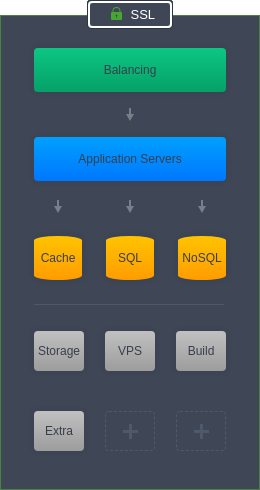

:::tip Tip

The sequence of blocks displayed above is the default order. However, you can mix and match them in any preferable way to create your custom topologies.

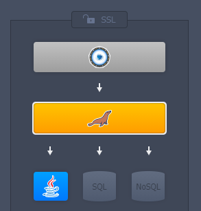

:::

1. The platform offers a number of the most popular options for each of these sections based on the default role. If you want to add a [stack](https://cloudmydc.com/) of a different role, click the **More** option at the bottom of the list. Also, you can use **Search** to quickly find any platform-managed stack.

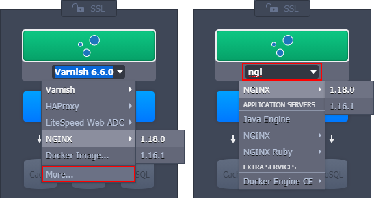

:::tip Tip

If you cannot find a required software solution, you can add it as a [custom container](/docs/Container/Container%20Deployment/Custom%20Containers%20Deployment) from Docker Hub or your private repository.

:::

2. An **SSL** protection can be configured for your environment via the same-named section. Here, two options are available:

- **[Built-In SSL](/docs/ApplicationSetting/SSL/Built-In%20SSL)** - enables an already trusted SSL certificate, avoiding any additional checks and saving your time on the certificate validation. However, it is applied to the default environment domain name only (i.e. with the hoster’s domain at the end) and does not work if [public IP](/docs/ApplicationSetting/External%20Access%20To%20Applications/Public%20IP) is attached to your servers.

- **[Custom SSL](/docs/ApplicationSetting/SSL/Custom%20SSL)** - shows the pre-conditions of using your custom SSL certificates for the environment. Click the **Enable** button to automatically fulfill the requirements (e.g. enable Public IP) and refer to the linked instruction for further guidance.

:::tip Tip
Also, you can apply the Let’s Encrypt SSL add-on after the environment creation to automatically issue and integrate a free SSL certificate.

:::

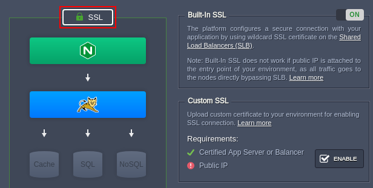

## Configuring Nodes Resources and Specifics

Once you are done with the topology structure, you can adjust each particular layer via the wizard’s central part. Let’s review the available options from top to the bottom of the section.

1. You can toggle a layer **on/off**, as well as provide a custom alias for it.

2. Configure the [automatic vertical scaling](/docs/ApplicationSetting/Scaling%20And%20Clustering/Automatic%20Vertical%20Scaling) by setting the number of reserved and dynamic [cloudlets](/docs/PlatformOverview/Cloudlet) (1 cloudlet = **128 MiB** of RAM and **400 MHz** of CPU) for the nodes within the layer.

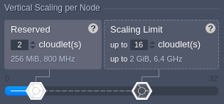

Think of it as a minimum and maximum CPU & RAM capacities per server. It is worth mentioning that no matter how high the scaling limit is, only actually consumed resources are charged. This helps to overcome load spikes and, at the same time, not to overpay for unused memory or processor.

3. The [Horizontal Scaling](/docs/ApplicationSetting/Scaling%20And%20Clustering/Horizontal%20Scaling) part allows defining a number of nodes within the layer and choosing a preferred scaling mode (stateful or stateless).

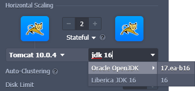

You can use the drop-down lists to change stack and engine type/versions (if needed, expand and start typing to **Search**). In case of adjusting an existing environment, these lists will redirect to the [container redeploy](/docs/Container/Container%20Redeploy) dialog in order to apply changes.

:::tip Tip

Click on the gear icon (circled in the image below) for additional [management options](/docs/ApplicationSetting/Scaling%20And%20Clustering/Horizontal%20Scaling#managing-nodes-within-layer) during scaling.

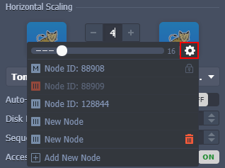

:::

4. Next, you need to configure additional settings.

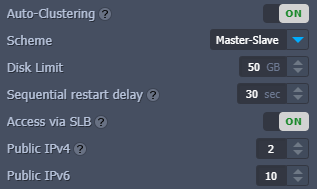

The list may vary depending on the particular stack and account permissions:

- **[Auto-Clustering](/docs/ApplicationSetting/Scaling%20And%20Clustering/Auto-Clustering%20of%20Instances)** - automatic clusterization for some platform certified templates. Additional fields can appear after activation, e.g. scheme selection (_master-slave, master-master, or galera_) for the database cluster.
- **Disk Limit** - an amount of disk space reserved per node. The dedicated [Shared Storage](/docs/Data%20Storage%20Container/Shared%20Storage%20Container) containers are usually provided with enlarged storage capacity.
- **Sequential restart delay** - a delay between the restart operation completion on one node and start on the other. It is used to avoid downtime, ensuring that at least one server is active. You can set it to “-1” for the simultaneous restart of all nodes within the layer.
- **[High-Availability](/docs/ApplicationSetting/Scaling%20And%20Clustering/Session%20Replication%20for%20HA)** (deprecated option, it is recommended redeploying to the latest version of the stack and using the Auto-Clustering feature instead) - automated session replication for the Tomcat and TomEE application servers
- **[Access via SLB](/docs/ApplicationSetting/External%20Access%20To%20Applications/Shared%20Load%20Balancer)**- blocks access to the nodes of the layer via the platform Shared Load Balancer
- **[Public IPv4/IPv6](/docs/ApplicationSetting/External%20Access%20To%20Applications/Public%20IP)** - attach the specified number of external IP addresses to each node within the layer

5. At the bottom of the section, you can find buttons to the container configuration tools:

- **[Variables](/docs/Container/Container%20Configuration/Variables)** - review and manage a list of the [environment variables](/docs/Container/Container%20Configuration/Variables) for the current layer
- **[Links](/docs/Container/Container%20Configuration/Links)** - interconnect layers inside the environment
- **[Volumes](/docs/Container/Container%20Configuration/Volumes)** - manage a list of the data volumes to ensure files integrity during container lifecycle
- **[Ports](/docs/Container/Container%20Configuration/Ports)** - view information about containers' ports
- **[CMD / Entry Point](/docs/Container/Container%20Configuration/Run%20Configuration)** - configure containers' Entry Point and Run Command

## Reviewing and Confirming Environment Creation

After all the configurations are done, you can review the amount of allocated resources and the estimated cost of the environment.

1. The main resource measuring units in the platform are [cloudlets](/docs/PlatformOverview/Cloudlet). Here, you can see the number of reserved ones and the scaling limit (dynamic) for the whole environment.

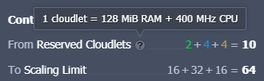

For better analysis, the values are divided into the color-marked groups:

- **_green_** - load balancers
- **_blue_** - application servers
- **_orange_** - databases and cache nodes
- **_gray_** - all other stacks

2. Next, you can view the **Estimated Cost** of your environment. The widget displays price using the same color-marking as above, and you can change the period - hourly, daily, or monthly.

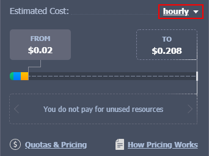

The **FROM** tab shows the price that will be fully charged as it covers reserved resources. The **TO** tab shows the maximum possible price if all nodes in the environment are going to fully consume all resources up to the scaling limit during the whole period.

:::tip Tip
Hover over the pricing widget to view extended details on the estimated cost calculation:

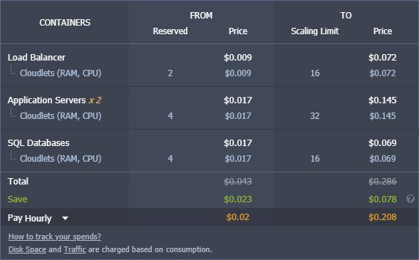

:::

If needed, you can click on the links under the widget for additional information on [how pricing works](/docs/Account&Pricing/Pricing%20Model%20Overview) and [what is charged at the platform](/docs/Account&Pricing/Resource%20Charging/Charged%20Resources).

3. Lastly, provide a name for your environment and click the **Create** button to proceed.

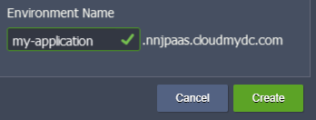

That’s all! In a few minutes, your new environment will appear on the dashboard.

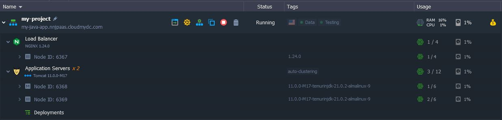

Now, you are ready for [application deployment](/docs/Deployment/Deployment%20Guide) and further use of your cloud environment.
