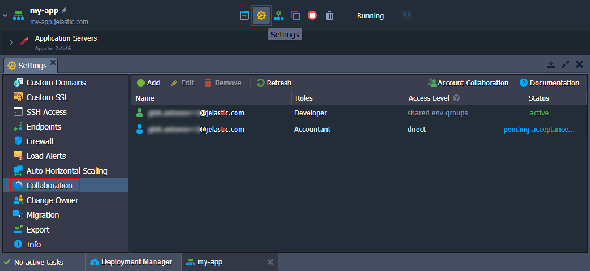
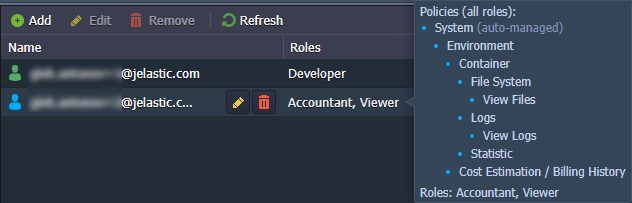
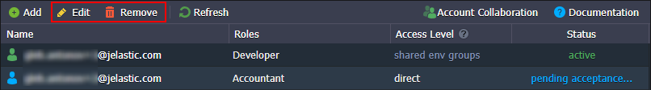

**Environment Sharing** is a particular case of the [account collaboration](/docs/Account&Pricing/Accounts%20Collaboration/Collaboration%20Overview) feature - when you want to give access or some functionality of your account to other users. The only difference is that you need to share just a single environment.

Check a quick summary of the feature for better understanding:

- environment _owner_ has complete control over the environment
- collaborators can only perform actions allowed by the owner (through the assigned [roles](/docs/Account&Pricing/Accounts%20Collaboration/Collaboration%20Roles%20Policies))
- only the _owner_ is charged for the shared environment

In order to share an environment, select it and go to the **Settings > Collaboration** tab. Here, you can see a list of all existing collaborators (if any) that have access to the current environment.

:::tip Tip

When accessing this tab as a collaborator, you can only check your own role for the current shared environment. However, the environment owner can share access and management possibilities through the Collaboration policy (cannot edit own roles).

:::

1. The table provides detailed information on access to the current environment. You can find all the required data in the following four columns:

- **Name** - lists emails of collaboration members that have access to the environment. Hover over to see the current member’s management options (Edit or Remove direct access).
- **Roles** - shows the exact access roles for the current environment per collaborator. Hover over for the combined list of policies from all roles.

- **Access Level** - shows the highest access level for the current environment. Hover over for more details. Information on the [access level algorithm](/docs/Account&Pricing/Accounts%20Collaboration/Collaboration%20Roles%20Policies#roles-assigning-algorithm) can be found upon hovering over the column header.

- **Status** - provides the collaboration status of the member (_active, pending acceptance, left, suspended_). The icon color at the start of each record also represents status.

2. Click the **Add** button at the top of the tools panel to provide <u>direct</u> access to the environment. Here, you need to provide the following data:

- **_Member_** - select an existing collaboration member or click the **Invite Member** option to provide email addresses
- **_Roles_** - choose at least one role from the list (if needed, click the **Create New Role** option to add a new one)

:::tip Tip

When inviting a new member, the flow is similar to the one described in the **[Create Collaboration](/docs/Account&Pricing/Accounts%20Collaboration/Create%20Collaboration)** guide. The user receives an invitation email and can accept or reject it.

:::

3. You can select an existing record in the list to **Edit** assigned <u>direct</u> roles or **Remove** <u>direct</u> direct access to the current environment.

:::danger Note

After removing direct access, the environment can still be available for the member through other access types, e.g. if the environment belongs to the shared group.

:::

You can click the **Account Collaboration** button (displayed for the environment owner only) at the top-right of the tools panel to go to the **User Settings > Collaboration > Shared by Me** section and perform more complex customizations.
