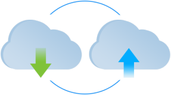

## Environment Export/Import: How To Migrate Application between Clouds

[PaaS & CaaS](/docs/EnvironmentManagement/Environment%20Export%20and%20Import/App%20Migration%20between%20Clouds) is designed to provide a real freedom of choice to developers: no proprietary APIs, no necessity to adjust your applications' code before hosting, a wide variety of stacks and features available. And one of the key options that exempts our users from any lock-in is the **Environment Export / Import** feature.

It allows to easily migrate hosted applications across [available PaaS installations](https://cloudmydc.com/) (i.e. hosting provider platforms). In such a way, you are able to switch to the most suitable platform according to your current preferences (e.g. due to platform versions differentiation or pricing systems distinctions) at any time.

To accomplish this, you need to:

- [export](/docs/environment-management/environment-export-and-import/environment-export) your environment from PaaS installation it is currently hosted at
- [import](/docs/environment-management/environment-export-and-import/environment-import) it to the preferred target platform

:::tip Notes

- Currently, the **_Environment Export_** feature exports only topology information. The imported environment will be created from scratch without any custom data inside.
- **_Environment Export / Import_** feature to work properly, the initial hosting provider’s platform should have the 7979 port opened, which is intended to be used for downloading environment source files during the import operation. Thus, depending on a particular provider’s configurations, exported environments from some of our partners' platforms may be not available for importing at other PaaS installations.
- You can also use the [Environment Transferring](/docs/environment-management/environment-transferring) option for moving your projects between different accounts of a single hosting provider platform, without the necessity to export/import them.
