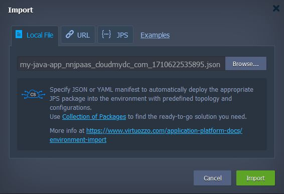
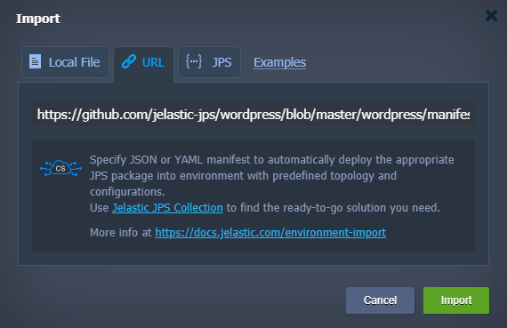
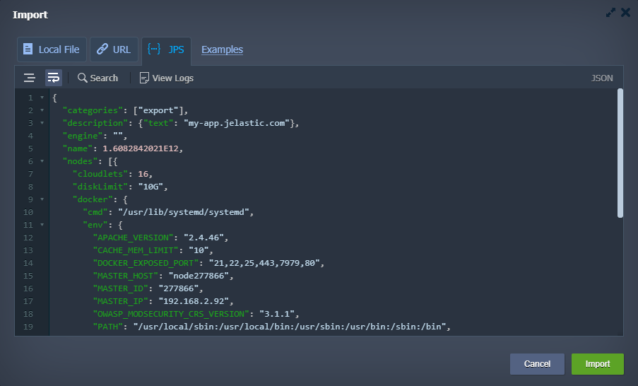
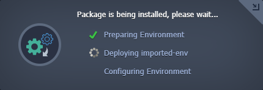
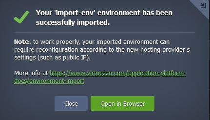

The the platform’s **Environment Import** feature allows executing the **_.json, .jps, .yml, .yaml_**, or **_.cs_** files on the platform to automatically install and configure projects according to the declared settings. Being initially designed to deploy the previously [exported](/docs/environment-management/environment-export-and-import/environment-export) environment copies (e.g. to transfer an application from another PaaS installation), it can also be used to install your own solutions, declared via JSON, or integrate any ready-to-go package from [JPS Collection](https://github.com/jelastic-jps).

So, let’s consider how to work with the platform import functionality in detail on the example of the exported environment.

:::danger Note

For your exported environment to work correctly, it should be migrated to the PaaS installation of <u>the same or higher version</u>. You can compare the platform’s versions at [Cloud Union](https://cloudmydc.com/).

:::

1. Click on the **Import** button at the top of the dashboard.

2. Within the opened **Import** frame, you’ll see three tabs with different options for providing the required file:

- **_Local File_** - to select a locally stored manifest (via the **Browse** button)

- **URL** - to type in or paste a direct link to the required fileimport via URL

- **JPS** - the built-in editor to either insert and edit code or to compose your own solution from scratch (refer to the [JPS deployment and troubleshooting](/docs/EnvironmentManagement/Environment%20Export%20and%20Import/Environment%20Import#jps-deployment--troubleshooting) section below for more information)

:::tip Tip

The **_Examples_** link next to these tabs redirects to the [JPS Collection](https://github.com/jelastic-jps) at GitHub, which stores multiple open-source samples of the ready-to-go packages. You can import any of them by fetching manifest.jps via the tabs above or examine files and scripts to create your own solution.

:::

To proceed, click the **Import** button in the bottom-right corner of the needed import type tab.

3. After that, you’ll see the installation confirmation window with the corresponding package description. For the exported environment, it shows details on the source platform and export date.

Within the fields inside, you need to specify the following parameters:

- **Environment** - domain name for your new environment
- **Display Name** - environment [alias](/docs/environment-management/environment-aliases) to be displayed at the dashboard instead of its domain (optional)
- **Region** - [environment region](/docs/environment-management/environment-regions/choosing-a-region) to host the solution (if several ones are available)

Click **Import** when ready.

4. Wait until the environment is created, deployed, and configured.

:::tip Tip

You can minimize this window and continue working with the dashboard without interrupting the importing process, which will proceed in the background.

:::

5. In a few minutes, you’ll see the installation success window.

Here, you can click **Open in Browser** to immediately check the result or **Close** this frame to reconfigure your environment and application according to the new platform’s settings (e.g. due to changed hostnames, IP addresses, etc.).

Also, check your email for information (like hostname, new administrator credentials for the nodes, etc.) on your imported environment.

That’s all! This way, you can automatically install any required solution to the chosen platform just in a few clicks, without the necessity to set up all configurations manually.

## JPS Deployment & Troubleshooting

The **Import > JPS** option is most frequently used by developers who create [JPS packages](/docs/Deployment%20Tools/Cloud%20Scripting%20&%20JPS/JPS%20Overview) (e.g. for automation of the common tasks or implementation of complex CI/CD flows). Also, it is an excellent tool for the quick tuning and testing of the packages.

1. Once added into this editor, your code will be automatically parsed for errors. If detected, they will be marked with the red cross icon before the corresponding line (hover over for some additional information on the issue). Besides, your code is safely retained in your browser’s local storage, so you can freely close the whole Import frame (e.g. to perform some other operations at the dashboard) and return to coding later on.

2. At the top of the frame, you can find several tools for a more comfortable work experience:

- **_Format JSON_**- automatically sets proper indentation and line feeds (not available for YAML)
- **_Wrap lines_** - brakes lines when they reach a frame border
- **_Search_** - locates the needed information, with additional options to narrow the search results even further:
  - Match case - enables a case sensitive search
  - Regex - uses [regular expressions](https://en.wikipedia.org/wiki/Regular_expression) for the search conditions specification
- **_View Logs_** - opens a console to track your code execution

3. The Import logs provide essential information for troubleshooting. If you face issues during the JPS packages creation, refer to this **Import > JPS > View Logs** tab and search for errors.

:::tip Tip

On the platforms before the 5.9.7 release, you can access this JPS console in a separate browser tab by adding the **/console** suffix to your dashboard URL (must be logged in for authorization).

:::
If you face any issues while importing a JPS package, feel free to appeal for our technical experts’ assistance at [Stackoverflow](https://stackoverflow.com/questions/tagged/jelastic).
