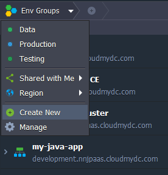

Setting new [environment group](/environment-management/environment-groups/overview) involves creation of a special tag, that subsequently can be attached to the required environment to logically mark it within the dashboard. You can use any naming paradigm that would be convenient for you - for example, if having development, testing, and production versions of a project, you can apply such tags to the corresponding environments to easily separate them.

So, to quickly create an environment group with only a few minutes notice, follow the next steps.

1. Open your platform dashboard and click the **"+" (Create New)** button within the **_Env Groups_** panel at the top.

:::tip Tip

Alternatively, you can access the same option via the expandable **Env Groups** menu:

- select the **Create New** point

- choose **Manage** and click on the **Add** button within the opened frame

:::

2. The appropriate **_Add Group_** dialog box will be opened.

Specify the following data in order to create a new group:

- **Name** - type a name for your group (any letters, numbers and special characters can be used including space)
- **Parent Group **- optionally, specify nesting for the currently created group to be included to another one as a [subgroup](/environment-management/environment-groups/group-management#add-subgroups)
- **Environments** - select environments that should belong to the group (shared environments cannot be added to your personal groups); also, it is possible to create an empty group and [fill it up with environments](/environment-management/environment-groups/group-management#assign-group-to-environment) later on

:::tip Tip

To enhance visual recognition of groups within the dashboard, you can assign different color to each of them by clicking the circled button near group name.

:::

Once you are finished, click Add.

3. The newly created group will be automatically selected and displayed as a new element on the top Env Groups navigation panel. The list of shown environments will be also filtered correspondingly.

Additionally, learn the ways you can [manage your environment groups](/environment-management/environment-groups/group-management) and quickly [navigate between them](/environment-management/environment-groups/navigation-across-groups) within dashboard.
