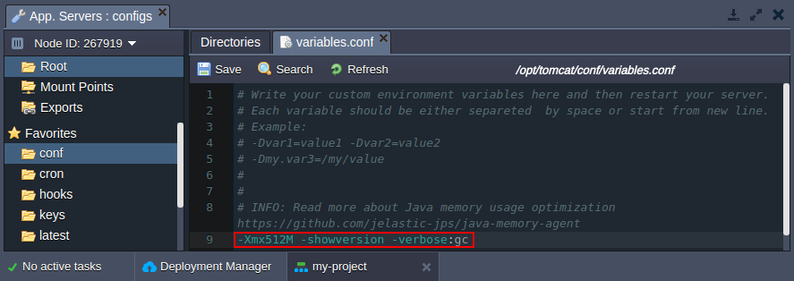
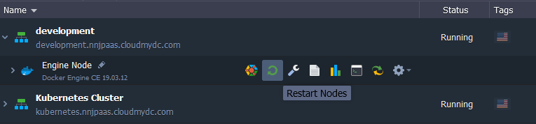
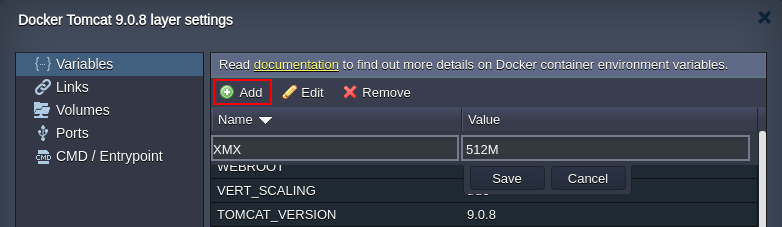
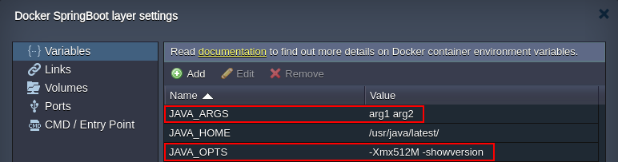

In order to ensure cost efficiency, all platform-managed Java servers are automatically configured to utilize memory in the most beneficial way. It is achieved by adjusting the main Java memory parameters based on resources allocated to a container.

:::tip Tip

Custom Java servers (e.g. inside Docker containers or VPS) can be optimized similarly using the [Java Memory Agent](https://github.com/jelastic-jps/java-memory-agent/) add-on.

:::

The default options can be manually changed to ensure high performance or to support any custom implementation.

1. In order to provide all the preferred [Java options](https://docs.oracle.com/javase/7/docs/technotes/tools/windows/java.html#CBBIJCHG) at once, the **variables.conf** file can be utilized.

Depending on a particular application server you are working with, the exact location may vary:

- **Tomcat, TomEE** - /opt/tomcat/conf/variables.conf
- **Jetty** - /opt/jetty/etc/variables.conf
- **Spring Boot** - /opt/shared/conf/variables.conf
- **GlassFish** - /opt/glassfish/glassfish/domains/domain1/config/variables.conf
- **Payara** - /opt/payara/glassfish/domains/domain1/config/variables.conf
- **WildFly** - /opt/wildfly/conf/variables.conf
  variables.conf file for Java options

If needed, you can [redefine the main memory options](/docs/EnvironmentManagement/EnvironmentVariables/Java%20Options%20and%20Arguments#redefining-main-java-parameters) via container variables.

2. Don’t forget to **Restart nodes** to apply changes.

That’s it! Now, your application is running with your custom Java options.

## Redefining Main Java Parameters

Most of the essential memory parameters (_-Xms, -Xmn, -Xmx, -Xminf, -Xmaxf, -XX:MaxPermSize, _-XX:+Use.GC\*) can be redefined using the dedicated environment [Variables](/docs/Container/Container%20Configuration/Variables).

As an example, you can **Add** the **-Xmx** option (i.e. maximum size for the Java heap memory):

:::tip Tip

The platform supports two additional variables that allow setting up main RAM parameters as a percentage of the total memory available:

- **_XMS_DEF_PERCENT_** - the initial size (%) of the memory allocation pool
- **_XMX_DEF_PERCENT_** - the maximum size (%) of the memory allocation pool

These values are automatically validated - if XMS is bigger than XMX, its actual value is set equal to XMX.

:::

## Spring Boot and Java Engine Specific Variables

When operating with the **Spring Boot** and **Java Engine** templates, you can provide two additional [Variables](/docs/Container/Container%20Configuration/Variables):

- **_JAVA_OPTS_** - to customize Java options for your app (similar to the **_variables.conf_** file)
- **_JAVA_ARGS_** - to pass some custom arguments to your application main function

Don’t forget to restart your application server(s) in order to apply changes.
