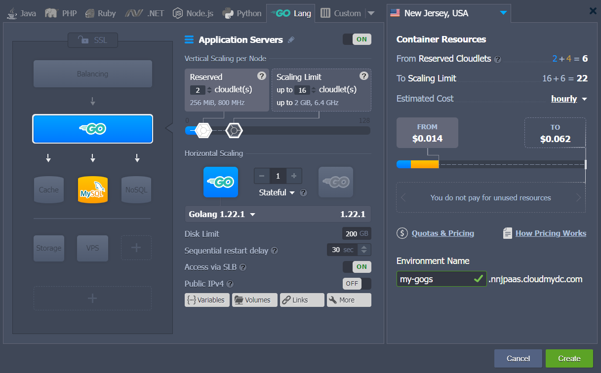
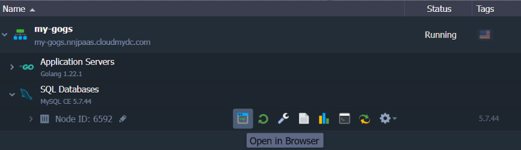

## Deploy and Run Go Git Service in the Cloud

[Gogs](https://gogs.io/) (Go Git Service) is an open-sourced self-hosted Git service, which can be easily deployed and hosted at Jelastic PaaS. Get your own GitHub-like fully configurable and isolated instance with unlimited private repositories and a tiny resource footprint.
Follow the step-by-step guide below to deploy Gogs:

1. [Create a new environment](/docs/environment-management/setting-up-environment) with the **_Golang_** application server and the **_MySQL_** database.

<div style={{
    display:'flex',
    justifyContent: 'center',
    margin: '0 0 1rem 0'
}}>



</div>

Set the required resource limits for nodes, adjust name and click **Create** to proceed. 2. Once your environment is created, click the **Open in Browser** button next to the MySQL node to access the database admin panel.

<div style={{
    display:'flex',
    justifyContent: 'center',
    margin: '0 0 1rem 0'
}}>



</div>

Use your DB credentials (sent via the appropriate email) to log in. 3. Navigate to the **Databases** tab and **Create** a new gogs database, which will be used with your Git service.

<div style={{
    display:'flex',
    justifyContent: 'center',
    margin: '0 0 1rem 0'
}}>


</div>

:::tip Tip

For production usage, it is recommended to create separate DB user (the **User accounts** tab) instead of using database root account.

:::

4. [Deploy](/docs/deployment/deployment-guide) the Gogs project using the following repository link:
   [https://github.com/gogs/gogs.git](https://github.com/gogs/gogs)

<div style={{
    display:'flex',
    justifyContent: 'center',
    margin: '0 0 1rem 0'
}}>


</div>

5. After successful deployment, you need to adjust the default settings.
   First of all, make a copy of the **_/home/jelastic/webapp/ROOT/conf/app.ini_** config file and paste it into the newly created **_/home/jelastic/webapp/ROOT/custom/conf/_** folder.
   This can be easily done via [Web SSH](/docs/deployment-tools/ssh/ssh-access/web-ssh), just run the following two commands:

```bash
mkdir -p /home/jelastic/webapp/ROOT/custom/conf
cp /home/jelastic/webapp/ROOT/conf/app.ini /home/jelastic/webapp/ROOT/custom/conf/app.iniinstall gogs
```

6. Adjust the **_server_** section of your custom **_app.ini_** config file:

- **_PROTOCOL_** - set the protocol to be used (e.g. http)
- **_DOMAIN_** - provide your environment domain name (my-gogs.jelastic.com)
- **_ROOT_URL_** - change to the following `%(PROTOCOL)s://%(DOMAIN)s/`

<div style={{
    display:'flex',
    justifyContent: 'center',
    margin: '0 0 1rem 0'
}}>


</div>

Don’t forget to **Save** the changes.

7. Add the **_GO_RUN_OPTIONS_** [environment variable](/docs/environment-management/environment-variables/environment-variables) with the **_web_** value.

<div style={{
    display:'flex',
    justifyContent: 'center',
    margin: '0 0 1rem 0'
}}>


</div>

**Restart** your Golang node to apply changes.

8. Open your environment in a browser and you’ll be automatically redirected to the Gogs installation page:

- **_Database Settings_** (_Type, Host, User, Password, DB name_) - provide the database connection data (use the previously received email to get the required credentials)
- **_Application General Settings_** - change the Run User field value to _golang_
- **_Optional Settings_** - configure Admin Account Settings (can be registered later - the very first user will be automatically provided with administrator permissions)

<div style={{
    display:'flex',
    justifyContent: 'center',
    margin: '0 0 1rem 0'
}}>


</div>

Click the **Install Gogs** at the bottom of the page.

9. You’ll be automatically logged in or redirected to the login screen (where you can sign up a new user).

<div style={{
    display:'flex',
    justifyContent: 'center',
    margin: '0 0 1rem 0'
}}>


</div>

That’s it! You can start using Gogs immediately!
Feel free to explore the benefits and usability of this Go Git service within Jelastic PaaS at one of the available service providers.
