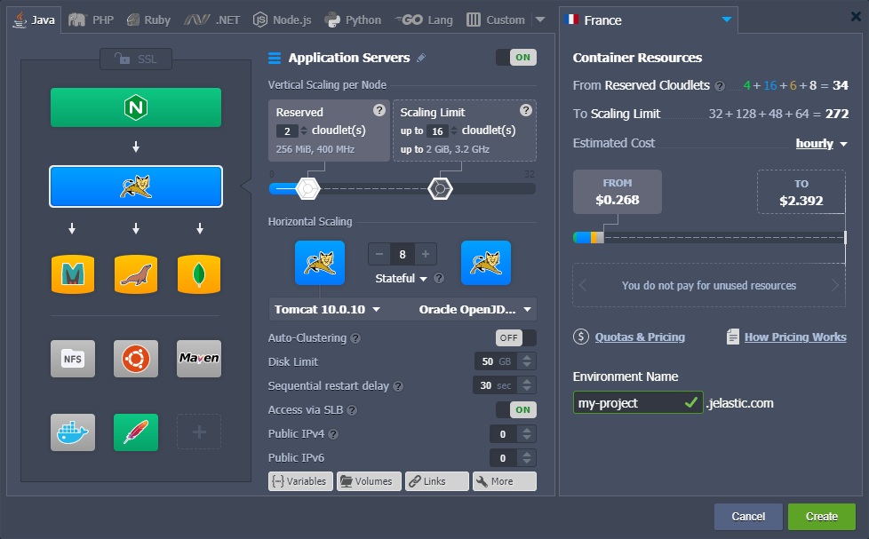

# Tasks TODO List

- QuickStart ✅
- Platform Overview ✅
- Container ✅
- Environment Management ✅
- Deployment ✅

- Application Setting 👍
- Deployment Tools 👍
- Java 👍
- PHP 👍

- Node.js ❌
- Ruby ❌
- Python ❌
- Go Lang ❌
- Window & .NET ❌
- Databases ❌
- Load Balancers ❌
- Kubernetes Hosting ❌
- Wordpress as a service ❌
- Elastic VPS ✅
- Data Storage Container ✅
- Memcached ✅
- Account & Pricing ✅

------------------------------------- Heading -------------------------------------

# this is content [No Short Link]

## this is content

### this is content

#### this is content [No Short Link]

------------------------------------- Extra Line -------------------------------------

<br/>

------------------------------------- Bold Text -------------------------------------
<br/>

Let's discover _Docusaurus0_.

<br/>

Let's discover **Docusaurus1**.

<br/>

Let's discover <b>Docusaurus2</b>.

<br/>

Let's discover **_Docusaurus3_**.

<br/>

Let's discover **_Docusaurus4_**.

------------------------------------- Link | Anchor Tag -------------------------------------
<br/>

Let's discover [Docusaurus1](https://cloudmydc.com/).

<br/>

Let's discover **[Docusaurus1](https://cloudmydc.com/)**.

<br/>

Let's discover **_[Docusaurus1](https://cloudmydc.com/)_**.

<br/>

Let's discover \***\*[Docusaurus1](https://cloudmydc.com/)\*\***.

<br/>

-------------------------------------------- Code --------------------------------------------

<div style={{
    width: '100%',
    border: '1px solid #eee',
    borderRadius: '7px',
    boxShadow: 'rgba(0, 0, 0, 0.16) 0px 1px 4px',
    overflow: 'hidden',
    margin: '0 0 1rem 0',
}}>
        <div style={{
            display: "flex",
        }}>
        <div style={{ width: '5%', background: 'red',
        padding: '10px 20px 5px 20px', color: 'white' }}>
          1
        </div>
        <div style={{
            padding: '10px 20px 5px 20px',
        }}>
           content
        </div>
    </div>
</div>

```bash
write code here

#include "bits/stdc++.h"

using namespace std;

void main() {
  cout<<"OnemindService LLC";
}
```

**2 Method**

```md title="docs/hello.md" {1-4}
---
sidebar_label: "Hi!"
sidebar_position: 3
---

#include "bits/stdc++.h"

using namespace std;

void main() {
cout<<"OnemindService LLC";
}
```

**3 Method**

```js title="sidebars.js"
module.exports = {
  tutorialSidebar: [
    "intro",
    // highlight-next-line
    "hello",
    {
      type: "category",
      label: "Tutorial",
      items: ["tutorial-basics/create-a-document"],
    },
  ],
};
```

-------------------------------------------- Image [how to find image is used] --------------------------------------------

<div style={{
    display:'flex',
    justifyContent: 'center',
    margin: '0 0 1rem 0'
}}>


</div>

--------------------------------------- Small Command -------------------------------------
<br/>

The `npm run start`

Open `docs/intro.md` (this page) and edit some lines.

--------------------------------------- Image Container -------------------------------------

<div style={{
    display: 'grid',
    gridTemplateColumns: '0.15fr 1fr',
    gap: '10px'
}}>
<div>
<div style={{
    display: 'flex',
    alignItems: 'center',
    justifyContent: 'cetner',
}}>

<!-- Image Url changes -->



</div>
</div>
<div>

<!-- Content changes -->

Gitblit is one of the most popular tools for managing, viewing and serving your repositories within Git - a widely spread VCS (version control system) for software elaboration. Mainly, Gitblit is designed for small workgroups, which work with centralized repositories, and supports the variety of remarkable features, such as access control, repository’s content displayment via web, multiple repositories management, ability to be integrated with other Git-management solutions etc.

</div>
</div>

--------------------------------------- Table -------------------------------------

<div style={{
        width: '100%',
        margin: '0 0 5rem 0',
        borderRadius: '7px',
        overflow: 'hidden',
    }} >
    <div>
        <div style={{
            width: '100%',
            height: 'auto',
            border: '1px solid var(--ifm-toc-border-color)',
            display: 'grid', 
            fontWeight: '500',
            color: 'var(--table-color-primary)',
            background: 'var(--table-bg-primary-t2)', 
            gridTemplateColumns: '1fr 2fr 1fr',
            overflow: 'hidden',
        }}>
            <div style={{
                display: 'flex', 
                alignItems: 'center', 
                justifyContent: 'center',
                padding: '20px',
                wordBreak: 'break-all',
                borderRight: '1px solid var(--ifm-toc-border-color)',
            }}>
                Hoster
            </div>
            <div style={{
                display: 'flex', 
                alignItems: 'center', 
                justifyContent: 'center',
                padding: '20px',
                borderRight: '1px solid var(--ifm-toc-border-color)',
                wordBreak: 'break-all'
            }}>
               CNAME
            </div>
            <div style={{
                display: 'flex', 
                alignItems: 'center', 
                justifyContent: 'center',
                padding: '20px',
                borderRight: '1px solid var(--ifm-toc-border-color)',
                wordBreak: 'break-all'
            }}>
                A Record
            </div> 
        </div>
        <div style={{
            width: '100%',
            height: 'auto',
            border: '1px solid var(--ifm-toc-border-color)',
            display: 'grid', 
            gridTemplateColumns: '1fr 2fr 1fr',
            fontWeight: '400',
        }}>
            <div style={{
                padding: '20px',
                borderRight: '1px solid var(--ifm-toc-border-color)',
                background: 'var(--table-bg-primary-t1)',
                display: 'flex', 
                alignItems: 'center', 
                justifyContent: 'flex-start',
                wordBreak: 'break-all',
                padding: '20px',
            }}>content1</div>
            <div style={{
                padding: '20px',
                wordBreak: 'break-all'
            }}>content2</div>
            <div style={{
                wordBreak: 'break-all',
                 padding: '20px',
            }}>content3</div>
        </div> 
        <div style={{
            width: '100%',
            height: 'auto',
            border: '1px solid var(--ifm-toc-border-color)',
            display: 'grid', 
            gridTemplateColumns: '1fr 2fr 1fr',
            fontWeight: '400',
        }}>
            <div style={{
                padding: '20px',
                borderRight: '1px solid var(--ifm-toc-border-color)',
                background: 'var(--table-bg-primary-t1)',
                display: 'flex', 
                alignItems: 'center', 
                justifyContent: 'flex-start',
                wordBreak: 'break-all',
                padding: '20px',
            }}>content1</div>
            <div style={{
                padding: '20px',
                wordBreak: 'break-all'
            }}>content2</div>
            <div style={{
                wordBreak: 'break-all',
                 padding: '20px',
            }}>content3</div>
        </div> 
    </div> 
</div>

<br/>

<div style={{
        width: '100%',
        margin: '0 0 5rem 0',
        borderRadius: '7px',
        overflow: 'hidden',
    }} >
    <div style={{
        width: '100%',
        padding: '20px',
        height: '70px',
        border: '1px solid var(--ifm-toc-border-color)',
        display: 'flex', 
        alignItems: 'center', 
        justifyContent: 'center',
        fontWeight: '400',
        fontSize: '25px',
        color: 'var(--table-color-primary)',
        background: 'var(--table-bg-primary-t3)'
    }}>
        LOAD BALANCERS
    </div>
    <div>
        <div style={{
            width: '100%',
            height: 'auto',
            border: '1px solid var(--ifm-toc-border-color)',
            display: 'flex', 
            alignItems: 'center', 
            justifyContent: 'flex-start',
            fontWeight: '500',
            gap: '10px',
            color: 'var(--table-color-primary)',
            background: 'var(--table-bg-primary-t2)', 
        }}>
            <div style={{
                minWidth: '40%',
                maxWidth: '40%',
                padding: '20px',
                borderRight: '1px solid var(--ifm-toc-border-color)',
                 display: 'flex', 
                alignItems: 'center', 
                justifyContent: 'center',
            }}>
                Name & Link to Tags
            </div>
              <div style={{
                width: '100%',
                display: 'flex', 
                alignItems: 'center', 
                justifyContent: 'center',
            }}>
                Latest Supported Version
            </div>
        </div>
        <div style={{
            width: '100%',
            height: 'auto',
            border: '1px solid var(--ifm-toc-border-color)',
            display: 'flex', 
            alignItems: 'center', 
            justifyContent: 'flex-start',
            fontWeight: '400',
            gap: '10px', 
        }}>
            <div style={{
                minWidth: '40%',
                maxWidth: '40%',             
                padding: '20px',
                borderRight: '1px solid var(--ifm-toc-border-color)',
                background: 'var(--table-bg-primary-t1)',
            }}>
                <a href="/">
                    content2  
                </a>
            </div>
            <div>
              content2  
            </div>
        </div>
    </div>
</div>

<br/>

<div style={{
        width: '100%',
        margin: '0 0 5rem 0',
        borderRadius: '7px',
        overflow: 'hidden',
    }} >
    <div>
        <div style={{
            width: '100%',
            height: 'auto',
            border: '1px solid var(--ifm-toc-border-color)',
            display: 'grid', 
            fontWeight: '500',
            color: 'var(--table-color-primary)',
            background: 'var(--table-bg-primary-t2)', 
            gridTemplateColumns: '1fr 0.6fr 1fr 1fr 1fr',
            overflow: 'hidden',
        }}>
            <div style={{
                display: 'flex', 
                alignItems: 'center', 
                justifyContent: 'center',
                padding: '20px',
                wordBreak: 'break-all',
                borderRight: '1px solid var(--ifm-toc-border-color)',
            }}>
                Hoster
            </div>
            <div style={{
                display: 'flex', 
                alignItems: 'center', 
                justifyContent: 'center',
                padding: '20px',
                borderRight: '1px solid var(--ifm-toc-border-color)',
                wordBreak: 'break-all'
            }}>
               Country
            </div>
            <div style={{
                display: 'flex', 
                alignItems: 'center', 
                justifyContent: 'center',
                padding: '20px',
                borderRight: '1px solid var(--ifm-toc-border-color)',
                wordBreak: 'break-all'
            }}>
                Hoster Domain
            </div> 
            <div style={{
                display: 'flex', 
                alignItems: 'center', 
                justifyContent: 'center',
                padding: '20px',
                borderRight: '1px solid var(--ifm-toc-border-color)',
                wordBreak: 'break-all'
            }}>
                User Environment Domain(s)
            </div>
            <div style={{
                display: 'flex', 
                alignItems: 'center', 
                justifyContent: 'center',
                padding: '0 20px',
                borderRight: '1px solid var(--ifm-toc-border-color)',
                wordBreak: 'break-all'
            }}>
                Region(s) with Native Docker*
            </div>
        </div>
        <div style={{
            width: '100%',
            height: 'auto',
            border: '1px solid var(--ifm-toc-border-color)',
            display: 'grid', 
           gridTemplateColumns: '1fr 0.6fr 1fr 1fr 1fr',
            fontWeight: '400',
        }}>
            <div style={{
                padding: '20px',
                borderRight: '1px solid var(--ifm-toc-border-color)',
                background: 'var(--table-bg-primary-t1)',
                display: 'flex', 
                alignItems: 'center', 
                justifyContent: 'flex-start',
                wordBreak: 'break-all',
                padding: '20px',
            }}>
                <a href="/">
                  item1
                </a>
            </div>
            <div style={{
                display: 'flex', 
                alignItems: 'center', 
                justifyContent: 'center',
                padding: '20px',
                wordBreak: 'break-all'
            }}>
                item2
            </div>
            <div style={{
                wordBreak: 'break-all',
                 padding: '20px',
            }}>
                item3
            </div>
            <div style={{
                wordBreak: 'break-all',
                 padding: '20px',
            }}>
                item4
            </div>
            <div style={{
                wordBreak: 'break-all',
                padding: '20px',
            }}>
                item5
            </div>
        </div>
    </div>
</div>

------------------------------------- TIP -------------------------------------

:::tip Tip

this is something that i like to do in my free time

:::

:::tip Note

this is something that i like to do in my free time

:::

:::danger Tip

this is something that i like to do in my free time

:::

:::danger Note

this is something that i like to do in my free time

:::

------------------------------------- Ordered List -------------------------------------

1. this is something awesome
2. this is something awesome
3. this is something awesome

------------------------------------- UnOrdered List -------------------------------------

- this is something awesome
- this is something awesome
- this is something awesome

------------------------------------- Nested List [3 white space] -------------------------------------

- this is something awesome
  - this is something awesome
    - this is something awesome

1. this is something awesome
   - this is something awesome
     - this is something awesome
1. this is something awesome 2. this is something awesome
   - this is something awesome

------------------------------------- White Line -------------------------------------

<hr/>

------------------------------------- Button Line -------------------------------------

<button>Click Me</button>

<br/>

------------------------------------- Additional Tutorial -------------------------------------

HTML -> `https://youtube.com/playlist?list=PL0b6OzIxLPbxStBQ21C2toa5uQMqHEoRT&si=JTK6h9g4Skq6FfKK`

Video Not Completed
!incomplete