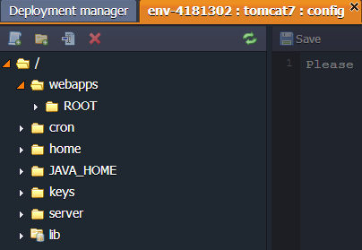

import obj from './JavaAppServerConfiguration.json'

## Java Application Server Configuration

To perform the necessary configurations, press the **Config** button next to your application server. In the case you have **several application servers** you can configure them together or separately. To do this follow the steps:

- Open the drop-down menu at the top of the configuration tab. It includes the list of all of the app servers in your environment.

- Choose the one you need and make the configurations.
- To apply the changes:

  - only for the chosen server click **Save only for current instance** button from drop-down menu;
  - for all the servers click **Save**.

  

  

    

:::tip Note

if you create/rename a file or folder in the Configuration manager, this will be applied only in the list of the chosen node. You can’t save this change for all of the app servers available in the environment. If you want to also create/rename the file or folder in the other servers you need to do this manually.

:::

Below you will see the list of the configuration files available for editing in the Java application servers:

- [Tomcat](/docs/Java/Java%20App%20Server%20Configuration#tomcat)
- [TomEE](/docs/Java/Java%20App%20Server%20Configuration#tomee)
- [GlassFish](/docs/Java/Java%20App%20Server%20Configuration#glassfish)
- [Jetty](/docs/Java/Java%20App%20Server%20Configuration#jetty)

To get more information on which settings can be changed in the provided config folders, use the appropriate descriptions:

- [server](/docs/Java/Java%20App%20Server%20Configuration#server)
- [home](/docs/Java/Java%20App%20Server%20Configuration#home)
- [webapps/work](/docs/Java/Java%20App%20Server%20Configuration#webapps--work)
- [JAVA_HOME](/docs/Java/Java%20App%20Server%20Configuration#java_home)
- [lib](/docs/Java/Java%20App%20Server%20Configuration#lib)
- [cron](/docs/Java/Java%20App%20Server%20Configuration#cron)
- [keys](/docs/Java/Java%20App%20Server%20Configuration#keys)
- [contexts](/docs/Java/Java%20App%20Server%20Configuration#contexts)
- [server_lib](/docs/Java/Java%20App%20Server%20Configuration#server_lib)
- [apps](/docs/Java/Java%20App%20Server%20Configuration#apps)

## SERVER

The main Java servlet container configurations are performed in the files, located in the **_server_** folder.

Using the following config files, you can perform the actions listed below (these are just some examples):

**_<u>context.xml</u>_**

- configure [session replication via Memcached](/docs/Memcached/Session%20Replication%20via%20Memcached)

  **_<u>web.xml</u>_**

- configure [remote access via WebDav](/docs/Deployment%20Tools/Remote%20Access%20via%20WebDAV)

  **_<u>server.xml</u>_**

- enable [Multiple Domains](/docs/ApplicationSetting/Domain%20Name%20Management/Multiple%20Domain%20for%20Tomcat)

  **_<u>variables.conf</u>_**

- configure memory settings for your java containers by stating your custom [GC](https://cloudmydc.com/), [-Xmx](https://docs.oracle.com/cd/E13150_01/jrockit_jvm/jrockit/jrdocs/refman/optionX.html#wp999528), [-Xms](https://www.oracle.com/java/technologies/javase/gc-tuning-6.html) parameters (use standard parameters stating each at the new line):

  _-Xmx< size >m -Xms< size >m_

- set your custom [system properties](/docs/EnvironmentManagement/EnvironmentVariables/Java%20Options%20and%20Arguments) for your [Tomcat, TomEE, Jetty](/docs/Java/Java%20App%20Servers/Tomcat%20and%20TomEE/Tomcat-TomEE%20Variables)or [GlassFish](/docs/Java/Java%20App%20Servers/Tomcat%20and%20TomEE/Tomcat-TomEE%20Variables#glassfish-variables):

  _-Dvar1=value1 -Dvar2=value2 -Dmy.var3=/my/value_

- configure [JavaAgent interceptor](/docs/Java/Java%20Apps%20Specifications/Java%20Agent)

- enable [remote debugging](/docs/ApplicationSetting/Remote%20Debugging):
  _-Xdebug -Xrunjdwp:transport=dt_socket,server=y,suspend=n,address={port_number}_

**Note** that this file is available only for **Tomcat 6,7** and **TomEE** application servers. For configuring a **GlassFish** server, use the _Admin Panel_.

[Back to the list](/docs/Java/Java%20App%20Server%20Configuration)

## HOME

If you need to use any custom files/folders for configuring your application you can download/create them in the **home** directory which is used as a storage in your Java server.

As a result you can make configurations specifying the path to your downloaded/created files in the **_variables.conf_** file (_server_ folder).

[Back to the list](/docs/Java/Java%20App%20Server%20Configuration)

:::tip Note

though the server’s directory, which refers to this folder, can be named temp for some servers, it is never automatically cleaned by the platform system.

:::

[Back to the list](/docs/Java/Java%20App%20Server%20Configuration)

## WEBAPPS / WORK

The **webapps** (for Tomcat/TomEE) and **work** (for Jetty) folders are used for storing the unpacked application deployed to the environment.

[Back to the list](/docs/Java/Java%20App%20Server%20Configuration)

[Back to the list](/docs/Java/Java%20App%20Server%20Configuration)

## JAVA_HOME

The **JAVA_HOME** folder contains the java config files and libs. Here, you can edit java settings and upload additional java libraries.

[Back to the list](/docs/Java/Java%20App%20Server%20Configuration)

## LIB

The **lib** folder is used for storing default and uploading custom **jar** libraries.

[Back to the list](/docs/Java/Java%20App%20Server%20Configuration)

## CRON

App servers include a cron folder with the config file, where cronjobs can be configured. Detailed information on Cronjob configuration can be found in the [Setting Up a Cronjob](/docs/ApplicationSetting/Scheduling%20Configuration/Setting%20Up%20Cronjob) document.

[Back to the list](/docs/Java/Java%20App%20Server%20Configuration)

## KEYS

The **keys** directory is used as a location for uploading any private key which is needed for your application. Generate the key, save it as a simple file and upload to the **key** folder. It can be used for different cases by simply stating the path to your key:

_/var/lib/jelastic/keys/{key_file_name}_

[Back to the list](/docs/Java/Java%20App%20Server%20Configuration)

## CONTEXTS

The **contexts** folder contains XML config files for each deployed context. All of these files are open for editing.

[Back to the list](/docs/Java/Java%20App%20Server%20Configuration)

## SERVER_LIB

The **server_lib** folder is the GlassFish config directory with all available server libraries.

[Back to the list](/docs/Java/Java%20App%20Server%20Configuration)

## APPS

The **apps** TomEE folder is used for storing the unpacked EE application deployed to the environment.

[Back to the list](/docs/Java/Java%20App%20Server%20Configuration)

## Tomcat

    

        

            

                Folder
            

            

               File
            

            

                Path
            
 
        

        {obj.data1.map((item, idx) => {
          return 

            

                {item.Folder}
            

            

                {item.File}
            

            

                {item.Path}
            

        
 
        })}
    
 

[Back to the list](/docs/Java/Java%20App%20Server%20Configuration)

## TomEE

    

        

            

                Folder
            

            

               File
            

            

                Path
            
 
        

        {obj.data2.map((item, idx) => {
          return 

            

                {item.Folder}
            

            

                {item.File}
            

            

                {item.Path}
            

        
 
        })}
    
 

[Back to the list](/docs/Java/Java%20App%20Server%20Configuration)

## GlassFish

    

        

            

                Folder
            

            

               File
            

            

                Path
            
 
        

        {obj.data3.map((item, idx) => {
          return 

            

                {item.Folder}
            

            

                {item.File}
            

            

                {item.Path}
            

        
 
        })}
    
 

[Back to the list](/docs/Java/Java%20App%20Server%20Configuration)

## Jetty

    

        

            

                Folder
            

            

               File
            

            

                Path
            
 
        

        {obj.data4.map((item, idx) => {
          return 

            

                {item.Folder}
            

            

                {item.File}
            

            

                {item.Path}
            

        
 
        })}
    
 

[Back to the list](/docs/Java/Java%20App%20Server%20Configuration/)
