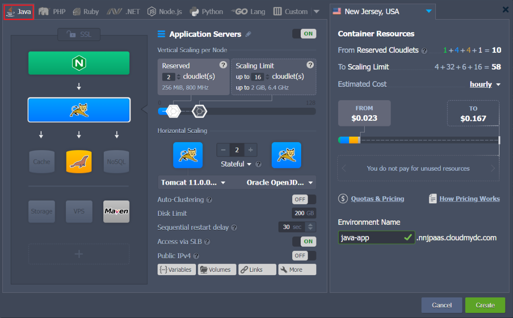
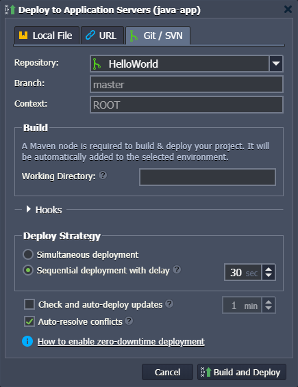
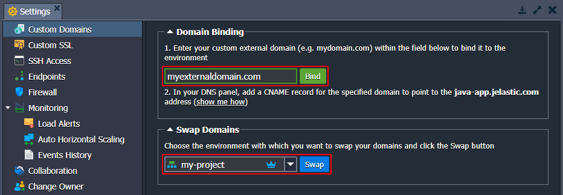
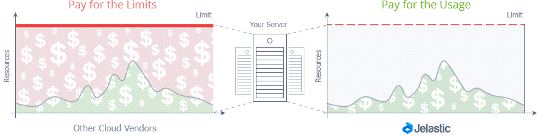
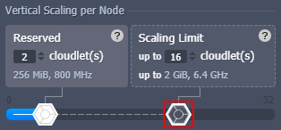
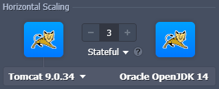
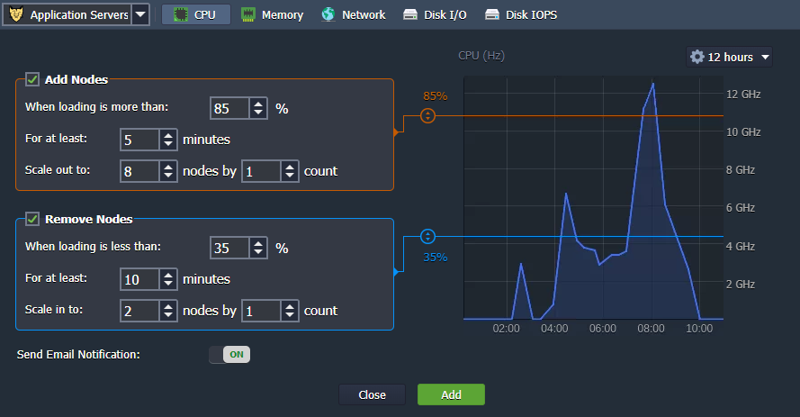
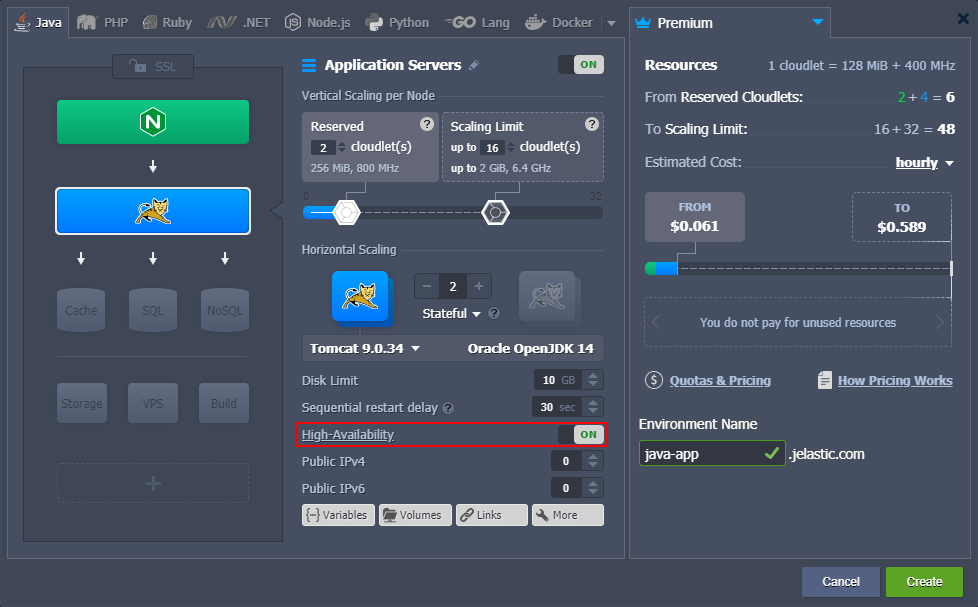
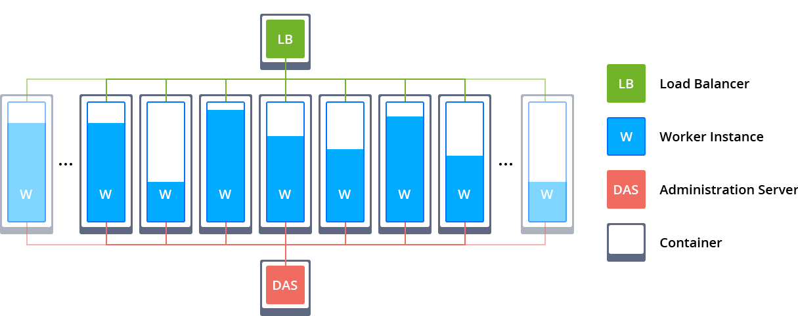

<!-- ## Java Developer’s Center -->

Currently multilingual, the platform was initially created as pure Java Cloud and still maintains a primary focus on this programming language. The maturity of the platform technology was recognized by the Java community with Duke’s Choice Award already twice (in 2012 and 2018). This guide acquaints you with the distinctive features of Java hosting within the platform and lets you easily get started with a broad functionality list.

<!-- 
Use the table of content below to find required information within the guide quicker:
- [Java Versions](/java/java-dev-center#java-versions)
- [Java Application Servers](/java/java-dev-center#java-application-servers)
- [Java Environment Creation](/java/java-dev-center#java-environment-creation)
- [Java Application Deployment](/java/java-dev-center#java-application-deployment)
- [Domains Management](/java/java-dev-center#domains-management)
- [automatic vertical scaling](/application-setting/scaling-and-clustering/automatic-vertical-scaling)
- [Horizontal Scaling: Manual and Automatic](/java/java-dev-center#horizontal-scaling-manual-and-automatic)
- [Java Clusterization](/java/java-dev-center#java-clusterization)
- [Database Connection to Java Application](/java/java-dev-center#database-connection-to-java-application) -->

## Java Versions

Currently (at the time of this writing), the following Java versions and distributions are available:

- **[AdoptOpenJDK](https://adoptium.net/)**: 8.0.312; 11.0.13; 13.0.2; 14.0.2; 15.0.2; 16.0.2
- **[Alibaba Dragonwell](https://dragonwell-jdk.io/#/index)**: 8.11.12
- **[Amazon Corretto](https://aws.amazon.com/corretto/?filtered-posts.sort-by=item.additionalFields.createdDate&filtered-posts.sort-order=desc)**: 8.382.05.1; 11.0.20.9.1; 15.0.2.7.1; 16.0.2.7.1; 17.0.8.8.1; 18.0.2.9.1; 19.0.2.7.1; 20.0.2.10.1
- **[Eclipse OpenJ9](https://eclipse.dev/openj9/)**: 0.11.0 (8u192-b12; 11.0.1); 0.15.1 (8u222-b10; 11.0.4); 0.17.0 (8u232-b09; 11.0.5; 13.0.1); 0.18.1(8u242-b08; 11.0.6; 13.0.2) 0.20.0 (8u252-b09; 11.0.7); 0.21.0 (8u262-b10; 8u265-b01; 11.0.8; 14.0.2); 0.22.0 (15.0.0); 0.23.0 (8u272-b10; 11.0.9); 0.24.0 (8u282-b08; 11.0.10); 0.25.0-16; 0.26.0 (8u292-b10; 11.0.11); 0.27.0 (8u302-b08; 11.0.12); 0.29.0 (8u312-b07; 11.0.13); 0.30.0 (8u322-b06; 11.0.14); 0.32.0 (8u332-b09; 11.0.15); 0.33.1 (8u345-b01; 11.0.16); 0.35.0 (8u352-b08; 11.0.17); 0.36.1 (8u362-b09; 11.0.18); 0.38.0 (8u372-b07; 11.0.19)
- **[Eclipse Temurin](https://projects.eclipse.org/projects/adoptium.temurin)**: 8.0.382; 11.0.20; 17.0.8; 18.0.2.1; 19.0.2; 20.0.2
- **[GraalVM CE](https://projects.eclipse.org/projects/adoptium.temurin)** (currently, for Java Engine and Maven only): 19.3.1; 20.2.0; 21.3.0; 22.3.3
- **[Liberica JDK](https://bell-sw.com/)**: 8.0.322; 11.0.14; 13.0.2; 14.0.2; 15.0.0; 16.0.0; 17.0.2
- **[Oracle JDK Dev](https://jdk.java.net/)**: 7.0_79; 8.0_202; 11.0.2
- Oracle OpenJDK: 7.0.261; 8.0.382; 11.0.20; 13.0.2; 14.0.2; 15.0.2; 16.0.2; 17.0.2; 18.0.2.1; 19.0.2; 20.0.2; 21; 22.ea-b18
- **[Zulu Community](https://www.azul.com/downloads/#zulu)**: 7.0.352; 8.0.382; 11.0.20.1; 13.0.9; 14.0.2; 15.0.10; 16.0.2; 17.0.8.1; 18.0.2.1; 19.0.2; 20.0.2

The _6th, 9th, 10th_, and _12th_ Java versions cannot be created within the new environments anymore due to end-of-life of the respective releases. However, the already existing instances remain fully operable (including redeploy, cloning, horizontal scaling).

:::tip

The up-to-date list of the releases available on the platform is provided via the dedicated, regularly (weekly) updated [Software Stack Versions](/quickstart/software-stack-versions#engines) document.

:::

You can choose the preferred version while creating an environment, or change it later. These procedures are described in the [Java Versions](/java/java-versions) document.

## Java Application Servers

Within a wide variety of software stacks, the platform supports a pure [Java Engine](/java/java-app-servers/java-engine-server) and the following Java application servers:

- [GlassFish](/java/java-app-servers/glassfish/glassfish-server)
- [Jetty](/java/java-app-servers/jetty/jetty-server)
- [Payara](https://cloudmydc.com/)
- [Spring Boot](https://cloudmydc.com/)
- [Tomcat9](/java/java-app-servers/tomcat-and-tomee/tomcat-server)
- [TomEE](/java/java-app-servers/tomcat-and-tomee/tomee-server)
- [WildFly](/java/java-app-servers/wildfly/wildfly-server)

Read the documentation below for additional information on Java servers specifics within the platform:

- [Java App Server Configuration](/java/java-app-server-configuration)
- [Java Garbage Collection](https://cloudmydc.com/)
- [Java Agent](https://cloudmydc.com/)
- [Java Tutorials](/java/java-apps-specifications/java-agent)

## Java Environment Creation

To host a Java application, you need to create an appropriate environment. Just open the [**topology wizard**](/environment-management/setting-up-environment) in your PaaS dashboard, navigate to the **Java** language tab, pick the desired Java application server, databases, and other stacks. If needed, customize settings (such as cloudlets, disk space, region, etc.) and click **Create**.

All added servers represent [fully isolated containers](/platform-overview/isolated-container), located on different hosts for more availability, while isolation eliminates the risks of interfering with one another. You can attach the [public IP](/application-setting/external-access-to-applications/public-ip) address to any of these servers for being accessed directly. Otherwise (i.e. if using default settings), the incoming requests sent to your application will be proxied by [Shared Load Balancer](/application-setting/external-access-to-applications/shared-load-balancer).

## Java Application Deployment

After environment creation, you can deploy your Java application. The platform fully automates the deployment process allowing you to get the project up and running effortlessly.

The following deployment methods are supported:

- via the application **_archive_** - _.war, .zip, .jar,_ and _.ear_ archives
- from the GIT/SVN remote **_repository_**, using the Maven build node
- using **_plugins_** - _[Ant Task](/deployment-tools/plugins/ant-task), [Eclipse, IntelliJ IDEA](https://cloudmydc.com/), [Maven](/java/build-node/java-vcs-deployment-with-maven)_ and _[NetBeans](/deployment-tools/plugins/netbeans-plugin/netbeans-plugin-overview/)_

You can read the appropriate documents to learn more about the deployment of the Java applications:

- [Deployment Guide](/deployment/deployment-guide)
- [Maven Build Node](/java/build-node/java-vcs-deployment-with-maven)
- [Auto-Deploy Overview](/deployment/git-&-svn-auto-deploy/auto-deploy-overview)
- [Deployment Hooks](/deployment/deployment-hooks)

There are also separate instructions for managing your projects via [Gitblit](/deployment/deploying-apps-via-gitblit) and [WebDAV](/deployment-tools/remote-access-via-webdav).

## Domains Management

You can bind a [custom domain](/application-setting/domain-name-management/custom-domain-name) name to your application’s URL and use it instead of the default environment domain:

- **_CNAME redirect_** if using _Shared Load Balancer_; is recommended for **_dev_** and **test** environments
- **DNS A Record** if using _public IP_; can handle high traffic load and is suitable for **production** environments

Also, with the help of the [swapping domains](https://cloudmydc.com/) feature or the **SwapExtIps** [API](https://cloudmydc.com/)/[CLI](/deployment-tools/api-&-cli/platform-cli/platform-cli-overview) method, you can upgrade and modify your application with zero downtime (i.e. your users won’t notice any interruption).

:::tip

The platform allows using multiple domains within a single environment to increase its usability, efficiency, and scalability, while simultaneously saving your costs by avoiding a need to set up separate instances for different apps. Check the appropriate examples below:

- [Multiple Domains with Public IP](/application-setting/domain-name-management/multiple-domains-with-public-ip)
- [Multiple Domains for Tomcat](/application-setting/domain-name-management/multiple-domain-for-tomcat)
- [Multiple Domains for GlassFish](/application-setting/domain-name-management/multiple-domains-for-glassfish)

:::

## Automatic Vertical Scaling

The platform dynamically provides the number of cloudlets (i.e. RAM and CPU resources), which are required by your application to handle the current load. Just specify the maximum limit, and everything else will be performed by the platform automatically - no manual intervention required. This feature is called [**_atuomatic vertical scaling_**](/application-setting/scaling-and-clustering/automatic-vertical-scaling) and ensures that you never overpay for unused capacities without experiencing a resource shortage.

To set or change the vertical scaling limit, just use the appropriate slider within the topology wizard:

## Horizontal Scaling: Manual and Automatic

In case your application becomes highly popular and a single node is not enough, feel free to scale it [horizontally](/application-setting/scaling-and-clustering/horizontal-scaling). In order to ensure even more reliability and high-availability, all the newly added nodes are created on the different hardware nodes.

Click the **+/-** buttons within the _Horizontal Scaling_ section of the topology wizard to set the required number of nodes (load balancer will be added automatically).

Also, you can adjust the preferred [scaling mode](/application-setting/scaling-and-clustering/horizontal-scaling):

- **_Stateless_** - simultaneously creates all of the new nodes from the base image template
- **_Stateful_** - sequentially copies file system of the master container into the new nodes

Horizontal scaling can be performed not only manually but also automatically based on the current load on the node, which is monitored through the tunable triggers.

Within the **Settings > Monitoring > [Auto Horizontal Scaling](/application-setting/scaling-and-clustering/automatic-horizontal-scaling)** section, you can adjust the scaling conditions due to your needs, i.e. the lower/upper limit (percentage) for the specified resource type during a certain period. If the load stays out of the set limits, the nodes removal/addition process will be called automatically.

There are five different types of resources, which are monitored by triggers:

- CPU
- Memory (RAM)
- Network
- Disk I/O
- Disk IOPS

The trigger starts monitoring the resource consumption immediately after addition, and when the usage level exceeds the stated limit, a trigger becomes invoked. Subsequently, if the load persists for a defined period, it will be executed, adjusting the number of nodes.

## Java Clusterization

The embedded application server clustering feature provides replication of sessions between pairs of nodes and eliminates the necessity of additional software or Memcached usage for increasing application availability.

The platform provides automated session replication between _Tomcat_ and _TomEE servers_ with the help of multicast to gain web application high availability within the Java cluster. This [**High-Availability**](/application-setting/scaling-and-clustering/session-replication-for-ha) feature can be enabled in the wizard during environment creation or topology tuning.

The newer modern [**Auto-Clustering**](/application-setting/scaling-and-clustering/auto-clustering-of-instances) solution is provided for the _GlassFish, Payara,_ and _WildFly_ stacks:

- [Out-of-Box GlassFish & Payara Clustering0](https://cloudmydc.com/)
- [WildFly Automatic Micro Clustering and Scaling](https://cloudmydc.com/)

## Database Connection to Java Application

A set of scalable and fully manageable database servers can be easily installed within the Java environment. To establish the connection, adjust your application following the instruction based on the database you require:

- [MySQL and MariaDB Connection](/database/mysql-mariadb-percona/connection-to-applications/java-connection)
- [PostgreSQL Connection](https://cloudmydc.com/)
- [MongoDB Connection](/database/mysql-mariadb-percona/connection-to-applications/java-connection)

The platform provides high-quality Java hosting with improved availability, redundancy, and scalability strengths for your application.
