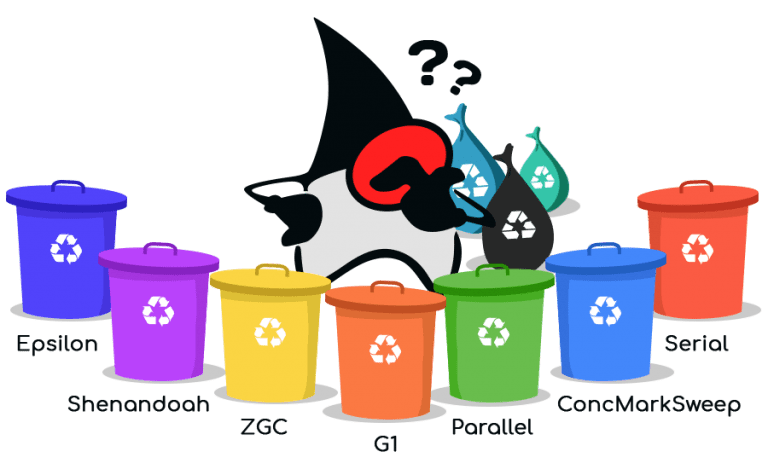
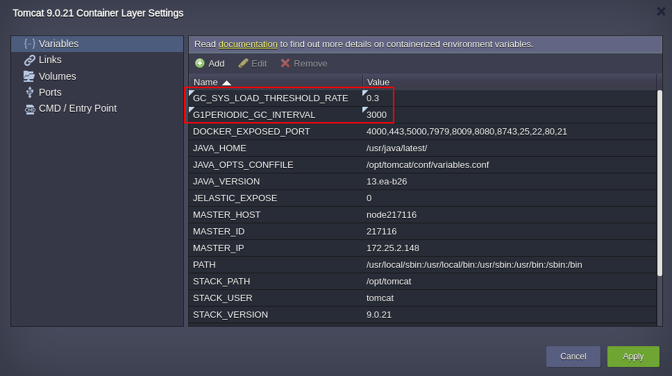
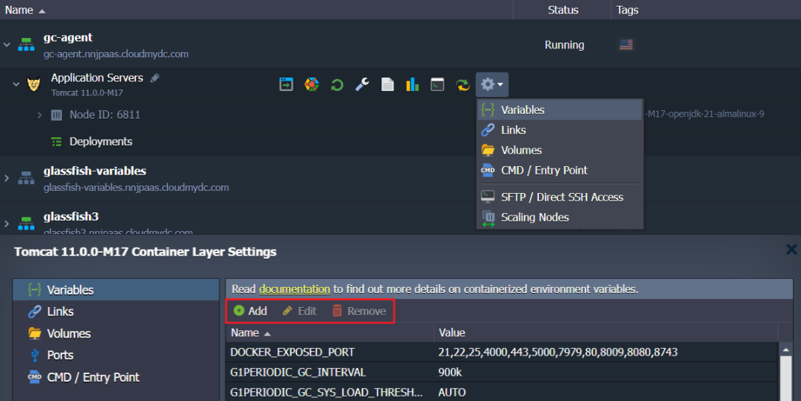
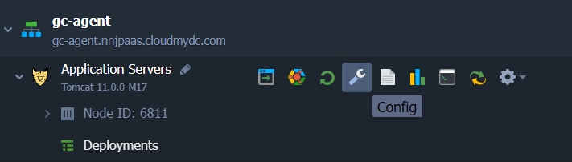
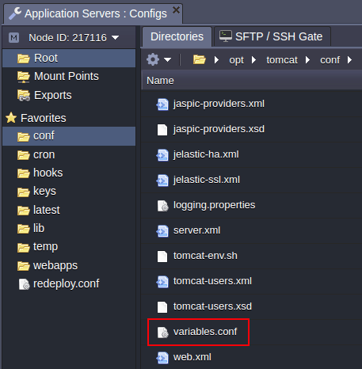
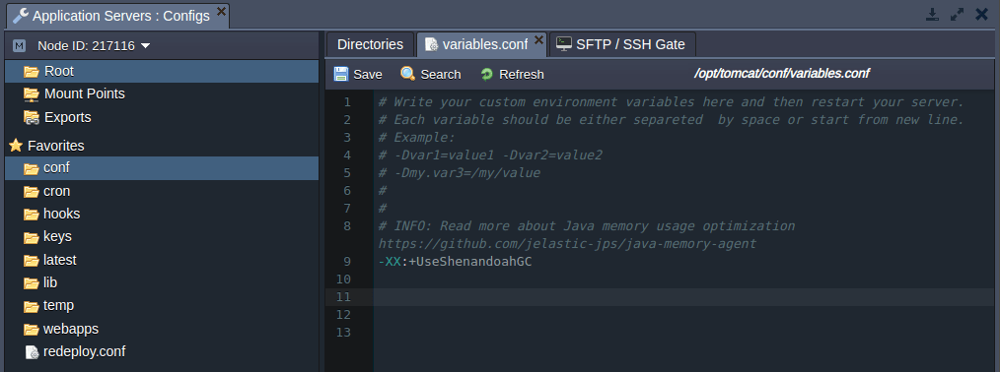
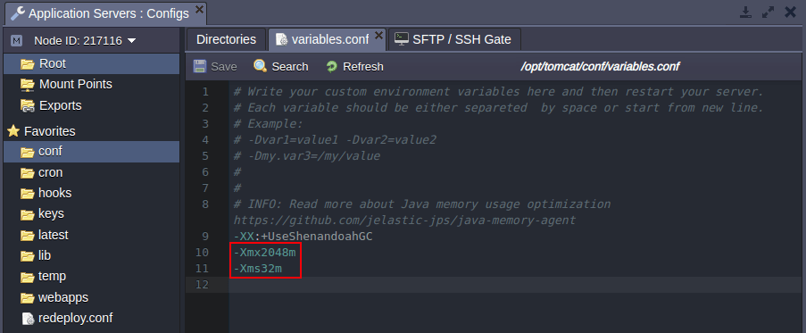
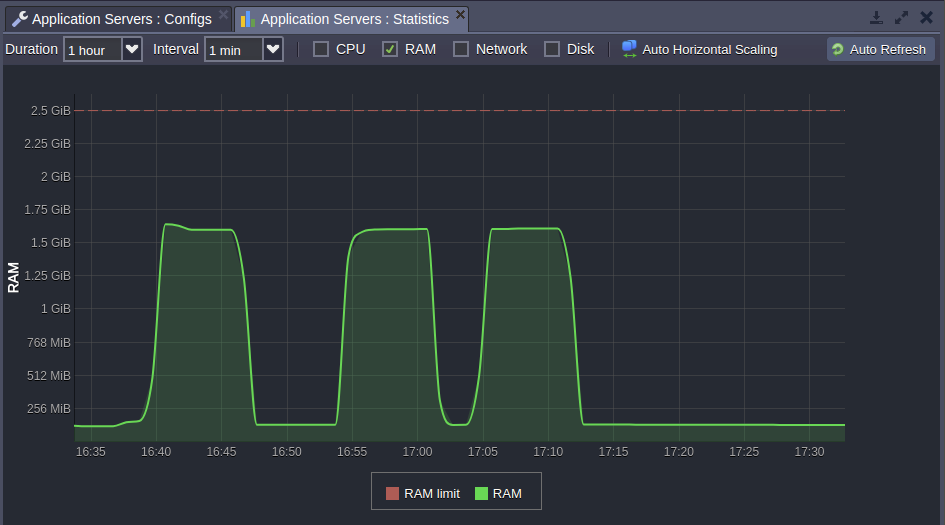

import obj from './JavaGarbageCollector.json'

Performance and price are two big considerations in application hosting that always matter. And, often, we question ourselves on how to decrease the spends, without affecting the performance of your apps at the same time. In this article, we’d like to address automatic memory management for Java applications hosted with Jelastic using garbage collection.

Let’s clarify what garbage collection is, what it does for Java applications and how it works within Jelastic PaaS.

## Java Garbage Collection Overview

**Garbage Collection** is a form of automatic memory management. Its aim is to find data objects in memory that are no longer demanded and make their space available for reuse.

The created object uses some memory that remains allocated until there are references for the use of the object. When there are no references for an object, it is considered to be no longer required and the memory occupied by the object can be reclaimed. In such a way, you don’t pay for unused resources and can cut your costs.

We’ve tested different kinds of Garbage Collectors (GC) and defined the most appropriate ones for the Java applications hosted in our cloud, taking into consideration the automatic vertical scaling that Jelastic provides. As a result of our investigations, we adjusted the default settings of Garbage Collectors in Jelastic in order to increase the benefits for our users.

Jelastic supports the following GCs:

- **_G1 GC (-XX:+UseG1GC)_** is a default GC in Jelastic PaaS. The Garbage-First (G1) is a server-style Garbage Collector for multiprocessor machines with a large amount of memory. The heap is partitioned into fixed-sized regions and G1 tracks the live data in those regions. When Garbage Collection is required, it collects from the regions with less live data first.
- **_Shenandoah GC (-XX:+UseShenandoahGC)_** is a concurrent garbage collector for the JVM. Concurrent means that the GC tries to perform most of the activities in parallel without interrupting application performance. Such parallelism makes “stop-the-world” (STW) pauses extremely short that is the most required task for each GC. Another inherent advantage is an efficient work with small and large heaps with no impact on STW pauses' length. The Shenandoah GC uses an additional [**_-XX:ShenandoahGCHeuristics=compact_**](https://wiki.openjdk.org/display/shenandoah/Main#Main-Heuristics) option.
- **_ZGC (-XX:+UseZGC)_** is low latency scalable garbage collector. Designed for use with applications that require a large heap and low latency. It uses a bunch of one generation and performs most (but not all) garbage collection in parallel with uninterrupted application work. This greatly limits the impact of garbage collection on your application response time. The ZGC uses an additional **_-XX:ZCollectionInterval=$ZCOLLECTION_INTERVAL_** option to set the maximum interval (in seconds) between two GC cycles (can be redefined via the **_ZCOLLECTION_INTERVAL_** [variable](/container/container-configuration/variables)).
- **_Epsilon GC (-XX:+UseEpsilonGC)_** is a passive GC that handles memory allocation and doesn't clear it when objects are no longer used. When your application exhausts the Java heap, the JVM goes down. So, EpsilonGC prolongs an application life until the memory will run out and dumps the memory, that can be useful for application memory usage debugging, as well as measuring and managing application performance.
- Parallel
  - **_ParNew GC (-XX:+UseParNewGC)_** is a "stop-the-world" multithreaded Garbage Collector. Mostly it is aimed to collect the young generation objects. Since the young generation is normally small in size, the ParNew does collection very fast and does not impact your application too much. In addition, ParNew has compaction of unused RAM that enables support of automatic vertical scaling - one of the prominent Jelastic features.
  - **_Parallel GC (-XX:+UseParallelGC)_** is used when the parallel collection method is required over young generation only. It cannot be applied along with _ConcMarkSweep GC_ simultaneously unlike _ParNew GC_.
  - **_Parallel Old GC (-XX:+UseParallelOldGC)_** utilizes a parallel "mark and compact" algorithm which catches all application threads and then handles labeling and subsequent compaction with multiple garbage collector threads.
  - **_ConcMarkSweep GC (-XX:+UseConcMarkSweepGC)_** collector is designed for applications that prefer shorter garbage collection pauses and which can afford to share processor resources with the garbage collector while the application is running. It makes sense to use such a collector when applications requirements for time garbage collection pauses are low.
  - **_Serial GC (-XX:+UseSerialGC)_** performs garbage collection in a single thread and has the lowest consumption of memory among all GC types but, at the same time, it makes long pauses that can lead to application performance degradation.

:::tip Note

The **_Openj9_** Java engine <u>_does not_</u> support the GCs listed above. The following options are available for the Openj9 instances instead:

- [-XX:+IdleTuningCompactOnIdle](https://eclipse.dev/openj9/docs/xxidletuningcompactonidle/)
- [-XX:+IdleTuningGcOnIdle](https://eclipse.dev/openj9/docs/xxidletuninggconidle/)
- [-XX:IdleTuningMinIdleWaitTime=180](https://eclipse.dev/openj9/docs/xxidletuningminidlewaittime/)
- [-Xjit:waitTimeToEnterDeepIdleMode=500000](https://eclipse.dev/openj9/docs/xjit/)

:::

## Default JVM Options in Jelastic PaaS

By default Jelastic PaaS uses G1 GC for JVM 8+ versions. For lower versions it employs the ParNew GC. Also, for JVM versions below 12 Jelastic attaches [jelastic-gc-agent.jar](https://github.com/jelastic-jps/java-memory-agent) which enables vertical scaling for older releases.

For JVM 12+ versions, the platform provides integrated vertical scaling to ensure G1 triggering with the following pre-set container [Variables](/container/container-configuration/variables):

- `G1PERIODIC_GC_INTERVAL=3000`

  Interval between garbage collection in milliseconds (15 minutes by default)

- `GC_SYS_LOAD_THRESHOLD_RATE=0.3`

  Custom multiplier to flexibly adjust the G1PeriodicGCSystemLoadThreshold value

- `G1PERIODIC_GC_SYS_LOAD_THRESHOLD={CPU_cores_number}\*GC_SYS_LOAD_THRESHOLD_RATE`
  Activates garbage collection, if the average one-minute system load is below the set value. This condition is ignored if set as zero.

You can always check current settings of your Java process by executing **_ps -ax | grep java_**. You will see something like this:

**_/usr/java/libericajdk-12.0.1/bin/java.orig -server -XX:G1PeriodicGCSystemLoadThreshold=0.6 -XX:G1PeriodicGCInterval=900k -XX:+UseStringDeduplication -
XX:+UseG1GC -Xmaxf0.3 -Xminf0.1 -Xmx1638M -Xmn30M -Xms32M -jar jelastic-helloworld-1.1.war_**

Also Jelastic automatically configures the following parameters:

- **_Xmx_** - 80% of total available RAM in the container
- **_Xms_** - 32MB
- **_Xmn_** - 30MB

If JVM version is higher than 12, the platform additionally configures the following Java options:

- ***G1PeriodicGCSystemLoadThreshold=CPU_COUNT*0.3\***

  30% of load average based on number of CPU cores available in the container

- **_G1PeriodicGCInterval=900k_**

  15 minutes should pass since any previous garbage collection pause

For more details, you can review the following script that manages [automatic configuration of the Java options](https://github.com/jelastic-jps/java-memory-agent/blob/master/scripts/memoryConfig.sh).

## Customization of GC Settings in Jelastic PaaS

If you believe that customization of default settings can improve performance or memory consumption, you can tune them according to the requirements of your application. We recommend customizing these configurations only if you fully understand the impact of such changes on your application behaviour.

You can set a custom GC parameter based on your application requirements via [Environment Variables](/environment-management/environment-variables/environment-variables) (please do not mix them with Java options).

- **\_JAVA_OPTIONS and JAVA_TOOL_OPTIONS** - please [read more about these options](https://stackoverflow.com/questions/28327620/difference-between-java-options-java-tool-options-and-java-opts).
  Java options can be used for changing default GC type, for example:
  _\_JAVA_OPTIONS="-XX:+UseShenandoahGC"_
- **GC_DEF** - type of Garbage Collector, for example GC_DEF=G1GC
- **XMX_DEF_PERCENT** - RAM percentage to be provided as XMX, for example XMX_DEF_PERCENT=80
- **XMX_DEF** (or just XMX) - maximum size for the Java heap memory, for example if total RAM is 2048Mb the XMX_DEF=1638
- **XMS_DE**F (or just XMS) - initial java heap size, for example XMS=32M
- **XMN_DEF**- the size of the heap for the young generation, for example XMN=30M
- **G1PERIODIC_GC_INTERVAL** (_for openJDK 12/13 only_) - a frequency of the G1 Periodic Collection in milliseconds (G1PeriodicGCInterval - 15 minutes by default); set as 0 to disable, G1PERIODIC_GC_INTERVAL=900
- **G1PERIODIC_GC_SYS_LOAD_THRESHOLD** (for openJDK 12/13 only) - allows G1 Periodic Collection execution, if the average one-minute system load is below the set value; This condition is ignored if set as zero. By default, it is equal to the `{CPU_cores_number}*{GC_SYS_LOAD_THRESHOLD_RATE}`
- **GC_SYS_LOAD_THRESHOLD_RATE** (for openJDK 12/13 only) - custom multiplier to flexibly adjust the G1PeriodicGCSystemLoadThreshold value (0.3 by default), for example G1PERIODIC_GC_SYS_LOAD_THRESHOLD_RATE=0.3
- **FULL_GC_AGENT_DEBUG** - enables (true) or disables (false) the debug mode to track the Java GC processes in the logs, for example, FULL_GC_AGENT_DEBUG=true
- **FULL_GC_PERIOD** - Sets the interval (in seconds) between the full GC calls; 900 by default, i.e. 15 minutes, for example FULL_GC_PERIOD=900
- **MAXPERMSIZE**- automatically defined only for those Java containers, which run JVM version lower than 8th and with an allocated amount of RAM > _800 MiB_. In all other cases (i.e. if container scaling limit is less than 7 [cloudlets](/platform-overview/cloudlet) or it uses Java 8) this parameter is omitted. The actual value of the _MaxPermSize_ setting is calculated based on _Xmx_ memory amount divided by ten, but cannot be set greater than maximum of _256 MiB_. For example, MAXPERMSIZE=163
- **XMINF_DEF-** this parameter controls the minimum free space in the heap and instructs the JVM to expand the heap, if after performing garbage collection it does not have at least _XMINF_DEF_ value of free space. For example, -XMINF_DEF=0.1
- **XMAXF_DEF** - this parameter controls how the heap is expanded and instructs the JVM to compact the heap if the amount of free space exceeds _XMAXF_DEF_ value. For example, XMAXF_DEF=0.3

Alternatively, all these parameters can be passed to Java process via **variables.conf** in the container.

All of the paths to config, executable or log files can differ based on the Java server you use and can be accessed via [configuration file manager](/application-setting/configuration-file-manager) or [SSH](/deployment-tools/ssh/ssh-overview).

    

        

            

               Java Application Server Name
            

            

                Path to variables.conf
            
 
        

        {obj.data1.map((item, idx) => {
          return 

            

                {item.JavaApplicationServerName}
            

            

                {item.PathToVariablesConf}
            

        
 
        })}
    
 

1. Open **Conf** files to configure your Java server.

2. For Tomcat, navigate to the **opt > tomcat > conf > variables.conf** file.

In the opened **variables.conf** file you can override garbage collector default settings or even add another GC to replace the default one _(G1)_. So if you want to use _ShenandoahGC_ instead, simply add it to the _variables.conf_ as stated in the example below:

**_-XX:+UseShenandoahGC_**

After this, only the specified garbage collector will be used while starting your Java server without taking into consideration the amount of allocated resources.
Also, you can control how JVM handles its heap memory with other JAVA options stated in this file.

As a result of properly configured options, the GC can be observed in action via the [Statistics](/application-setting/built-in-monitoring/statistics) tab.

That’s it! Enjoy resource efficiency while running your Java applications in the cloud. Try it yourself with Jelastic Multi-Cloud PaaS.
