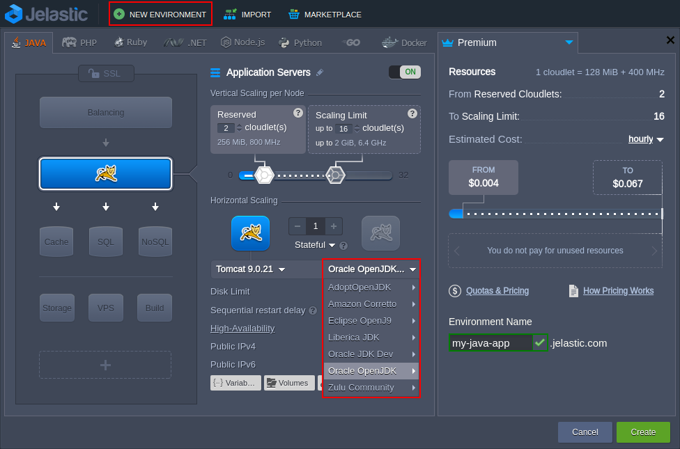
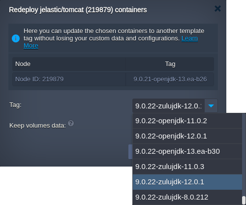

## Java Versions

When setting up an environment on the platform, you can choose the distribution and version of JDK you want to run:

- [**AdoptOpenJDK**](https://adoptium.net/): 8.0.312; 11.0.13; 13.0.2; 14.0.2; 15.0.2; 16.0.2
- [**Alibaba Dragonwell**](https://dragonwell-jdk.io/#/index): 8.11.12
- [**Amazon Corretto**](https://aws.amazon.com/corretto/?filtered-posts.sort-by=item.additionalFields.createdDate&filtered-posts.sort-order=desc): 8.382.05.1; 11.0.20.9.1; 15.0.2.7.1; 16.0.2.7.1; 17.0.8.8.1; 18.0.2.9.1; 19.0.2.7.1; 20.0.2.10.1
- [**Eclipse OpenJ9**](https://eclipse.dev/openj9/): 0.11.0 (8u192-b12; 11.0.1); 0.15.1 (8u222-b10; 11.0.4); 0.17.0 (8u232-b09; 11.0.5; 13.0.1); 0.18.1(8u242-b08; 11.0.6; 13.0.2) 0.20.0 (8u252-b09; 11.0.7); 0.21.0 (8u262-b10; 8u265-b01; 11.0.8; 14.0.2); 0.22.0 (15.0.0); 0.23.0 (8u272-b10; 11.0.9); 0.24.0 (8u282-b08; 11.0.10); 0.25.0-16; 0.26.0 (8u292-b10; 11.0.11); 0.27.0 (8u302-b08; 11.0.12); 0.29.0 (8u312-b07; 11.0.13); 0.30.0 (8u322-b06; 11.0.14); 0.32.0 (8u332-b09; 11.0.15); 0.33.1 (8u345-b01; 11.0.16); 0.35.0 (8u352-b08; 11.0.17); 0.36.1 (8u362-b09; 11.0.8); 0.38.0 (8u372-b07; 11.0.19)
- [**Eclipse Temurin**](https://projects.eclipse.org/projects/adoptium.temurin): 8.0.382; 11.0.20; 17.0.8; 18.0.2.1; 19.0.2; 20.0.2
- [**GraalVM CE**](https://www.graalvm.org/) (currently, for Java Engine and Maven only): 19.3.1; 20.2.0; 21.3.0; 22.3.3
- [**Liberica JDK**](https://bell-sw.com/): 8.0.322; 11.0.14; 13.0.2; 14.0.2; 15.0.0; 16.0.0; 17.0.2
- [**Oracle JDK Dev**](https://www.oracle.com/java/technologies/downloads/): 7.0_79; 8.0_202; 11.0.2
- [**Oracle OpenJDK**](https://jdk.java.net/): 7.0.261; 8.0.382; 11.0.20; 13.0.2; 14.0.2; 15.0.2; 16.0.2; 17.0.2; 18.0.2.1; 19.0.2; 20.0.2; 21; 22.ea-b18
- [**Zulu Community**](https://www.azul.com/downloads/#zulu): 7.0.352; 8.0.382; 11.0.20.1; 13.0.9; 14.0.2; 15.0.10; 16.0.2; 17.0.8.1; 18.0.2.1; 19.0.2; 20.0.2

:::tip

The up-to-date list of the releases available on the platform is provided via the dedicated, regularly (weekly) updated [Software Stack Versions](/docs/quickstart/software-stack-versions) document.

:::

Also, for the existing environments the used engine version can be easily switched to a different one:

1. Log into the PaaS dashboard and click the **New Environment** button.

Within the opened wizard, switch to the **_Java_** tab, pick the desired application server and engine versions (as it is shown in the image above).

2. To change the version of Java in the already existing environment, [redeploy](http://localhost:3001/docs/category/container-deployment) the appropriate container(s):

Just, select the required _Tag_ (stack and JDK distribution versions) and click **Redeploy**.

Confirm an action within the appeared pop-up and wait a few minutes for the changes to be applied.
