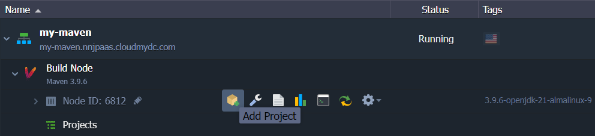
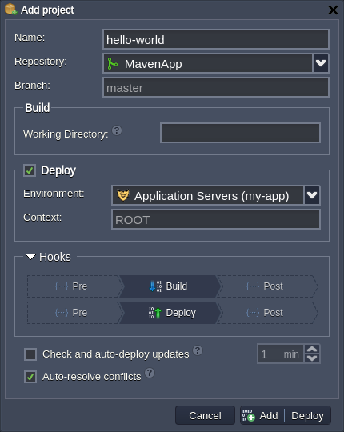
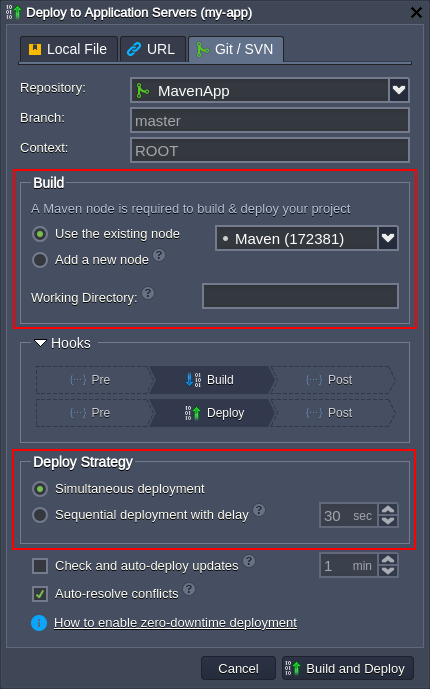
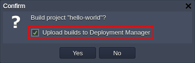
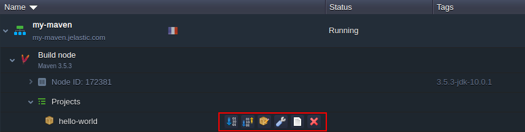

## Java VCS Deployment with Maven

**Maven** is a build automation and software comprehension tool, which is primarily used for Java programming. With the platform you can add any _public_ or _private_ project directly from your version control system (VCS) repository using the appropriate link type: _http_, _https_ or _svn_ for **SVN** and _git_, _http_, _https_ or _ftp_ for **Git**. After addition, Java projects can be deployed to the appropriate application servers using the Maven build node.

Now, let’s see how you can add private or public Java application from a remote VCS repository directly to the Maven node and deploy this project to your environment.

:::tip

Before proceeding to the deployment, you need to add your project to the [Deployment Manager](https://cloudmydc.com/). As an example, you can use the demo “Hello World” application from our [GitHub repository](https://cloudmydc.com/) (no authentication needed) - use the _Clone or download_ button to get the required URL.

:::

## Add Project to Maven

You can add Java project directly to the Maven build node.

1. Select the **Add project** button next to the Maven layer, node or the Projects line underneath:

2. In the opened dialog box, you need to fill in the required fields:

- **Name** - sets a name for your project (no spaces and special symbols are allowed)
- **Repository** - allows to select the Git / SVN project from Deployment Manager (or jump to its addition form)
- **Branch** - defines the used repository branch (_master_ by default)
- **Working Directory** (optional) - provides relative path to the repository subdirectory with application source code
- **Deploy** - chooses whether project should be just build on the Maven node (if unticked) or build and immediately deployed (if ticked); herewith, the letter option requires to fill into two additional fields:
  - **Environment** - selects a target environment with the application server (is automatically selected, when installing from application server)
  - **Context** - sets the desired custom context for the project (_ROOT_ by default)
- **Hooks** - applies the provided [scripts](https://cloudmydc.com/) either before or after build / deployment processes
- **Check and auto-deploy updates** - enables periodical check ups for code changes in your repository (with configurable frequency); if any, project [automatic deployment](https://cloudmydc.com/) is initiated
- **Auto-resolve conflicts** - prevents the occurrence of merge conflicts by updating the contradictory files to the repository version (i.e. locally made changes are discarded)

:::tip

If initiating deployment from a Java application server, you may need to set some additional options:

- Build - allows to select the existing Maven build node or add one into the target environment
- Deploy Strategy (for deployments into [scaled server](https://cloudmydc.com/)) - allows to choose between relatively quicker _Simultaneous deployment_ variant, which causes a brief downtime, and the _Sequential deployment_ with _delay_ option to perform deployment on servers one-by-one with a set delay between operations, which ensures application uptime

:::

Finally, select **Add** **or Add + Build** (**Add + Deploy**) at the bottom of the frame. The first option will just save the provided data as a project template (i.e. without performing any actual actions), allowing to easily execute _build_ and _deploy_ operations in a future.

3. Now, your project will appear in the Maven node _Projects_ list. Here, upon hovering over and clicking the appropriate button, you can call the following actions:

- Build - downloads project from repository to Maven node (only if there were some changes since the last build) and prepares it for deployment

:::tip

The project created with this option can be automatically uploaded to the [Deployment Manager](https://cloudmydc.com/) as archive by ticking the _Upload builds_ to _Deployment Manager_ checkbox.

:::

- **Build and Deploy** - checks for changes and deploys project into the target environment (allows to choose between the _Simultaneous deployment_ and _Sequential deployment_ with _delay_ options, if deploying into [scaled server](https://cloudmydc.com/))

- **Edit project** - opens a form to edit data specified in the project addition frame described in the previous step

- **Config** - opens the build project folder within the [configuration file manager](/docs/ApplicationSetting/Configuration%20File%20Manager)

- **Log** - opens the Log section for issues troubleshooting and analysis

- **Delete** - removes this project from Maven

These are GUI options available for Maven build node management, for additional tuning get acquainted with the [Maven Configuration](https://cloudmydc.com/) guide.
