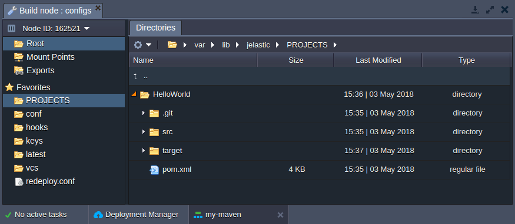
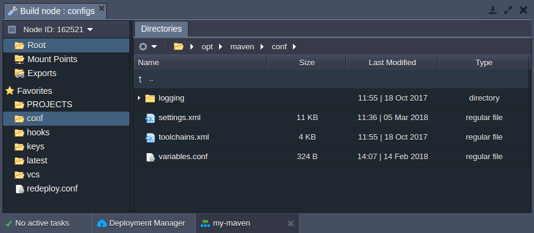
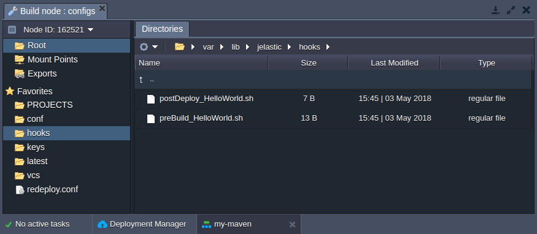
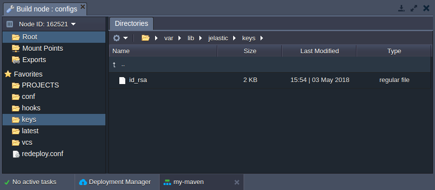
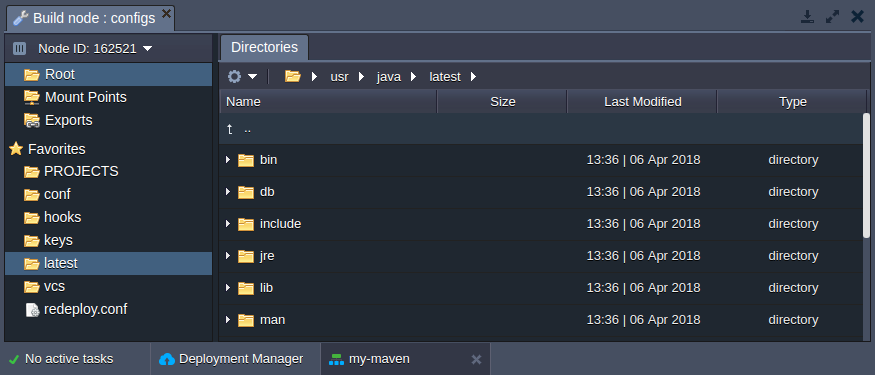
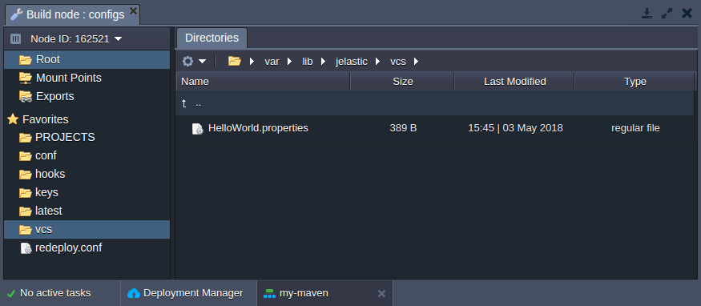
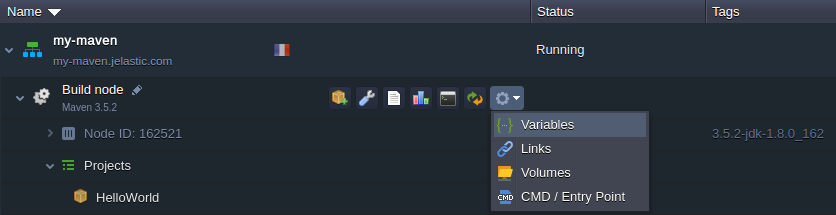
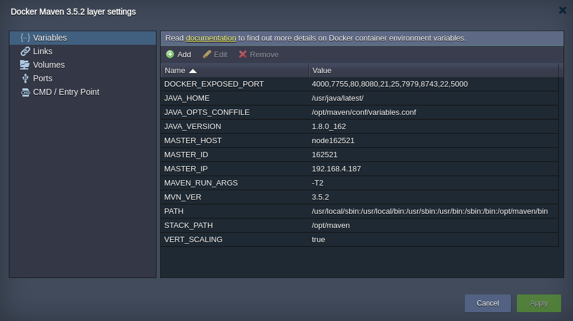

import obj from './MavenConfiguration.json'

<!-- ## Maven Build Node Configuration -->

**Maven** is a tool for compiling and managing Java projects. At PaaS, it’s provisioned out-of-box to cover all the main stages of your Java application lifecycle - from building & deploying till their pushing onto production.

Herewith, all the adjustable Maven server settings can be set and/or changed with:

Herewith, all the adjustable Maven server settings can be set and/or changed with:

- configuration files
- [environment variables](/container/container-configuration/variables)

## Maven Configuration Files

The main Maven build node configuration files can be located within the following server directories:

    

        

            

                Folder
            

            

               Path
            

        

        {obj.data1.map((item, idx) => {
          return 

            

                {item.Folder}
            

            

                {item.Path}
            

        
 
        })}
    
 

## PROJECTS

The **PROJECTS** folder is used for storing files of the unpacked project that were added to, built and deployed via Maven node.

## conf

The conf directory contains the following files:

- [**_settings.xml_**](https://cloudmydc.com/) - contains the main Maven configurations
- [**_toolchains.xml_**](https://cloudmydc.com/) - allows to set which JDK (or other tool) should be used by embedded plugins during the project build
- [**_variables.conf_**](https://cloudmydc.com/) - is used to set your custom variables, to configure memory settings, etc

## hooks

The **hooks** folder stores custom scripts (so-called [hooks](https://cloudmydc.com/)), which should be executed prior or after application build/deploy operations.

## keys

The **keys** directory is used as a location for uploading private keys which are needed for your application.

Just generate your key, save it as a simple file and upload to the **keys** folder. Now, you can use it for different cases (e.g. for authentication between nodes) by simply stating the appropriate **_/var/lib/jelastic/keys/{key}_** path.

## latest

The **latest** folder contains all JDK libraries, tools, binaries, etc. Here you can edit already available files or upload additional if required.

## vcs

In the **vcs** directory, you can find a list of **_{project_name}.properties_** files, which contain all information about your projects. Herewith, these configuration files are not editable, but can be viewed to inspect parameters for a particular project.

## Maven-Specific Variables

In addition to the configuration files, Maven build node can be managed through providing (or adjusting) some of the environment variables, integrated specifically for this stack template:

1. Click the **Additionally** button next to your Maven node and navigate to the **Variables** section.

2. In the opened window, you’ll see the list of default variables for the stack, which can be adjusted up to your needs.

Below, the Maven-specific variables are listed:

- **_MAVEN_OPTS_** - allows to define values for the most essential Java server options, e.g. _-Xmx, -Xms, -Xmn_, etc
- **_MAVEN_RUN_ARGS_** - specifies additional [Maven command-line parameters](https://cloudmydc.com/), which should be set for all Maven projects (for example, to define the number of process threads)
- **_MAVEN*RUN_ARGS*{project}_** - sets additional parameters for a particular project; herewith, **note** that the **_{project}_** name should be stated with underscores “\_” instead of spaces and dashes
- **_MAVEN_DEPLOY_ARTIFACT_** - defines an artifact to be deployed (all projects)
- **_MAVEN*DEPLOY_ARTIFACT*{project}_** - provides an artifact for a particular project (higher priority than _MAVEN_DEPLOY_ARTIFACT_)

In this way, with the platform you can take a full control over the Maven build node and configure it as required according to your Java project specifics.
