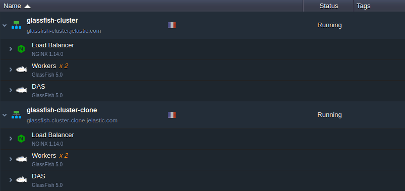

<!-- ## Out-of-Box GlassFish & Payara Clustering: Running Java EE Highly-Available Applications in the Cloud -->

Ensuring trouble-proof 24/7 service delivery is among of the most discussed areas in cloud hosting for the last few years. And the very obvious and commonly used solution here is building a clustered infrastructure for your project.

Intending to help our customers to deal with such a non-trivial task and save time for other project-related activities

today we are glad to present a special high-availability solution, designed to facilitate the Java EE application hosting, – embedded **Auto-Clustering** for **GlassFish** and **Payara** application servers.

The main advantage of this solution is in the automatic interconnection of multiple application server instances upon the application topology change, which implements the commonly used clustering configuration.

So, the article below describes how the Glassfish and Payara auto-clustering works, as well as infrastructure topology specifics and the way you can get the appropriate development and production environments up and running inside Jelastic PaaS.

## How the Auto-Clustering for GlassFish and Payara Works

In the most general sense, any “clusterized solution” can be defined as a set of interconnected instances that run the same stack and operate the same data. In other words, this means that the corresponding server should be [horizontally scaled](/application-setting/scaling-and-clustering/horizontal-scaling) and share user sessions.

Starting with the Jelastic 5.5.3 version, a new **Auto-Clustering** feature is introduced allowing to enable clusterization of the GlassFish and Payara instances directly within the topology wizard:

Choose either GlassFish or Payara application server on the **Java** tab of the wizard. Then, in the central part, locate and enable the appropriate **_Auto-Clustering_** switcher. Configure the remaining settings up to your need (consider [horizontal scaling](/application-setting/scaling-and-clustering/horizontal-scaling) to get a reliable solution from the start).

:::tip Tip

The Auto-Clustering feature is also available for some other software templates (e.g. MySQL, MariaDB, and Couchbase).

:::

Based on your environment purpose, you may consider not to use Auto-Clustering (for example during development). In such a way a regular standalone server(s) will be created without configuring a cluster.

For production, clustering is virtually a mandatory option to ensure your application high-availability and smooth/uninterrupted experience for clients. The usage of the Auto-Clustering by Jelastic is the simplest way to implement a reliable topology for your services without a necessity to manually configure anything. Herewith, the following adjustments take place:

- for 2+ GlassFish (Payara) instances, environment topology is complemented with a load balancer (LB), intended to handle the incoming requests and distribute them across the workers
- An extra Domain Administration Server (**[DAS](https://docs.oracle.com/cd/E19159-01/819-3680/abfbb/index.html)**) node is automatically added - a dedicated instance to perform centralized control of cluster nodes and to configure interaction between them via SSH. Its integration implies a number of specifics:
  - administration server is linked to all workers within the application server layer with the DAS alias hostname, which can be used by workers for further interaction
  - to enable proper nodes connectivity and control, the system automatically generates an SSH keypair for DAS node and places it within a [volume](/container/container-configuration/volumes), mounted to all the rest of cluster instancecluster without multicast

## Session Replication Implementation

To ensure high availability of your cluster, the Jelastic PaaS automatically configures session replication across the worker nodes. This way, all user session data, that is stored during its processing, is distributed across all application server instances from the node that has actually handled the request.

Together with automatically configured sticky sessions mechanism on the [load balancer](/application-setting/external-access-to-applications/shared-load-balancer) layer, session replication ensures hosting of the increased reliability and improves failover capabilities of your application within such GlassFish or Payara cluster. Herewith, depending on a used stack, the implemented replication mechanism will slightly differ - let’s consider each approach in more details.

## GlassFish Session Replication with GMS

Within the GlassFish cluster, session replication is powered by the Group Management Service (**[GMS](https://docs.oracle.com/cd/E19879-01/821-0182/gjfnl/index.html)**) – a built-in application server component that ensures failover protection, in-memory replication, transaction and timer services for cluster instances.

GMS uses [**TCP** without multicast](https://docs.oracle.com/cd/E26576_01/doc.312/e24934/clusters.htm#GSHAG485) to detect cluster instances. When a new node is joining a GlassFish cluster, the system re-detects all running workers and DAS node - such [auto discovery](https://docs.oracle.com/cd/E26576_01/doc.312/e24934/clusters.htm#CHDIGFCG) mechanism is applied by means of the **GMS_DISCOVERY_URI_LIST** property being set to the **_generate_** value.

## Payara Session Replication with Hazelcast

Session replication inside the Payara cluster is based on Hazelcast, which has an extra benefit of being JCache compliant and provides the embedded Web and EJB sessions’ persistence. This in-memory data grid is automatically enabled at all Payara instances to discover your environment cluster members by [**TCP** without multicast](https://docs.oracle.com/cd/E26576_01/doc.312/e24934/clusters.htm#GSHAG485).

To manage Hazelcast settings, access the Administration Console and refer to the Hazelcast Configuration page.

## Deploy Example Application for HA Testing

Now, let’s check the high availability of such automatically composed cluster with the example of scaled GlassFish server. To make sure of its fault tolerance, we’ll deploy a dedicated testing application, which enables to add some custom session data and to view the detailed information on a server this session is handled by. This way, stopping particular cluster instances allows ascertaining that the already running user sessions will continue being processed even in case the corresponding server fails. So, let’s see it in practice.

1. Click **Open in browser** next to your environment to access the application server start page.

Within the opened page, select the **go to the Administration Console** reference and log in with credentials, delivered to you via email upon the environment creation.

2. Switch to the **Applications** section and upload <a href="https://raw.githubusercontent.com/jelastic-jps/glassfish/master/glassfish-cluster/test-app/clusterjsp.ear" target="_blank" rel="noopener noreferrer external" data-wpel-link="external">**clusterjsp.ear**</a> application to the **Packaged File to Be Uploaded to the Server** location.

3. Check to have the **Availability** enabled and set up **_cluster1_** as the application target, then click **OK** to proceed.

4. Now, open environment in the browser and append **_/clusterjsp_** to the URL.

Provide any custom Name and Value for your own session attribute and click on **Add Session Data**.

5. Switch back to the admin panel and navigate to the **Clusters > cluster1 > Instances** tab. Here, select and **Stop** the instance your session is running on (its hostname is circled in the image above).

6. Return to our application and **Reload Page** with the appropriate button.

As you can see, despite the session being handled by another instance, our custom attribute is still output.

:::tip Tip

All replication settings are available at the **Configurations > cluster1-config > Availability Service** section of the server admin panel. Here, you can see the following replication modes being enabled by default:

- _Web Container Availability_
- _EJB Container Availability_

:::

## Cloning Cluster for A/B Testing

When releasing a new application version or just applying some essential adjustments, it’s a good practice to check how the newly implemented changes could affect the service work and your users’ appeal. The Jelastic PaaS allows you to accomplish such testing ‘on-fly’ (i.e. without service downtime and implicitly for your customers) with the **Clone Environment** option.

As a result, a ready-to-work cluster copy will be created, with all the required modifications being already applied. To be more precise, this means that a cloned DAS node operates with the appropriate cloned workers, which are already listed within its admin panel, and all applications from the original environment are deployed to the cloned one as well. Thus, the only thing that remains for you to do is to recheck your app’s code & custom server configurations for the hardcoded IPs/domains and fix them accordingly, if are any.

This way, you can apply the implied changes to your environment copy without affecting the actual production one.

Subsequently, you can also evaluate the productivity and effectiveness of the modified application version comparing to the currently original one, i.e. to perform so-called A/B Testing. At Jelastic PaaS, this can be implemented with a special supplementary [Traffic Distributor](/application-setting/traffic-distributor/traffic-distributor-overview) add-on.

auto clustering computing

Being placed in front of a pair of environments with the Sticky Sessions mode chosen, it provides smart routing of the incoming requests according to the stated backends weight. For more details on a proper TD configuration in this case, refer to the dedicated [A/B Testing](/application-setting/traffic-distributor/use-cases/a-b-testing) guideline.

## ...and a Few Useful Tips

When your GlassFish or Payara cluster is set up and you’ve ensured everything works as intended, you could also consider the hints below to get the maximum efficiency of its running inside the Jelastic Cloud with the extensive platform functionality:

- For optimized resource consumption, set [auto-scaling triggers](/application-setting/scaling-and-clustering/automatic-horizontal-scaling) within your environment settings so that nodes will be automatically added/removed within a cluster depending on the incoming load.
- For connection with any [database software stack](/quickstart/software-stack-versions#additional-stacks), the cluster requires the appropriate libraries being integrated to its Administration Server - the most popular ones are available by default at all newly created GF/Payara nodes. And if operating with legacy instances, make sure the _/opt/glassfish/glassfish/domains/domain1/lib_ DAS directory contains the appropriate files (otherwise - just upload them to the mentioned location manually).
