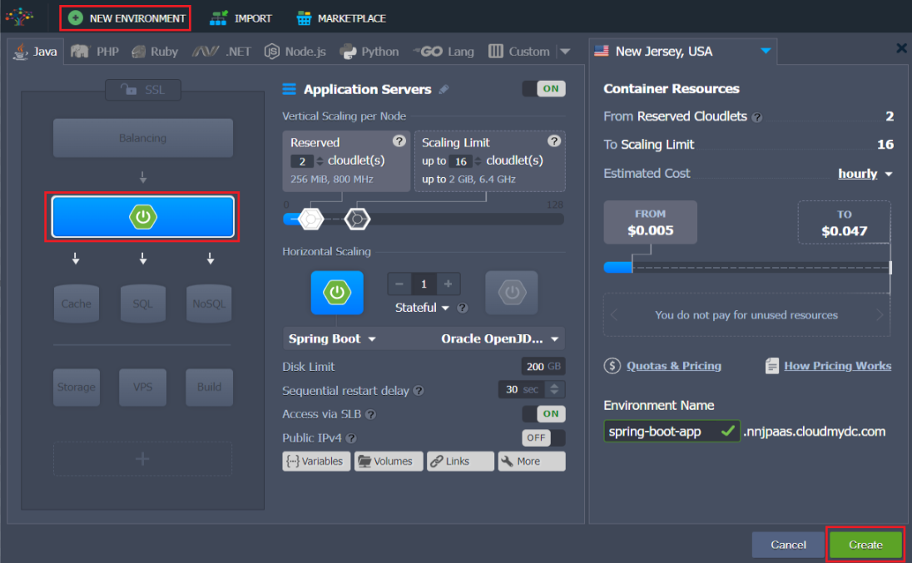

Hosting Spring Boot Standalone and Clustered Java Applications with Jelastic Cloud

<div style={{
    display: 'grid',
    gridTemplateColumns: '0.35fr 1fr',
    gridGap: "20px",
}}>
<div>


</div>

<div>

Since the very foundation, Jelastic PaaS evangelizes the idea of making the application deployment process as easy and universal as possible. Keep following our mission, today we are glad to introduce another newcomer within a family of certified Java-powered stacks - [Spring Boot](https://spring.io/projects/spring-boot) server for standalone and clustered applications or microservices.

</div>

</div>

With Jelastic’s Spring Boot stack template, you can effortlessly run various Java-based applications inside the cloud via easy-to-use graphic interface or automation scripts. The following Java project types can be hosted within this server:

- _JAR_ - for standalone Java apps or stateless microservice instances, created using [Spring Boot](https://spring.io/projects/spring-boot), [Dropwizard](https://www.dropwizard.io/en/latest/) or [Spark](https://sparkjava.com/) frameworks
- _WAR_ - for web applications with an embedded servlet container

In this way, Spring Boot enables you to keep things portable, whilst Jelastic ensures quick delivery of applications to production and their comprehensive management via GUI, API, or [Cloud Scripting](https://docs.cloudscripting.com/).

## Creation of Spring Boot Environment

So, log in to your Jelastic Cloud dashboard and let’s get started.

1. First of all, you need to create a **New Environment** - use the same-named button to launch topology wizard. Switch to the **Java** language tab and choose the **Spring Boot** template within the application server layer at the left-hand panel as shown below. Set the amount of [allocated resources](/docs/application-setting/scaling-and-clustering/automatic-vertical-scaling), type your environment name and click Create to proceed.

<div style={{
    display:'flex',
    justifyContent: 'center',
    margin: '0 0 1rem 0'
}}>



</div>

2. When your new environment appears at the dashboard, you can click **Open in Browser** to launch the pre-installed Hello World application sample.

<div style={{
    display:'flex',
    justifyContent: 'center',
    margin: '0 0 1rem 0'
}}>


</div>

In this way, you can make sure your Spring Boot instance is up and running.

<div style={{
    display:'flex',
    justifyContent: 'center',
    margin: '0 0 1rem 0'
}}>


</div>

Now, let’s consider how to integrate your custom Java application into the created Spring Boot environment.

## Deploying Java Applications to Spring Boot

To launch your Spring Boot project inside Jelastic, you need to preliminary pack it into an executable archive with all the appropriate compiled classes and associated resources inside (including an embedded servlet container for handling self-contained applications). The following archive types are supported:

- **_JAR_** - the most common Java-archive type; should either contain a manifest with declared entry point class or being built as an all-in “fat” JAR or nested JAR file
- **_WAR_** - for the deployment of applications with embedded servlet container; in particular, should be used for JSP-based projects for solving known supportability [issues](https://docs.spring.io/spring-boot/docs/current/reference/htmlsingle/#web.servlet.embedded-container.jsp-limitations) within Spring Boot

## ZIP Bundle

By default, any executable JAR file, created by Spring Boot, contains property files and additional settings. However, in case of production deployment, it is more convenient to distribute these files outside of the packaged archive. For example, this can be applied to externalized configuration property files (application.property, application.yml) or logging configurations (log4j2.properties, logback.xml).

To simplify application deployment in these cases, Jelastic supports deployment of a ZIP bundle, which may contain an executable JAR file and any additional files or directories.

While unpacking a ZIP bundle, Jelastic processes all the included folders to detect the runnable JAR. To be considered as an execution point, a JAR file should contain the Main-Class declaration inside its **_META-INF/MANIFEST.MF_** manifest file. Once such JAR file is located, Jelastic will run JVM with “java –jar /path/to/jar” parameters inside the directory that corresponds to the root folder of the deployed archive.

## Example

Below is a sample directory structure of a ZIP bundle that can be used for deployment into Jelastic PaaS.

```bash
application.zip
|
+-config
| +-application.properties
| +-log4j.properties
+-lib
| +-my-springboot-app.jar
+-some_directory
| +-additional_file1
| +-additional_file2
+-additional_configuration.yml
```

If deploying such an archive, Jelastic will run JVM with the **_“java -jar lib/my-springboot-app.jar”_** arguments from a directory that corresponds to the root folder of the unpacked application.zip archive.

## Application Deployment

Jelastic provides versatile possibilities for your application deployment into the Cloud, allowing you to choose the most preferable one.

- **Manual Deployment**
  The most evident and comfortable approach is to perform this manually through the convenient Jelastic GUI.

:::tip Tip

As an example, give a try to a sample Spring Boot project, which represents a simple application to store the messages you create - you can either build it from the [sources](https://github.com/jelastic/spring-boot-sample-jelastic) or deploy the already built <a href="https://download.jelastic.com/public.php?service=files&amp;t=12147ec25f7d1a77e6d1fb682b8b1b27&amp;download" data-wpel-link="external" rel="external noopener noreferrer">JAR</a>.

:::

For that, **Upload** archive with your app via **Deployment Manager** and initiate its deployment by clicking the **Deploy to** button.

<div style={{
    display:'flex',
    justifyContent: 'center',
    margin: '0 0 1rem 0'
}}>


</div>

In the opened dialog, select the destination environment (the previously created spring-boot-app in our case) and confirm **Deploy** with the same-named button. Wait till the corresponding task is finished.

- **Remote Deploy via CLI**
  Alternatively, you can leverage [Jelastic CLI](/docs/deployment-tools/api-&-cli/platform-cli/platform-cli-overview) to deploy your application to a target Spring Boot environment remotely with the following command:

<b><i>~/jelastic/environment/control/deployapp --envName spring-boot-app --fileUrl
http://link/to/archive --fileName my_springboot.jar --context ROOT</i></b>

## Checking Logs

When the deployment is finished, give the system some more time to run the required services (where delay directly depends on your project complexity) - the current progress of this operation can be tracked in real-time via the **_run.log_** server [log](/docs/application-setting/built-in-monitoring/log-files).

<div style={{
    display:'flex',
    justifyContent: 'center',
    margin: '0 0 1rem 0'
}}>


</div>

After completion, your application web interface (if such is run on the default **_8080_** port) can be accessed identically you’ve done this for preinstalled Hello World - by clicking **Open in Browser** for your environment.

## Ways to Build a Spring Boot Application

To create an appropriate archive file for your application hosting inside Jelastic PaaS, either [Gradle](https://gradle.org/) or [Maven](https://maven.apache.org/) build tools can be used.

- The minimal base for **Gradle** build script (build.gradle) is listed below, where parameters in curly braces should be substitutes with your custom values:

```bash
buildscript {
ext {
springBootVersion = '{X.X.X.RELEASE}'
}
repositories {
mavenLocal()
mavenCentral()
}
dependencies {
classpath("org.springframework.boot:spring-boot-gradle-plugin:${springBootVersion}")
}
}
apply plugin: 'java'
apply plugin: 'eclipse'
apply plugin: 'org.springframework.boot'
sourceCompatibility = 1.8
targetCompatibility = 1.8
jar {
baseName = '{your_app_name}'
version = '{your_app_version}'
}
repositories {
mavenLocal()
mavenCentral()
}
dependencies {
compile("org.springframework.boot:spring-boot-starter")
}
task wrapper(type: Wrapper) {
gradleVersion = '{used_gradle_version}'
}
```

To build an executable JAR file with this script, use the following command:

**_./gradlew clean assemble_**
The generated archive will be stored upon the **_..build/libs/{app_name}-{app-version}.jar_** path.

- The minimal base for pom.xml **Maven** project description includes the following parameters (where parameters in curly braces should be substitutes with your custom values):

```bash
<?xml version="1.0" encoding="UTF-8"?>
<project xmlns="http://maven.apache.org/POM/4.0.0" xmlns:xsi="http://www.w3.org/2001/XMLSchema-instance"
 xsi:schemaLocation="http://maven.apache.org/POM/4.0.0 http://maven.apache.org/xsd/maven-4.0.0.xsd">
  <modelVersion>4.0.0</modelVersion>
  <parent>
     <groupId>org.springframework.boot</groupId>
     <artifactId>spring-boot-starter-parent</artifactId>
     <version>{Х.Х.Х.RELEASE}</version>
  </parent>
  <groupId>org.springframework</groupId>
  <artifactId>{your_app_name}</artifactId>
  <version>{your_app_version}</version>
  <properties>
     <java.version>1.8</java.version>
  </properties>
  <dependencies>
     <!-- Compile -->
     <dependency>
        <groupId>org.springframework.boot</groupId>
        <artifactId>spring-boot-starter-web</artifactId>
     </dependency>
  </dependencies>
  <build>
     <plugins>
        <plugin>
           <groupId>org.springframework.boot</groupId>
           <artifactId>spring-boot-maven-plugin</artifactId>
        </plugin>
     </plugins>
  </build>
</project>
```

To produce an executable JAR with Maven, execute the following command:

**_mvn clean package_**

Your app archive will be placed at the **_...target/{app_name}-{app-version}.jar_** location.

## Jelastic Maven Plugin

As a more convenient joint build & deployment option, consider using the Jelastic [Maven plugin](/docs/deployment-tools/plugins/maven-plugin), which is aimed to facilitate your application delivery to the Cloud. Integrate it within your Maven project’s pom.xml configuration file and get the ability to build an application archive and instantly push it to a target environment with a single command.

## CI/CD Tools for Java Applications in the Cloud

### Dedicated Maven Build Node in the Cloud

In case you do prefer working via GUI, you can leverage a dedicated Maven build node that the Jelastic PaaS provides out-of-box. Being included in the environment alongside the Java application server, it can be used to fetch, compile, and deploy applications from the sources within a specified remote GIT/SVN repository.

## CI/CD Automation Add-On

In addition to all the above-mentioned options, Jelastic offers a special Git-Push-Deploy add-on for continuous application deployment from GitHub & GitLab repositories via the automatically integrated CI/CD pipeline. It can be especially useful in case your project is under intensive development yet, which implies lots of repetitive commits. With this solution, your application will be automatically rebuilt and delivered to a target server upon any change is made within its code, making the newest version available via the corresponding domain in a matter of minutes.

## Maintaining Your Spring Boot Server

The majority of basic server management operations can be performed right via Jelastic Cloud UI with the appropriate embedded tools, e.g.:

- use the built-in **[Configuration Manager](/docs/application-setting/configuration-file-manager)** to create or upload new files, edit or delete the existing ones, set up [mount points](/docs/data-storage-container/data-sharing/mount-points), and manage [exported data](/docs/data-storage-container/data-sharing/exporting-data-for-sharing) from other servers

<div style={{
    display:'flex',
    justifyContent: 'center',
    margin: '0 0 1rem 0'
}}>


</div>

- set up custom [Java options and arguments](/docs/environment-management/environment-variables/java-options-and-arguments) for your server by adjusting the **_JAVA_OPTS_** and **_JAVA_ARGS_** environment variables

<div style={{
    display:'flex',
    justifyContent: 'center',
    margin: '0 0 1rem 0'
}}>


</div>

- explore server **[Logs](/docs/application-setting/built-in-monitoring/log-files)** to get the details on run operations for efficient service administration and troubleshooting
- track the **[Statistics](/docs/application-setting/built-in-monitoring/statistics)** on consumed resources to be aware of the capacities your server actually needs and define the best approach for their allocation

For more complex maintenance operations, you can connect to your Spring Boot container [via SSH](/docs/deployment-tools/ssh/ssh-access/overview) (either using the web or local SSH client). The following tips can come in handy when working with your Spring Boot server:

- your application files can be located in the **_/home/jelastic/APP_** directory, which is considered as “current” or “working” for the Java process
- Java Virtual Machine (JVM) configuration parameters can be customized within the **_/home/jelastic/conf/variables.conf_** file (e.g. to enable remote debugging or pass any additional arguments to JVM)
- to inspect log files, refer to the **_/var/log_** directory
- the **_/home/jelastic_** location is considered as a home directory
- JDK is located in the **_/usr/java/latest_** directory
- to restart your application, execute the **_jem service restart_** command

In particular, the ability to operate servers via console can be especially useful when handling [non-web](https://docs.spring.io/spring-boot/docs/current/reference/htmlsingle/#howto-create-a-non-web-application) Spring Boot applications.

## Automatic Scaling for Spring Boot Server

Jelastic Platform provides real-time elastic scalability that is available out-of-the-box for any server. By enabling both automatic vertical and horizontal scaling, you can make your Spring Boot application fully adaptable to changeable workloads.

## Automatic Vertical Scaling

The [automatic vertical scaling](/docs/application-setting/scaling-and-clustering/automatic-vertical-scaling) is enabled by default and ensures your service remains available during the load spikes, and at the same time, eliminates the need to pay for unused resources. Just decide on maximum limit of resources (set with [cloudlets](/docs/platform-overview/cloudlet)) your application may consume and Jelastic will automatically adjust the maximum memory size (**-Xmx**) for you application based on these capacities, for example:

- 8 cloudlets (1GiB RAM) set the maximum heap size to 819 MB
- 16 cloudlets (2GiB RAM) set the maximum heap size to 1638 MB
  To customize **-Xmx** or any other JVM options, edit the **_/home/jelastic/conf/variables.conf_** file either via Configuration Manager or Jelastic SSH Gate.

## Automatic Horizontal Scaling

The [automatic horizontal scaling](/docs/application-setting/scaling-and-clustering/automatic-horizontal-scaling) functionality allows adjusting the number of web and application servers according to the resources consumption of your application. It is implemented by means of the tunable monitoring triggers that are based on the usage of a particular resource type:

- CPU
- Memory (RAM)
- Network
- Disk I/O
- Disk IOPS

<div style={{
    display:'flex',
    justifyContent: 'center',
    margin: '0 0 1rem 0'
}}>


</div>

:::tip Note

When a server is scaled out (both with a trigger or [manually](/docs/application-setting/scaling-and-clustering/horizontal-scaling)), an NGINX [load balancer](/docs/load-balancers/load-balancing) will be automatically added to your environment, with pre-configurations for sticky session load balancing. Alternatively, you can switch the used balancer stack to _Apache_, _HAProxy_, _Varnish_, or _LiteSpeed ADC_.

:::

Herewith, all the newly added nodes will be created at different hardware servers to ensure high-availability for your application.

## Traffic Encryption with SSL

If your project requires some complex configurations for requests handling, like HTTPS and load balancing, feel free to leverage the following security options:

- [built-in SSL](/docs/application-setting/ssl/built-in-ssl) functionality allows to instantly apply traffic encryption for your application internal domain (i.e. _https://{envName}{platformDomain}_) with Jelastic wildcard SSL certificate

<div style={{
    display:'flex',
    justifyContent: 'center',
    margin: '0 0 1rem 0'
}}>


</div>

- [custom SSL](/docs/application-setting/ssl/custom-ssl) can be configured for the Spring Boot based environment by adding any of the certified load balancers
- as a free-of-charge SSL alternative, applicable for both internal and custom domains, a special Jelastic-developed Let’s Encrypt add-on can be used (certified [load balancer](/docs/load-balancers/load-balancing) is required)

Applying any of these solutions will enable traffic encryption on the environment level, eliminating the necessity to configure it inside your application. As a result, the received encrypted traffic will be terminated at the load balancing layer and proxied further to the application server in a plain view.

## Custom Ports & HTTP/HTTPS Usage Considerations

By default, the majority of Java applications listen to port **_8080_** on HTTP level, thus it is considered as the standard Spring Boot endpoint for HTTP traffic.
Herewith, when your environment link is requested over the Internet, the [ports](/docs/container/container-configuration/ports) are automatically mapped as follows:

- internal HTTP port **_8080_** refers to the port **_80_**
- secure HTTPS port **_8743_** refers to the ports **_443_** and **_80_**

Thus, if working over standard HTTP/HTTPS ports, your application can be accessed directly via environment URL with the corresponding protocol specified, with no necessity to enter the appropriate port number.

And if your application does need to process the requests on some custom interface, Jelastic allows exposing private container TCP and UDP ports via [Endpoints](/docs/application-setting/external-access-to-applications/endpoints). After adding such, the corresponding port will be automatically enabled in server firewall settings, making it accessible for the rest of the world.

## Conclusion

Find out more possibilities of the Spring Boot server by trying it out within Jelastic. Create your own account and easily deploy a scalable Java application to run it in the cloud.

:::tip TIp

Need some details or assistance? Feel free to ask for help within the comments below or get in touch with our technical experts at [Stackoverflow](https://stackoverflow.com/questions/tagged/jelastic).

:::
