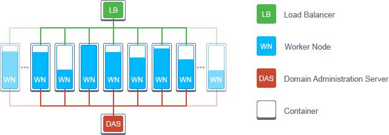
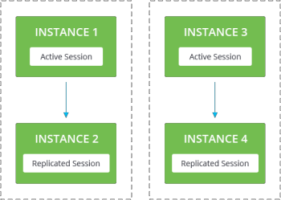
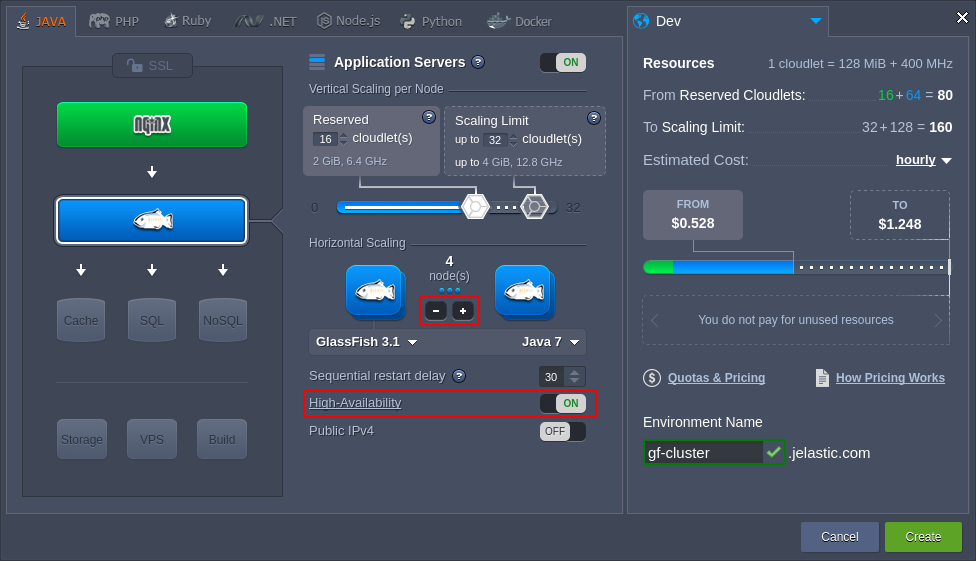

## GlassFish Clustering in the Cloud

[**GlassFish**](https://cloudmydc.com/) is an open-source enterprise level application server with high reliability and performance, which can run any Java EE project. It provides your application with full clustering capability and has a wide range of additional functions.

With the platform, you can use GlassFish not just as a separate server for hosting your Java applications, but also as a highly-available clustered instance with full replication. Let’s see how to easily setup GlassFish cluster within the platform in two different ways:

- automated installation via JPS
- manual deployment

## GlassFish Cluster Automatic Deployment via JPS Package

Get your GlassFish cluster up and running in just a few minutes using one-click installation option.

<!-- 
<input style={{
    padding: "10px 15px",
    borderRadius: "4px",
    border: "1px solid var(--ifm-link-color)",
    fontSize: "17px",
    margin: "0 0 1rem 0",
}} type="text" placeholder="Enter Email"/> -->

The process of [app installation via widget](https://cloudmydc.com/) is simple - just click the **Get It Hosted Now** button, type your email and get the cluster hosted while skipping the steps of manual installation.

GlassFish clustered solution, installed with this option, is built on top of [Docker containers](https://cloudmydc.com/). Such implementation provides additional reliability by operating each node, predefined cluster architecture (i.e. _Load Balancer, Worker Nodes, Domain Administration Server_), as an isolated instance. Herewith, [HAProxy](https://cloudmydc.com/) Docker image is used as _Load Balancer_ and [GlassFish](https://cloudmydc.com/) template serves as a base for _Worker nodes_ and _DAS_.

In order to gain a better insight into this package installation and management, refer to the [GlassFish Cluster with Automatic Load Balancing](https://cloudmydc.com/) page.

:::tip

- if your service is not so much visited yet, you can give a try to a JPS package with a [non-clustered GlassFish](https://cloudmydc.com/) solution
- take a look at [JPS Collection](https://cloudmydc.com/), where other numerous pre-configured solutions are stored for you and can be easily installed to the Platform in one click

:::

## GlassFish Cluster Manual Deployment

In case you want to gain the complete control over your GlassFish cluster configuration and deployment, the given below instruction can come in handy. It includes description of the main GF cluster configuration specifics and the way it can be implemented within the platform.

In accordance to the native GlassFish clustering architecture, it uses concept of an **administrative domain**. Such administrative domains consist of **clusters** and **instances**, which are managed using **Domain Administration Server** (DAS).

For central repository management you can use the **Admin Console**, interactive GUI which supports all available GlassFish features. **Group Management Service** (GMS) provides information about clusters, and DAS, as it was mentioned above, is responsible for managing Java instances in the administrative domain.

## Sessions Replication in GlassFish: How Does It Work?

Instances in each cluster are paired up. In the case main instance in the cluster fails, all users on this instance are automatically redirected to the second instance in the cluster. Wherein end-users will not see any changes: the replicated instance has all of the sessions of the failed instance. If occasionally both instances in a cluster fail, users are just switched to another cluster. For such switching the platform uses **NGINX-balancer**. It handles and shares all the requests between clusters and instances based on the load and availability.

Also you are provided with a complete scaling system: with [horizontal](https://cloudmydc.com/) and [vertical scaling](https://cloudmydc.com/) size and number of clusters can be easily changed manually or automatically due to the load increasing or decreasing.

To get your own GlassFish high-available clustered environment in the platform just pick up GlassFish as your application server and increase the number of nodes as it is shown in the picture.

Don’t forget to enable **High Availability** feature: it will pair up all the nodes to create the cluster(s).

That’s all the configurations you need! Just click **Create** button and in a minute you’ll get highly reliable environment with the instance replication inside each cluster and the cluster replication inside the environment.
