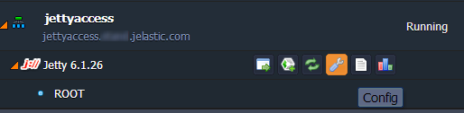
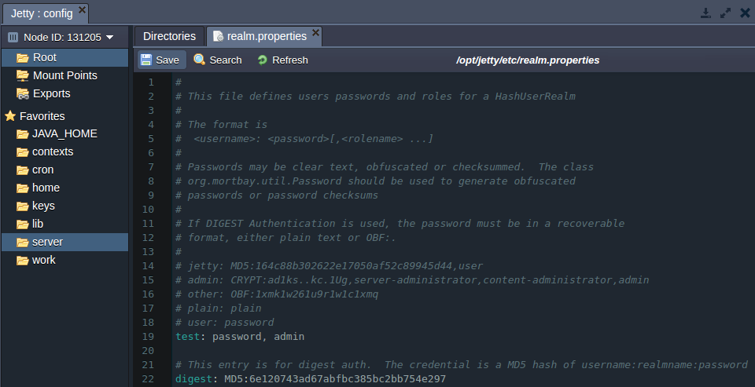
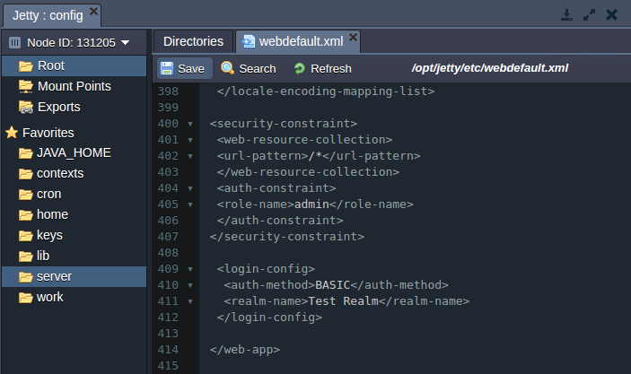
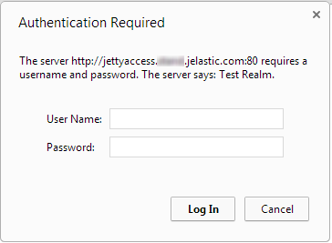
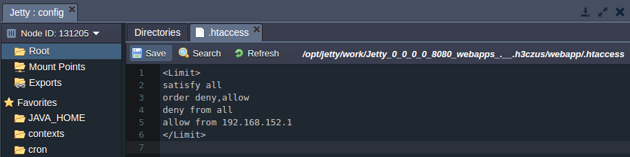
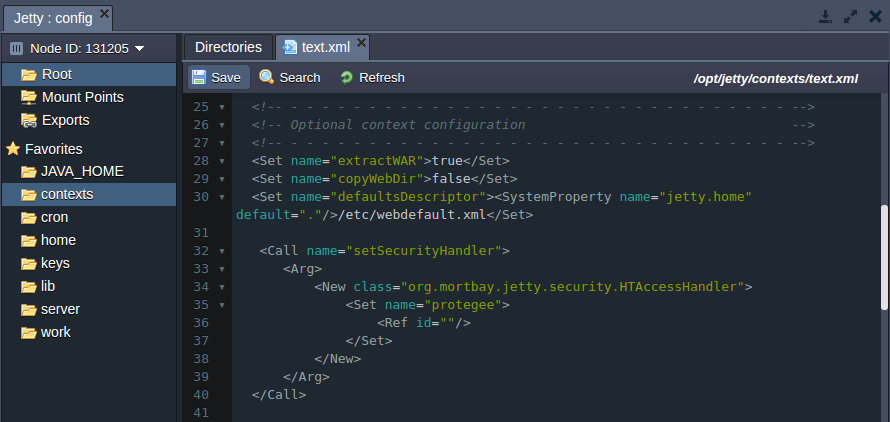
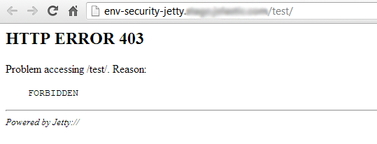

<!-- ## Security Configs for Jetty Applications -->

This document will help you to configure security realms for your **Jetty** application server in order to level up the protection of your app. Correctly configured realms provide the ability:

- to set the authentication and access control for your Jetty web application
- to grant access to your app for dedicated IP-addresses

**Realm** is a login service, which is available to all web applications on a server if it is defined in a Jetty config file. Each realm consists of a range of users and has its unique name. Every specified user has the authentication information and a set of roles associated with it. One or many different realms can be configured depending on your needs.

## Authentication

To configure the authentication request in front of Jetty application server with your app deployed, follow the next instruction:

1. Open the platform dashboard with your environment listed and press **Config** button next to the Jetty server node:

<div style={{
    display:'flex',
    justifyContent: 'center',
    margin: '0 0 1rem 0'
}}>



</div>

2. Open the **_realm.properties_** file, located in the **_/opt/jetty/etc_** directory.

3. Specify the new user’s name and password as it is shown in the picture below (_test_ and _admin_ respectively).

If you are going to use just the default test realm, it’s preferably to delete the already specified default users from this file (or just comment them).

<div style={{
    display:'flex',
    justifyContent: 'center',
    margin: '0 0 1rem 0'
}}>



</div>

4. Then open the **_webdefault.xml_** file (in the same **_/opt/jetty/etc_** directory) and specify the security restrictions for the created in the previous step new user using the following strings:

```bash
<security-constraint>
<web-resource-collection>
  <url-pattern>/*</url-pattern>
</web-resource-collection>
<auth-constraint>
  <role-name>admin</role-name>
</auth-constraint>
</security-constraint>
<login-config>
<auth-method>BASIC</auth-method>
<realm-name>Test Realm</realm-name>
</login-config>
```

<div style={{
    display:'flex',
    justifyContent: 'center',
    margin: '0 0 1rem 0'
}}>



</div>

5. Don’t forget to press the **Save** button in order to apply the changes and click **Restart** button for your Jetty server.

6. To ensure everything works fine, open your application (**Open in Browser** button next to your Jetty environment with application deployed). You will see the authentication request window:

<div style={{
    display:'flex',
    justifyContent: 'center',
    margin: '0 0 1rem 0'
}}>



</div>

## Deny Client IP Addresses

If you need to protect your web-application, deployed to the Jetty application server, within denying access for a client with particular IP address, follow the next short instruction:

1. Open the configuration manager (press **Config** button) for Jetty server in the environment with your application deployed.

2. Navigate to the **/opt/jetty/work/Jetty*0_0_0_0_8080_webapps*.\_\_.h3czus/webapp** directory of your deployed web application and create the **_.htaccess_** file.

3. Specify the IP restrictions in the newly created file. As an example you can use the following code, which allows access only for 192.168.152.1 IP address:

```bash
<Limit>
satisfy all
order deny,allow
deny from all
allow from 192.168.152.1
</Limit>
```

<div style={{
    display:'flex',
    justifyContent: 'center',
    margin: '0 0 1rem 0'
}}>



</div>

4. Navigate to the **/opt/jetty/contexts** directory and find there the xml file, named after the context of your application (test.xml in our case).

5. Using the _HTAccessHandler_, which interacts with the **_.htaccess_** policy file created earlier, protect the access to your application. Eventually your context xml file will look like the following one:

```bash
  <Call name="setSecurityHandler">
      <Arg>
          <New class="org.mortbay.jetty.security.HTAccessHandler">
              <Set name="protegee">
                  <Ref id=""/>
              </Set>
          </New>
      </Arg>
  </Call>
```

<div style={{
    display:'flex',
    justifyContent: 'center',
    margin: '0 0 1rem 0'
}}>



</div>

6. After that **Save** the changes made and **Restart** your Jetty node.

As a result user with any IP except of the allowed one will see the next error while trying to open your application:

<div style={{
    display:'flex',
    justifyContent: 'center',
    margin: '0 0 1rem 0'
}}>



</div>
